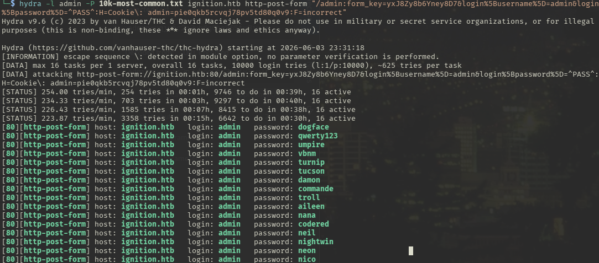
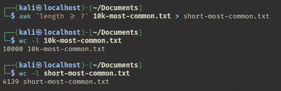

---
tags:
  - Linux
  - HTTP
  - Weak credentials
---

... is a very simple HTB machine which offers a `http` service that has an hidden `/admin` endpoint. The credentials must be inferred from the challenge hints. 

### Reconnaissance
The tool `nmap` is used to do the initial reconnaissance of any target, as it very reliably sends packets to specific ports of the target to verify if they are open, closed, or filtered. The following command is used as a standard `nmap` scan:
```bash
sudo nmap -sCV $IP
```
<div class="annotate" markdown> (1) </div>

1. 
```bash
# sudo: optional, but makes the scan a bit faster and stealthier, as no TCP connect() is used.
# -sC (or --script=default): uses the default scripts of nmap. can quickly discover simple vulnerabilities, such as anonymous logins.
# -sV: further scans open ports to determine the actual service which is running on them, as an open port 80 does not directly imply a HTTP service.
```

the output of `nmap` tells us this:
```bash
PORT   STATE SERVICE VERSION
80/tcp open  http    nginx 1.14.2
|_http-title: Did not follow redirect to http://ignition.htb/
|_http-server-header: nginx/1.14.2
```
The output of the `nmap` script `http-title` tells us that the redirect to `ignition.htb` has not been followed, the `/etc/hosts` file can be edited using this command, to enable the resolution of the DNS name to the expected IP address without a public DNS:
```bash
echo "$IP ignition.htb" | sudo tee --append /etc/hosts
```
<div class="annotate" markdown> (1) </div>

1. 
```bash
# echo "...": writes the specified string into STDOUT (terminal)
# | : redirect (pipe) the STDOUT of the left command into the STDIN of the right command
# sudo tee --append /etc/hosts: write the received STDIN into a file without overwriting it. requires sudo, as that file is critical to the system  
```

When visiting the web page `http://ignition.htb`, i see a online-shop-like website which is powered by `magento`, as seen in the footer of the web site. As this is a `CMS`, there are probably no secrets hidden in the page source, but it is still worth to check that.
I have further looked into the functionality of the web page by clicking through its pages, and by manually looking at its interactions it offers (a.k.a. `manual spidering`) to users. Most of them are blocked, and if any vulnerabilities would exist, a `CVE` would be present for them.

So i try to find more content. First off, i always to try forceful directory browsing. If that should fail, i try to find VHost subdomains. The output of the forceful browsing tool `dirb http://ignition.htb` has told me this:
```bash
---- Scanning URL: http://ignition.htb/ ----
+ http://ignition.htb/0 (CODE:200|SIZE:25803)
+ http://ignition.htb/admin (CODE:200|SIZE:7095)
+ http://ignition.htb/catalog (CODE:302|SIZE:0)
+ http://ignition.htb/checkout (CODE:302|SIZE:0)
+ http://ignition.htb/cms (CODE:200|SIZE:25817)
+ http://ignition.htb/contact (CODE:200|SIZE:28673)
+ http://ignition.htb/enable-cookies (CODE:200|SIZE:27176)
==> DIRECTORY: http://ignition.htb/errors/
+ http://ignition.htb/home (CODE:200|SIZE:25802)
+ http://ignition.htb/Home (CODE:301|SIZE:0)
+ http://ignition.htb/index.php (CODE:200|SIZE:25815)
==> DIRECTORY: http://ignition.htb/media/
==> DIRECTORY: http://ignition.htb/opt/
+ http://ignition.htb/rest (CODE:400|SIZE:52)
+ http://ignition.htb/robots (CODE:200|SIZE:1)
+ http://ignition.htb/robots.txt (CODE:200|SIZE:1)
==> DIRECTORY: http://ignition.htb/setup/
+ http://ignition.htb/soap (CODE:200|SIZE:391)
==> DIRECTORY: http://ignition.htb/static/
+ http://ignition.htb/wishlist (CODE:302|SIZE:0)
```
Most of these are pages i've already found through manual spidering and the directories only show `404` error messages, but the `/admin` endpoint is new. After visiting it, am greeted with a login window. A quick google search told me that `magento` does not offer hardcoded default credentials. Neither do standard login vulnerabilities like SQL injection exist (tried it with standard probing).

### Initial Exploitation
The next idea would be to try a wordlist attack, as common credentials do not work (e.g. `admin:admin` or `root:root`). To do so, i try common usernames like `admin`, `administrator` or `root` with a predefined list of passwords. As i do not want the list to be too large, i do not use the `rockyou.txt`, as it is very large. I use the `10.000` entries long wordlists from `SecLists/Passwords/Common-Credentials/10k-most-common.txt`. To download it, i issue this command:
```bash
curl -O https://raw.githubusercontent.com/danielmiessler/SecLists/refs/heads/master/Passwords/Common-Credentials/10k-most-common.txt
```
<div class="annotate" markdown> (1) </div>

1. 
```bash
# -O: preserve the name of the file when saving it.
```

Usually i do such attacks with `burpsuite's Intruder`, but it would take too long using a non-paid account. Instead, the CLI options of `hydra` or `ffuf` are shown below (the request structure is inferred from a `burpsuite` request):
```bash
hydra -l admin -P 10k-most-common.txt ignition.htb http-post-form "/admin:form_key=yxJ8Zy8b6Yney8D7&login%5Busername%5D=admin&login%5Bpassword%5D=^PASS^:H=Cookie\: admin=pie0qkb5rcvqj78pv5td80q0v9:F=incorrect"
```
<div class="annotate" markdown> (1) </div>

1. 
```bash
# -l: singular name, -L for list of names
# -P: list of passwords, -p for singular password
# http-post-form: use HTTP-POST for the attack
#
# the data is structured in 3 parts:
# 1. "/admin" - resource to post to
# 2. "login%5Busername%5D=admin&login%5Bpassword%5D=^PASS^"
#     - contains POST data, and optionally, multiple headers. #     make sure to add the admin cookie!
# 3. "F=incorrect" or "S=correct" - failure / success condition
```

The output of this command shows us this:


It is visible that after ~25 minutes, it started saying that each combination is correct. I have looked at the web page to see why this happened and saw that the `admin` cookie expired before `hydra` finished. Either it was too slow, or the word list was too long for this exact scenario.

I tried the same attack with `ffuf` instead, with another admin cookie:
```bash
ffuf -w ./10k-most-common.txt -H "Cookie: admin=uqjufc2n3uh6g0ho365fv3ju1r" -d "form_key=ULviS8j9rz4KzuT9&login%5Busername%5D=admin&login%5Bpassword%5D=FUZZ" -u http://ignition.htb/admin -fs 7095 -mc all
```
<div class="annotate" markdown> (1) </div>

1. 
```bash
# -w: specify wordlist file
# -H: add specific header. Here, the admin cookie header is places
# -d: POST data to use. mostly copied from a valid request from burp, but ive replaced the password with FUZZ, as that gets replaced with each entry from the wordlist
# -u: URL of the target. dont forget the /admin endpoint!
# -fs: filter by response size, as ive started the scan and ive found out that the standard reply is 7095 long.
# -mc: accept any response code (learned from Three writeup)
```

When starting this scan, it is clearly visible that `ffuf` is more suited for web application word list attacks, as it sends 10 requests per second, so ~600 requests per minute, unlike the ~230 requests per minute from `hydra`. Maybe it's use case lies more on other protocols such as `ssh` or `ftp`...

This still gave me the same problem as with `hydra`, which lets me know that the password file is too long. To make it shorter, i can rule out any passwords which are not even usable on `Magento`. A quick google search on its password requirements tell me that admin password must be at least 7 characters long. 
I could manually count the characters of each entry out of the 10.000 and delete the entries which are too long, but luckily, a tool exists for that in linux called `awk`. To display the line count of a file, `wc` can be used to find out how much slimmer the file has gotten!


The new file is almost 60% smaller! Using this new file, i issue the previous `ffuf` scan again.
When this did not work either, i decided to have a peek at the hints of the challenge. There was a question to google the most common passwords of 2023, which made me stumble upon a top 10 list. The required password was in that list (but also in my shortened down `short-most-common.txt`, so brute forcing does not work).
That's a bit disappointing, as i try to solve challenges without having to take a look at the hints. Still, i've learned valuable things from this challenge!