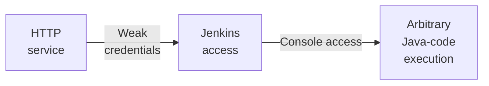

---
tags:
  - Linux
  - HTTP
  - Jenkins
  - Weak credentials
  - Groovy
---

... is a very simple HTB machine which offers a `Jenkins` instance on port `8080`. It can be accessed with weak credentials, which allow you to execute Groovy scripts on the machine as `root`.

### Reconnaissance
The tool `nmap` is used to do the initial reconnaissance of any target, as it very reliably sends packets to specific ports of the target to verify if they are open, closed, or filtered. The following command is used as a standard `nmap` scan:
```bash
sudo nmap -sCV $IP
```
<div class="annotate" markdown> (1) </div>

1. 
```bash
# sudo: optional, but makes the scan a bit faster and stealthier, as no TCP connect() is used.
# -sC (or --script=default): uses the default scripts of nmap. can quickly discover simple vulnerabilities, such as anonymous logins.
# -sV: further scans open ports to determine the actual service which is running on them, as an open port 80 does not directly imply a HTTP service.
```

the output of `nmap` tells us this:
```bash
PORT     STATE SERVICE VERSION
8080/tcp open  http    Jetty 9.4.39.v20210325
| http-robots.txt: 1 disallowed entry 
|_/
|_http-server-header: Jetty(9.4.39.v20210325)
|_http-title: Site doesn't have a title (text/html;charset=utf-8).
```
This scan tells us that it is a `http` service on port 8080, not the standard  port `80`. When visiting the website, don't forget to specify the port in the URL like `http://$IP:8080`!

When visiting the web page, i get a `SSL_ERROR_RX_RECORD_TOO_LONG`. After a quick google search i find out that the browser requested a `https` connection but the service offered `http`. The solution is to simply change the `https://` to `http://`. After that, i am greeted with a `Jenkins` login form. `Jenkins` is a very popular web software which allows developers to continuously integrate software components to their application.

You can probably assume that there is no SQL injection vulnerability in a Jenkins login (I've also probed for it with regular payloads). If you can find out the version number of the running `Jenkins`, you can search for CVEs. A quick google search also told me that `Jenkins` does not have default credentials. 
As i've hit a dead end, i used forceful browsing again using this command:
```bash
dirb http://$IP:8080 -w
```
<div class="annotate" markdown> (1) </div>

1. 
```bash
# -w: keep scanning, even if all responses are 403 Forbidden
```

This gave me this list of assets (Filtered through all warnings):
```bash
---- Scanning URL: http://10.10.10.10:8080/ ----
==> DIRECTORY: http://10.10.10.10:8080/assets/
+ http://10.10.10.10:8080/error (CODE:400|SIZE:8379)
+ http://10.10.10.10:8080/favicon.ico (CODE:200|SIZE:17542)
==> DIRECTORY: http://10.10.10.10:8080/git/
+ http://10.10.10.10:8080/login (CODE:200|SIZE:2028)
+ http://10.10.10.10:8080/logout (CODE:302|SIZE:0)
+ http://10.10.10.10:8080/robots.txt (CODE:200|SIZE:71)
```
When visiting these assets, i notice something funny. The `/error` page shows me a site where the version of `Jenkins` is displayed at the bottom right! I quickly google for `Jenkins 2.289.1` vulnerabilities, but i haven't found any that could help my cause.

### Initial Exploitation
The next idea would be to deploy brute forcing against the login form. To do so, i need a combination of `username:password`. For each of these i fetch the wordlists from [Seclists Github](https://github.com/danielmiessler/SecLists) `SecLists/Usernames/top-usernames-shortlist.txt`, and `SecLists/Passwords/Common-Credentials/500-worst-passwords.txt` using a `curl -O` command on the raw file.

I've learned my lesson that `burpsuites intruder` is the best tool for this task. `hydra` is relatively slow compared to `ffuf`, but `ffuf` does not take all parameters of the request into its mind.
To start an `intruder` attack, i intercept a login attempt and forward it to the `intruder` using `CTRL+I`. I select the cluster bomb attack, as i have two payloads and i want to try all combinations of these two together. I add `§` symbols around the username and password parameter, and i select the respective word-lists i've gathered from the step before. 

This results in 8483 requests and it would probably take hours to finish this with the non-paid version. Luckily, when filtering for the length of the response, the 18th request with the credentials `root:password` stands out! I use those to log in to the `Jenkins` backend.

With the login, i can access the infamous `Jenkins Groovy Script Console` under `Manage Jenkins > Script Console`. This allows me to execute `Groovy` (very similar to Java, but has additional productivity features) code as the account which is running the Jenkins instance. To find out which account is running `Jenkins`, i can use this groovy script:
```bash
println "whoami".execute().text
```
And it prints `root`! I can then use `cat /root/flag.txt` to view it!

### Summary

Below is a visualized summary of the exploitation steps used in this machine.

